# Bhukkad Backend — API Technical Guide

> **Purpose:** Complete reference for every API endpoint in the repository. Includes request/response examples, execution flow, dependencies, and cross-references.
>
> **Scope:** All REST endpoints across 15 services + gateway. Based on actual controller implementation.
> **Last updated:** 2026-09-19

---

## Table of Contents

1. [Conventions](#1-conventions)
2. [Gateway](#2-gateway)
3. [Identity](#3-identity)
4. [Restaurant](#4-restaurant)
5. [Order](#5-order)
6. [Payment](#6-payment)
7. [Delivery](#7-delivery)
8. [Social](#8-social)
9. [Notification](#9-notification)
10. [Search](#10-search)
11. [Admin Analytics](#11-admin-analytics)
12. [Referral](#12-referral)
13. [Support Ticket](#13-support-ticket)
14. [Survey](#14-survey)
15. [Growth](#15-growth)
16. [Realtime](#16-realtime)
17. [Platform / Health](#17-platform--health)
18. [Cross-Service Flows](#18-cross-service-flows)
19. [Error Handling](#19-error-handling)
20. [Testing](#20-testing)

---

## 1. Conventions

### 1.1 Base URL

```
Production: https://api.bhukkad.com
Gateway:     http://bhukkad-gateway:8080 (k8s)
```

### 1.2 Authentication

| Scheme | Header | Usage |
|--------|--------|-------|
| User JWT | `Authorization: Bearer <token>` | Customer, owner, agent, admin |
| Service JWT | `X-Service-Token: <token>` | Internal service-to-service |
| Webhook sig | `X-Razorpay-Signature` | Payment webhooks |
| API key | `X-Api-Key` | Admin exports |

**JWT validation:** RS256 via JWKS (`/.well-known/jwks.json`). Refresh tokens stored hashed with family tracking.

### 1.3 Rate Limiting

| Layer | Limit | Scope |
|-------|-------|-------|
| Nginx | 30 r/s general, 5 r/s auth, 10 r/s order | Per-IP |
| Ingress | 30 r/s | Per-service |
| Gateway | Per-route buckets | Per-user/IP |
| Service | `@RateLimited` annotation | Per-endpoint |

### 1.4 Error Response Format

```json
{
  "timestamp": "2026-09-19T08:00:00Z",
  "status": 400,
  "error": "Bad Request",
  "message": "Validation failed",
  "errors": [
    {"field": "email", "message": "must be a valid email"}
  ],
  "path": "/api/v1/auth/register"
}
```

### 1.5 Pagination

- **Offset:** `page` (default 0), `size` (default 10, max varies by endpoint)
- **Cursor:** `cursor` (opaque string), `size` (default 10)

---

## 2. Gateway

**File:** `services/gateway/src/main/java/com/bhukkad/gateway/FallbackController.java`

| Method | Path | Auth | Description |
|--------|------|------|-------------|
| GET | `/fallback/{service}` | Public | Service-unavailable fallback |

**Flow:** Gateway returns HTML/JSON fallback when upstream is unreachable or circuit is open.

---

## 3. Identity

**Controller files:**
- `IdentityController.java` — auth, addresses
- `CustomerController.java` — favorites, consent
- `CustomerAccountController.java` — devices, notifications, membership
- `CustomerSelfController.java` — self-scoped profile/addresses
- `TenantController.java` — tenant CRUD
- `MembershipController.java` — membership plans
- `AffiliateController.java` — affiliate codes
- `JwksController.java` — JWKS
- `KeyRotationController.java` — JWT rotation
- `AdminUserInternalController.java` — user admin
- `PlatformController.java` — cities, tenant lookup
- `ComplianceController.java` — GDPR/DPDP consents

### 3.1 Auth Endpoints

#### POST `/api/v1/auth/register`

**Purpose:** Register a new customer account.

**Auth:** Public (rate-limited)

**Request:**
```json
{
  "email": "user@example.com",
  "fullName": "John Doe",
  "password": "SecurePass123!",
  "role": "CUSTOMER",
  "phoneNumber": "+919876543210",
  "referralCode": "ABC123"
}
```

**Response 201:**
```json
{
  "userId": "uuid",
  "email": "user@example.com",
  "fullName": "John Doe",
  "role": "CUSTOMER",
  "emailVerified": false
}
```

**Flow:**
1. Validate input (email format, password strength)
2. Check email uniqueness
3. Hash password (BCrypt)
4. Create `User` (CUSTOMER) + `Customer` row
5. Apply referral code if provided
6. Issue JWT + refresh token
7. Return `AuthResponse`

**Related:** `POST /api/v1/auth/login`, `POST /api/v1/auth/refresh`

---

#### POST `/api/v1/auth/login`

**Purpose:** Authenticate user, issue JWT + refresh token.

**Auth:** Public (rate-limited)

**Request:**
```json
{
  "email": "user@example.com",
  "password": "SecurePass123!",
  "deviceId": "device-123",
  "totpCode": "123456"
}
```

**Response 200:**
```json
{
  "accessToken": "eyJ...",
  "refreshToken": "eyJ...",
  "tokenType": "Bearer",
  "expiresIn": 3600
}
```

**Flow:**
1. Load user by email
2. Verify password hash
3. Check TOTP if enabled
4. Invalidate previous refresh tokens (optional)
5. Issue new access + refresh tokens
6. Record device token if provided
7. Return `AuthResponse`

**Errors:** 401 invalid credentials, 403 account deactivated, 429 rate limit

---

#### POST `/api/v1/auth/refresh`

**Purpose:** Refresh access token using refresh token.

**Auth:** Public (rate-limited)

**Request:**
```json
{
  "refreshToken": "eyJ...",
  "deviceId": "device-123"
}
```

**Response 200:** Same as login.

**Flow:**
1. Validate refresh token signature + expiry
2. Check token family (rotation detection)
3. Issue new access + refresh tokens
4. Revoke old refresh token

---

#### POST `/api/v1/auth/logout`

**Purpose:** Revoke refresh token.

**Auth:** Customer

**Request:** Optional body with `refreshToken`.

**Response 204:** No content.

---

#### POST `/api/v1/auth/verify-email`

**Purpose:** Verify email with password confirmation.

**Auth:** Customer

**Query:** `email`, `password`

**Response 200:** `{ "verified": true }`

---

#### POST `/api/v1/auth/change-password`

**Purpose:** Change own password.

**Auth:** Customer

**Request:**
```json
{
  "currentPassword": "OldPass123!",
  "newPassword": "NewPass456!"
}
```

**Response 204:** No content.

---

#### POST `/api/v1/auth/forgot-password`

**Purpose:** Request password reset email.

**Auth:** Public (rate-limited)

**Request:** `{ "email": "user@example.com" }`

**Response 202:** Accepted (always, to prevent enumeration).

---

#### POST `/api/v1/auth/reset-password`

**Purpose:** Reset password with token.

**Auth:** Public (rate-limited)

**Query:** `token`, `newPassword`

**Response 204:** No content.

---

#### POST `/api/v1/internal/verify`

**Purpose:** Introspect token (RFC 7662).

**Auth:** Public (internal)

**Request:** `{ "token": "eyJ..." }`

**Response 200:**
```json
{
  "active": true,
  "sub": "user-id",
  "role": "CUSTOMER",
  "exp": 1698765432
}
```

---

### 3.2 Customer Endpoints

#### GET `/api/v1/customers/profile`

**Purpose:** Get own profile.

**Auth:** Customer

**Response 200:** `CustomerProfileResponse`

---

#### PUT `/api/v1/customers/profile`

**Purpose:** Update own profile.

**Auth:** Customer

**Request:** `fullName` (query or body)

**Response 200:** Updated profile.

---

#### GET `/api/v1/customers/addresses`

**Purpose:** List own addresses.

**Auth:** Customer

**Response 200:** `List<AddressResponse>`

---

#### POST `/api/v1/customers/addresses`

**Purpose:** Add address.

**Auth:** Customer

**Request:**
```json
{
  "label": "Home",
  "line1": "123 Main St",
  "city": "Mumbai",
  "state": "MH",
  "zipCode": "400001",
  "latitude": 19.0760,
  "longitude": 72.8777,
  "isDefault": true
}
```

**Response 201:** `AddressResponse`

---

#### PUT `/api/v1/customers/addresses/{addressId}/set-default`

**Purpose:** Set default address.

**Auth:** Customer

**Response 204:** No content.

---

#### DELETE `/api/v1/customers/addresses/{addressId}`

**Purpose:** Delete address.

**Auth:** Customer

**Response 204:** No content.

---

#### POST `/api/v1/customers/favorites/{restaurantId}`

**Purpose:** Add restaurant to favorites.

**Auth:** Customer

**Response 201:** Created.

---

#### GET `/api/v1/customers/favorites`

**Purpose:** List own favorites.

**Auth:** Customer

**Response 200:** `List<RestaurantSummary>`

---

#### DELETE `/api/v1/customers/favorites/{restaurantId}`

**Purpose:** Remove favorite.

**Auth:** Customer

**Response 204:** No content.

---

#### POST `/api/v1/customers/compliance/export`

**Purpose:** Request DPDP data export (202 + job).

**Auth:** Customer

**Response 202:** `{ "jobId": "uuid" }`

---

### 3.3 Admin Endpoints

#### GET `/api/v1/internal/admin/users`

**Purpose:** Paginated user registry.

**Auth:** ADMIN or SERVICE

**Query:** `page` (default 0), `size` (default 20)

**Response 200:** `PagedResponse<UserResponse>`

---

#### PUT `/api/v1/internal/admin/users/{userId}/activate`

**Purpose:** Activate user (revokes tokens if deactivated).

**Auth:** ADMIN or SERVICE

**Response 200:** Updated user.

---

#### PUT `/api/v1/internal/admin/users/{userId}/deactivate`

**Purpose:** Deactivate user (revokes all tokens).

**Auth:** ADMIN or SERVICE

**Response 200:** Updated user.

---

#### POST `/api/v1/internal/admin/users/{userId}/erase`

**Purpose:** GDPR erasure (anonymise + deactivate).

**Auth:** ADMIN or SERVICE

**Response 204:** No content.

---

### 3.4 Platform Endpoints

#### GET `/api/v1/platform/cities`

**Purpose:** List active cities.

**Auth:** Public

**Response 200:** `List<CityResponse>`

---

#### GET `/api/v1/platform/tenants/{domain}`
 
**Purpose:** Resolve tenant by domain.
 
**Auth:** Public
 
**Response 200:** `TenantResponse`
 
**Flow:**
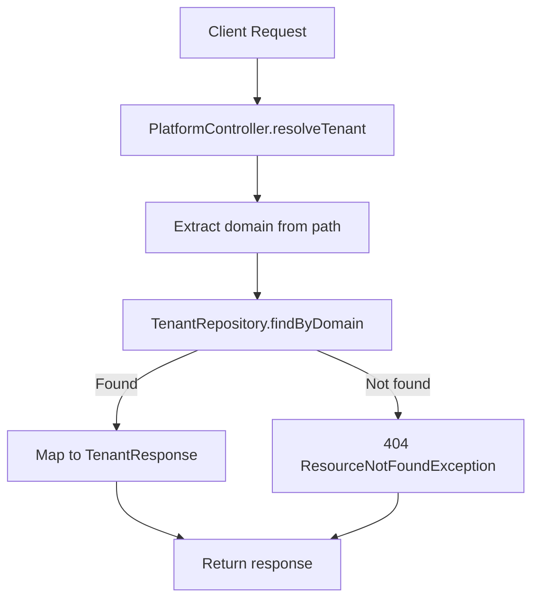
 
**Components:**
- **Controller:** `PlatformController.resolveTenant()`
- **Service:** `PlatformService` (simple pass-through)
- **Repository:** `TenantRepository`
- **Database:** `tenants`
- **Kafka:** None
- **Cache:** Redis cache for 5m

### 3.5 JWKS & Key Rotation

#### GET `/.well-known/jwks.json`
 
**Purpose:** Serve public JWKS (RS256).
 
**Auth:** Public
 
**Response 200:** JWKS JSON.
 
**Flow:**
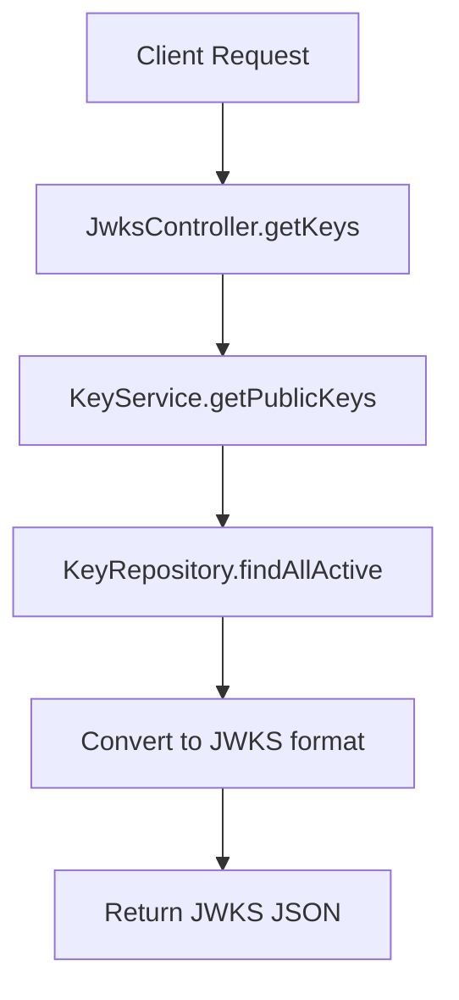
 
**Components:**
- **Controller:** `JwksController.getKeys()`
- **Service:** `KeyService.getPublicKeys()`
- **Repository:** `KeyRepository`
- **Database:** `keys` (public keys only)
- **Kafka:** None
- **Cache:** None (keys change infrequently, but freshness is critical)
- **Note:** endpoint is outside /api/v1/ for standard compliance

#### GET `/api/v1/admin/jwt/status`
 
**Purpose:** Get JWT key rotation status.
 
**Auth:** ADMIN
 
**Response 200:** `{ "currentKeyId": "kid", "nextRotation": "2026-09-20T00:00:00Z" }`
 
**Flow:**
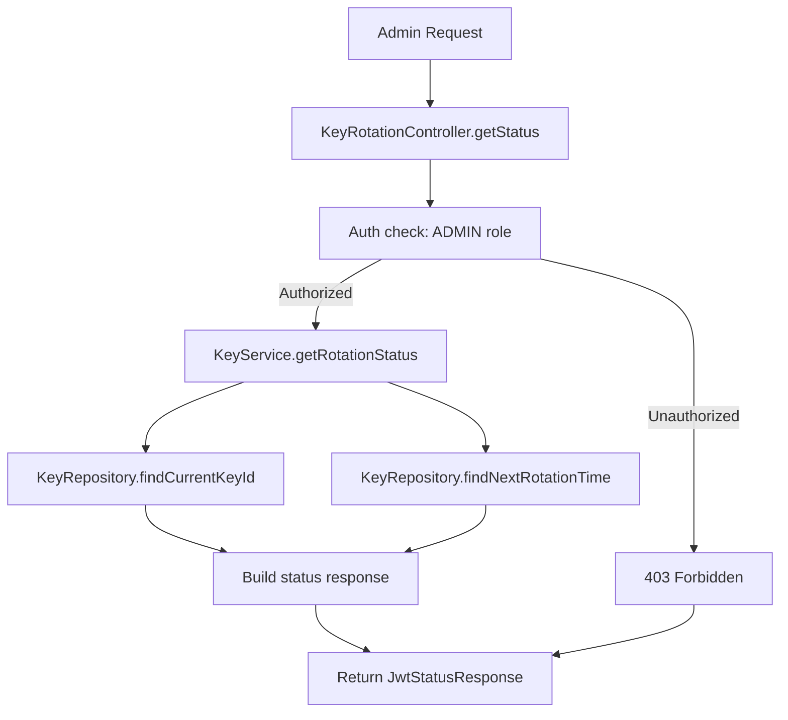
 
**Components:**
- **Controller:** `KeyRotationController.getStatus()`
- **Service:** `KeyService.getRotationStatus()`
- **Repository:** `KeyRepository`
- **Database:** `keys`
- **Kafka:** None
- **Cache:** None (real-time status)

#### POST `/api/v1/admin/jwt/refresh`
 
**Purpose:** Force JWKS refresh.
 
**Auth:** ADMIN
 
**Response 204:** No content.
 
**Flow:**
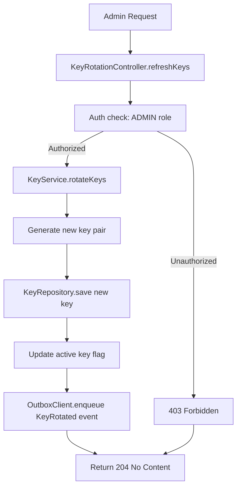
 
**Components:**
- **Controller:** `KeyRotationController.refreshKeys()`
- **Service:** `KeyService.rotateKeys()`
- **Repository:** `KeyRepository`
- **Database:** `keys`, `outbox_events`
- **Kafka:** `key.events.v1` — `KeyRotated`
- **Downstream:** All services consume JWKS updates via cache invalidation
- **Transaction:** `@Transactional` — key save + outbox atomic

## 4. Restaurant

**Controller files:**
- `RestaurantController.java`
- `PublicBrowseController.java`
- `AdminRestaurantController.java`
- `RestaurantOwnerController.java`
- `MenuOpsController.java`
- `MenuCategoryController.java`
- `MenuVersionController.java`
- `MenuBulkController.java`
- `MenuCategoryCompatController.java`
- `ReviewController.java`
- `CuisineController.java`
- `DynamicPricingController.java`
- `InventoryStockReservationController.java`
- `InventoryAlertController.java`
- `FeedController.java`
- `SurpriseMeController.java`
- `PromotionEvaluateController.java`
- `ExperimentAdminController.java`
- `AutocompleteController.java`
- `SearchController.java`
- `TenantController.java`
- `InternalRestaurantController.java`
- `InternalMenuController.java`

### 4.1 Browse & Search

#### GET `/api/v1/restaurants/public`

**Purpose:** List active restaurants (paged, filterable).

**Auth:** Public

**Query:** `page`, `size`, `cuisineId`, `isPureVeg`, `ids` (comma-separated, max 100)

**Response 200:**
```json
{
  "content": [
    {
      "id": 1,
      "name": "Pizza Hut",
      "cuisine": "Italian",
      "rating": 4.2,
      "deliveryFee": 30,
      "estimatedDeliveryMinutes": 30,
      "isPureVeg": false,
      "latitude": 19.0760,
      "longitude": 72.8777
    }
  ],
  "page": 0,
  "size": 20,
  "totalElements": 100
}
```

**Flow:**
1. Build query with filters
2. Apply pagination
3. Return `PagedResponse<RestaurantSummary>`

---

#### GET `/api/v1/restaurants/public/nearby`

**Purpose:** Geo-nearby restaurants.

**Auth:** Public

**Query:** `latitude`, `longitude`, `radiusKm` (default 5)

**Response 200:** `List<RestaurantSummary>`

**Flow:**
1. Haversine query with bounding box pre-filter
2. Return restaurants within radius

---

#### GET `/api/v1/restaurants/public/{id}`

**Purpose:** Get single restaurant.

**Auth:** Public

**Response 200:** `RestaurantResponse` (includes menu, reviews, pricing)

---

#### GET `/api/v1/search`

**Purpose:** Unified search (restaurants + menu items).

**Auth:** Public

**Query:** `keyword`

**Response 200:** `UnifiedSearchResponse`

---

#### GET `/api/v1/search/autocomplete`

**Purpose:** Autocomplete suggestions.

**Auth:** Public

**Query:** `q`, `limit` (default 8, max 50)

**Response 200:** `List<AutocompleteSuggestion>`

---

### 4.2 Menu

#### GET `/api/v1/menu/items`

**Purpose:** Batch get menu items by IDs.

**Auth:** Public

**Query:** `ids` (comma-separated, max 100)

**Response 200:** `List<MenuItemResponse>`

---

#### GET `/api/v1/menu/items/{id}`

**Purpose:** Get single menu item.

**Auth:** Public

**Response 200:** `MenuItemResponse`

---

#### POST `/api/v1/menu/items`

**Purpose:** Create menu item.

**Auth:** Owner or Admin

**Request:** `MenuItemUpsertRequest`

**Response 201:** `MenuItemResponse`

---

#### PUT `/api/v1/menu/items/{id}`

**Purpose:** Update menu item.

**Auth:** Owner or Admin

**Request:** `MenuItemUpsertRequest` (partial)

**Response 200:** `MenuItemResponse`

---

#### POST `/api/v1/restaurants/{id}/menu/bulk`

**Purpose:** Bulk upsert menu items (max 200).

**Auth:** Owner or Admin

**Request:** `List<BulkItem>`

**Response 200:** `{ "created": 10, "updated": 5 }`

---

### 4.3 Orders & Reviews

#### POST `/api/v1/reviews`

**Purpose:** Submit restaurant review.

**Auth:** Customer

**Request:**
```json
{
  "restaurantId": 1,
  "rating": 5,
  "comment": "Great food!"
}
```

**Response 201:** `ReviewResponse`

**Flow:**
1. Validate rating (1-5)
2. Save `Review` entity
3. Update `Restaurant.avgRating` + `totalReviews` (denormalized)
4. Publish `ReviewCreated` event

---

#### POST `/api/v1/reviews/menu-items`

**Purpose:** Rate a menu item.

**Auth:** Customer

**Request:**
```json
{
  "orderId": "order-123",
  "menuItemId": 42,
  "rating": 5,
  "comment": "Delicious"
}
```

**Response 201:** `MenuItemRatingResponse`

---

### 4.4 Internal Service Endpoints

#### GET `/internal/menu/snapshot`

**Purpose:** Get menu snapshot (service-to-service).

**Auth:** SERVICE or ADMIN

**Query:** `restaurantId`

**Response 200:** `MenuSnapshot`

---

#### GET `/api/v1/internal/restaurants/{restaurantId}/owner`

**Purpose:** Resolve restaurant owner (internal oracle).

**Auth:** SERVICE or ADMIN

**Response 200:** `{ "ownerId": "uuid" }`

---

### 4.5 Inventory

#### POST `/api/v1/inventory/stock-reservation/reserve`

**Purpose:** Reserve stock (order saga).

**Auth:** SERVICE

**Request:** `List<ReserveLine>`

**Response 200:** `{ "reserved": true }`

---

#### POST `/api/v1/inventory/stock-reservation/release`

**Purpose:** Release reserved stock (saga compensation).

**Auth:** SERVICE

**Request:** `List<ReserveLine>`

**Response 200:** `{ "released": true }`

---

## 5. Order

**Controller files:**
- `OrderController.java`
- `CustomerOrderController.java`
- `CartController.java`
- `OrderOpsController.java`
- `InternalOrderController.java`
- `AdminOrderInternalController.java`
- `OrderAdjunctController.java`
- `OrderAssistController.java`
- `OrderGrowthController.java`
- `GroupOrderController.java`
- `GiftCardController.java`
- `CouponController.java`
- `SubscriptionController.java`
- `DeliveryTruthAliasController.java`
- `OrderStreamController.java`
- `DisputeController.java`
- `LegacyCartCompatController.java`
- `LegacyOrderCompatController.java`
- `SocialSelfCompatController.java`

### 5.1 Order Creation

#### POST `/api/v1/orders`

**Purpose:** Create a new order.

**Auth:** Customer

**Request:**
```json
{
  "restaurantId": 1,
  "items": [
    {
      "menuItemId": 42,
      "quantity": 2,
      "specialInstructions": "Less spicy"
    }
  ],
  "deliveryAddressId": "addr-123",
  "specialInstructions": "Ring doorbell"
}
```

**Response 201:**
```json
{
  "orderId": "order-uuid",
  "orderNumber": "BH-1001",
  "status": "CONFIRMED",
  "totalAmount": 450.00,
  "estimatedDeliveryAt": "2026-09-19T09:00:00Z"
}
```

**Flow:**
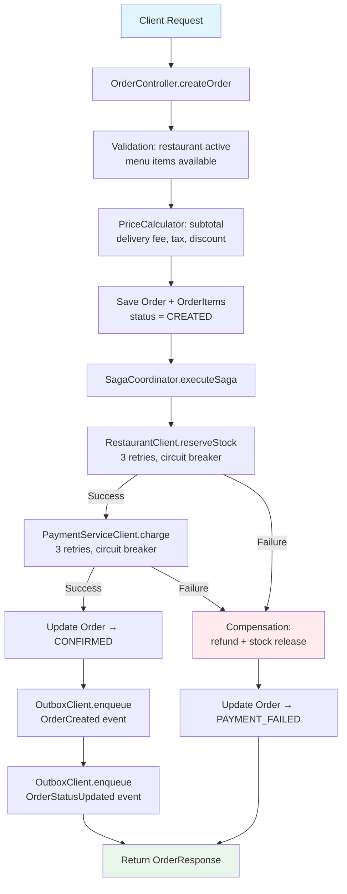

**Components:**
- **Controller:** `OrderController.createOrder()`
- **Service:** `SagaCoordinator.executeSaga()`
- **Repositories:** `OrderRepository.save()`, `OrderItemRepository.saveAll()`
- **Internal calls:**
  - `RestaurantClient.reserveStock()` (circuit breaker: `restaurantService`)
  - `PaymentServiceClient.charge()` (circuit breaker: `orderService`)
- **Database:** `orders`, `order_items`, `outbox_events`
- **Cache:** Redis rate limiting
- **Kafka:** `order.events.v1` — `OrderCreated`, `OrderStatusUpdated`
- **Transaction:** Single transaction for Order + Items + Outbox rows
- **Saga compensation:** On failure → refund + stock release

**Related:** `POST /api/v1/orders/{id}/cancel`, `GET /api/v1/orders/{id}`

---

### 5.2 Order Operations

#### GET `/api/v1/orders/restaurant/{restaurantId}`

**Purpose:** List restaurant orders (paged).

**Auth:** Owner or Admin

**Query:** `page`, `size`

**Response 200:** `PagedResponse<OrderSummary>`

**Flow:**
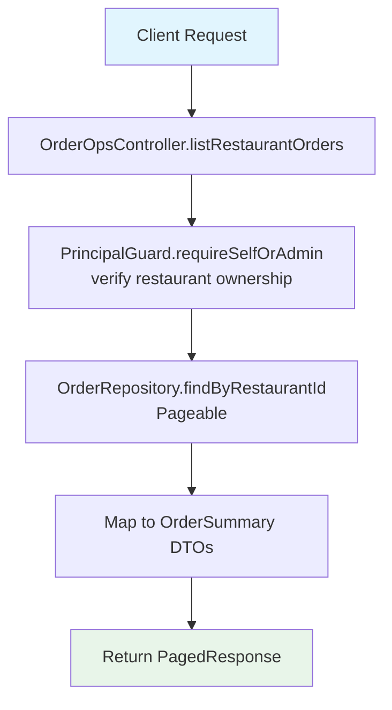

**Components:**
- **Controller:** `OrderOpsController.listRestaurantOrders()`
- **Service:** `OrderQueryService`
- **Repository:** `OrderRepository.findByRestaurantId(Pageable)`
- **Database:** `orders` table (read replica via `@UseReadReplica`)
- **Cache:** None
- **Kafka:** None

---

#### GET `/api/v1/orders/restaurant/{restaurantId}/kitchen-queue`

**Purpose:** Kitchen queue (active orders).

**Auth:** Owner or Admin

**Response 200:** `List<OrderSummary>`

**Flow:**
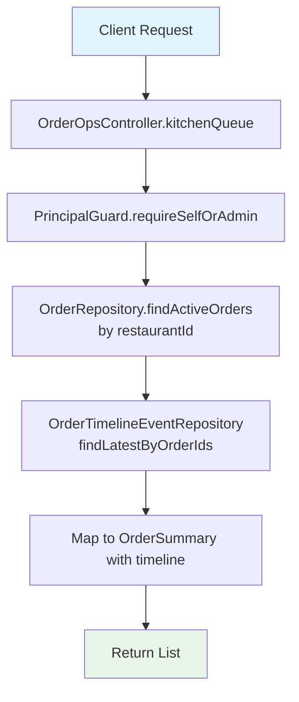

**Components:**
- **Controller:** `OrderOpsController.kitchenQueue()`
- **Service:** `OrderQueryService`
- **Repository:** `OrderRepository.findActiveOrdersByRestaurantId()`
- **Database:** `orders`, `order_timeline_events`
- **Cache:** None
- **Kafka:** None

---

#### PUT `/api/v1/orders/restaurant/{orderId}/accept`

**Purpose:** Accept order → CONFIRMED.

**Auth:** Owner or Admin

**Response 200:** Updated order.

---

#### PUT `/api/v1/orders/restaurant/{orderId}/ready`

**Purpose:** Mark READY_FOR_PICKUP.

**Auth:** Owner or Admin

**Response 200:** Updated order.

---

#### PUT `/api/v1/orders/restaurant/{orderId}/assign-delivery`

**Purpose:** Assign delivery agent.

**Auth:** Owner or Admin

**Query:** `agentId`

**Response 200:** Updated order.

---

### 5.3 Delivery Operations

#### PUT `/api/v1/orders/delivery/{orderId}/picked-up`

**Purpose:** Mark as picked up (OUT_FOR_DELIVERY).

**Auth:** Assigned Agent or Admin

**Response 200:** Updated order.

**Flow:**
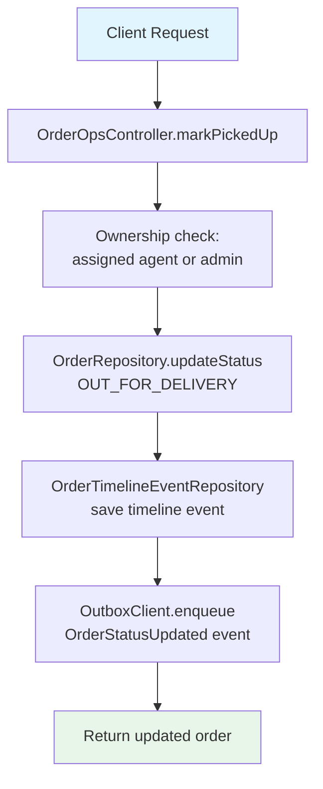

**Components:**
- **Controller:** `OrderOpsController.markPickedUp()`
- **Service:** `OrderLifecycleService.transitionStatus()`
- **Repository:** `OrderRepository.updateStatus()`
- **Database:** `orders`, `order_timeline_events`, `outbox_events`
- **Kafka:** `order.events.v1` — `OrderStatusUpdated`
- **Downstream:** Realtime SSE → customer + kitchen

---

#### PUT `/api/v1/orders/delivery/{orderId}/delivered`

**Purpose:** Mark as delivered.

**Auth:** Assigned Agent or Admin

**Response 200:** Updated order.

**Flow:**
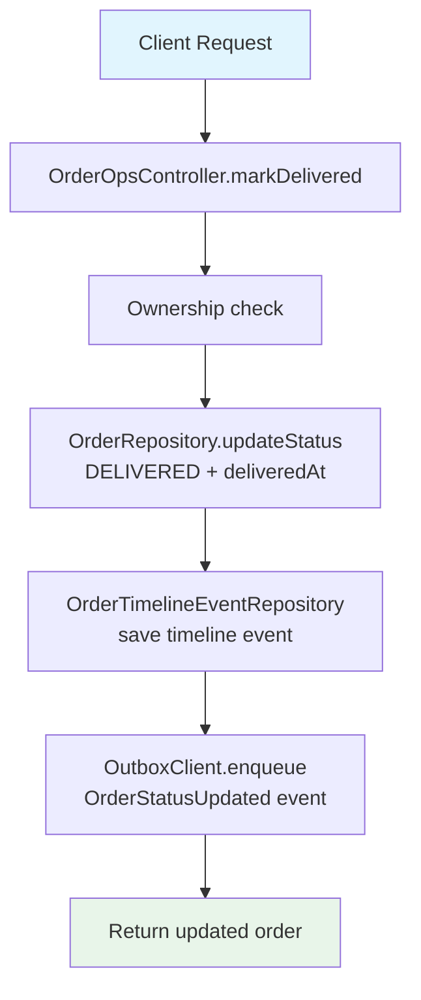

**Components:**
- **Controller:** `OrderOpsController.markDelivered()`
- **Service:** `OrderLifecycleService.transitionStatus()`
- **Database:** `orders`, `order_timeline_events`, `outbox_events`
- **Kafka:** `order.events.v1` — `OrderStatusUpdated`
- **Downstream:** Payment settlement, growth loyalty, notification

---

### 5.4 Customer Order

#### GET `/api/v1/orders/customer/my-orders`

**Purpose:** List own orders.

**Auth:** Customer

**Query:** `page`, `size`

**Response 200:** `PagedResponse<OrderSummary>`

**Flow:**
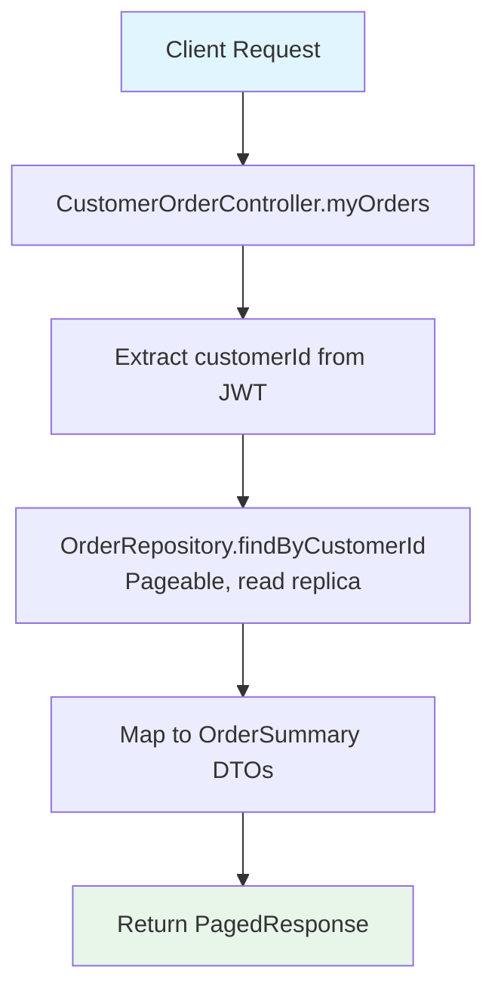

**Components:**
- **Controller:** `CustomerOrderController.myOrders()`
- **Service:** `OrderQueryService`
- **Repository:** `OrderRepository.findByCustomerId(Pageable)`
- **Database:** `orders` table (read replica)
- **Cache:** None
- **Kafka:** None

---

#### POST `/api/v1/orders/customer/{orderId}/cancel`

**Purpose:** Cancel own order.

**Auth:** Customer (order owner)

**Response 200:** Updated order.

**Flow:**
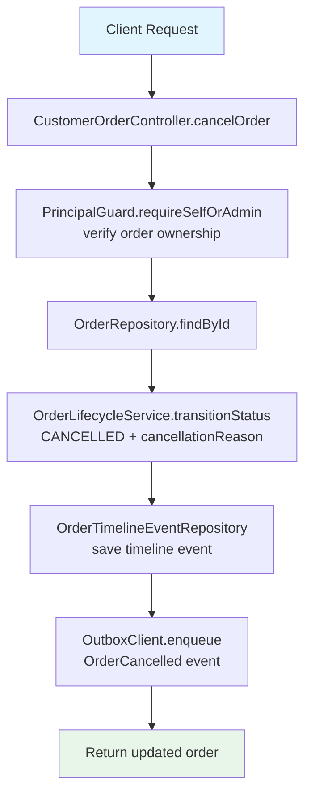

**Components:**
- **Controller:** `CustomerOrderController.cancelOrder()`
- **Service:** `OrderLifecycleService`
- **Database:** `orders`, `order_timeline_events`, `outbox_events`
- **Kafka:** `order.events.v1` — `OrderCancelled`
- **Downstream:** Payment refund, stock release, notification

---

### 5.5 Cart

#### POST `/api/v1/customers/{customerId}/cart/items`

**Purpose:** Add item to cart.

**Auth:** Customer (self or admin)

**Request:**
```json
{
  "menuItemId": 42,
  "quantity": 2
}
```

**Response 201:** `CartItemResponse`

**Flow:**
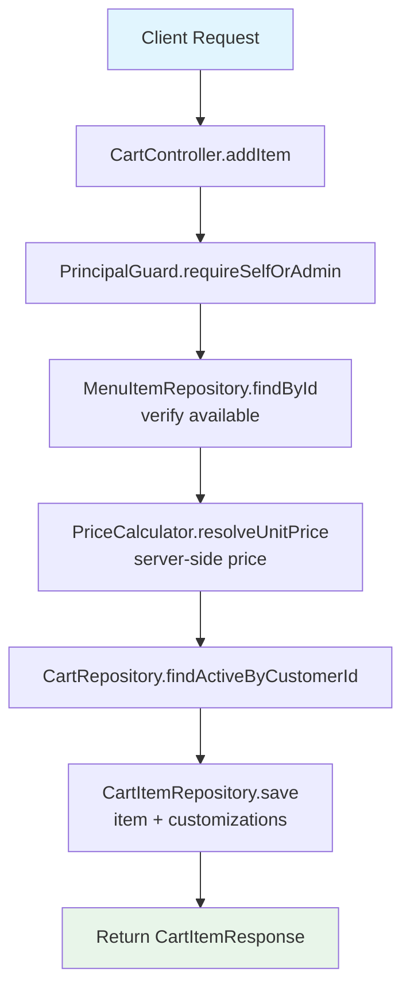

**Components:**
- **Controller:** `CartController.addItem()`
- **Service:** `CartService.addItem()`
- **Repositories:** `CartRepository`, `CartItemRepository`, `MenuItemRepository`
- **Database:** `carts`, `cart_items`, `menu_items`
- **Cache:** Menu item cache (60s TTL)
- **Kafka:** None

---

#### GET `/api/v1/customers/{customerId}/cart`

**Purpose:** Get cart items.

**Auth:** Customer (self or admin)

**Response 200:** `CartResponse`

**Flow:**
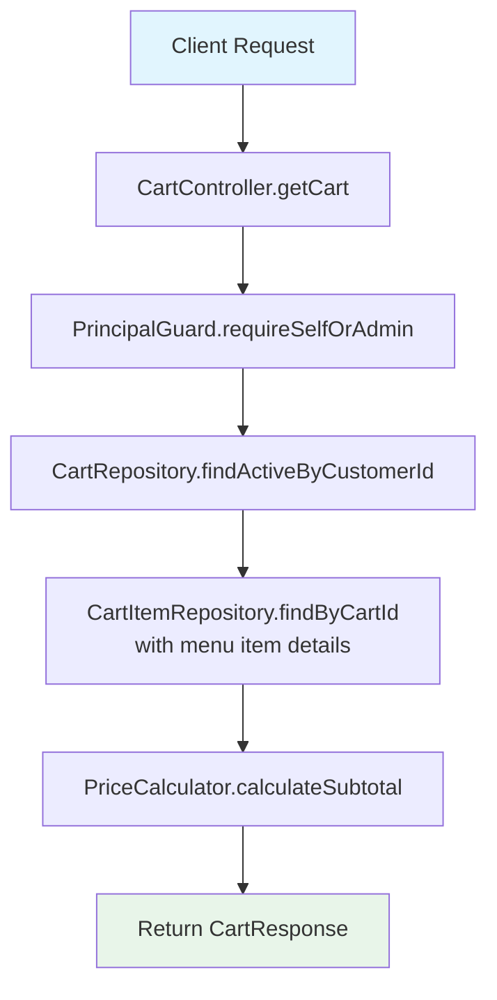

**Components:**
- **Controller:** `CartController.getCart()`
- **Service:** `CartService.getCart()`
- **Database:** `carts`, `cart_items`, `menu_items`
- **Cache:** Menu item cache (60s TTL)

---

#### DELETE `/api/v1/customers/{customerId}/cart`

**Purpose:** Clear cart.

**Auth:** Customer (self or admin)

**Response 204:** No content.

**Flow:**
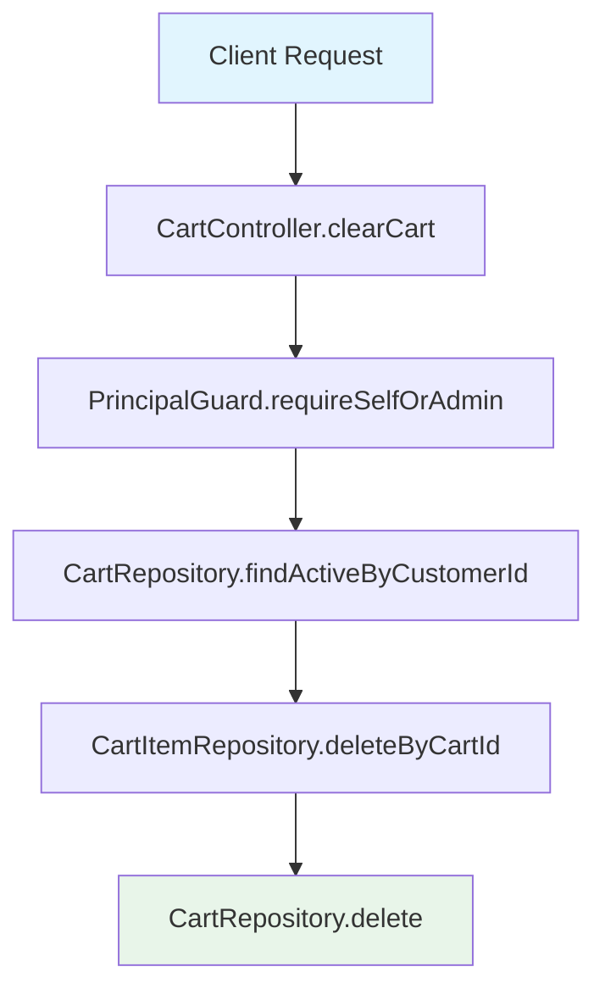

**Components:**
- **Controller:** `CartController.clearCart()`
- **Service:** `CartService.clearCart()`
- **Database:** `carts`, `cart_items`
- **Kafka:** None

---

### 5.6 Invoices & Tracking

#### GET `/api/v1/orders/{orderId}/invoice`

**Purpose:** Get invoice JSON.

**Auth:** Customer (order owner)

**Response 200:** `OrderInvoiceResponse`

**Flow:**
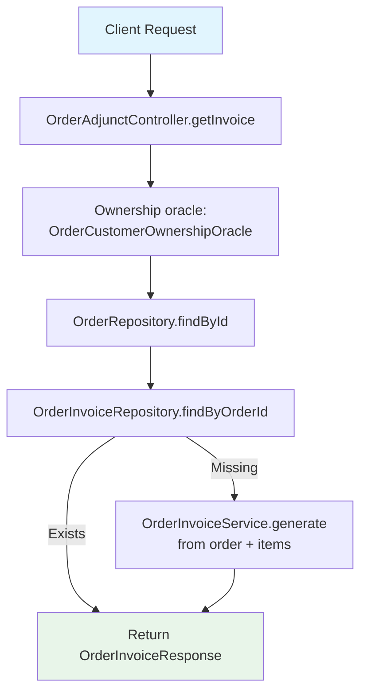

**Components:**
- **Controller:** `OrderAdjunctController.getInvoice()`
- **Service:** `OrderInvoiceService`
- **Repository:** `OrderInvoiceRepository`, `OrderRepository`
- **Database:** `orders`, `order_items`, `order_invoices`
- **Kafka:** None

---

#### GET `/api/v1/orders/{orderId}/invoice/pdf`

**Purpose:** Get PDF invoice.

**Auth:** Customer (order owner)

**Response 200:** PDF binary.

**Flow:**
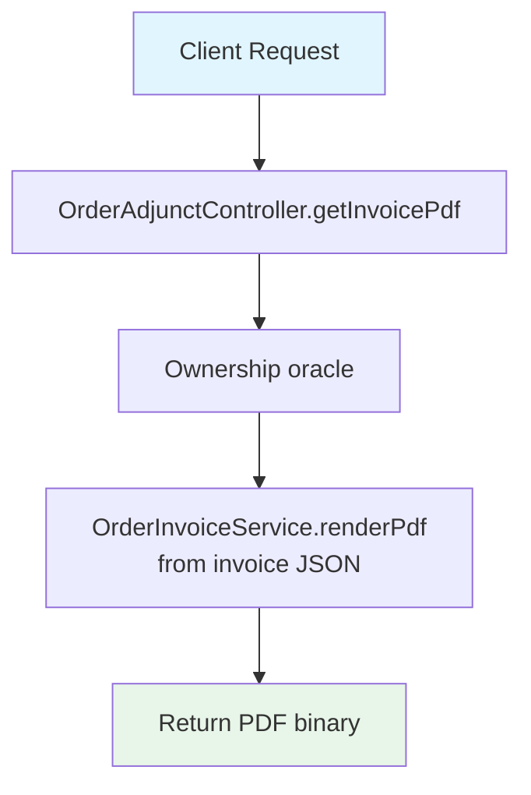

**Components:**
- **Controller:** `OrderAdjunctController.getInvoicePdf()`
- **Service:** `OrderInvoiceService`
- **PDF generation:** iText / PDFBox
- **Cache:** PDF cached for 24h

---

#### GET `/api/v1/orders/customer/track/{orderId}`

**Purpose:** Track order (legacy, rate-limited 20/min).

**Auth:** Customer (order owner)

**Response 200:** `OrderEtaDetailResponse`

**Flow:**
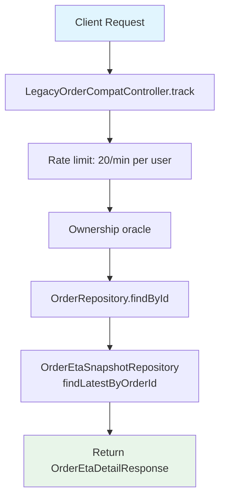

**Components:**
- **Controller:** `LegacyOrderCompatController.track()`
- **Service:** `OrderQueryService`
- **Database:** `orders`, `order_eta_snapshots`
- **Rate limit:** `edge-order-track` bucket, 20/min

---

### 5.7 Delivery Proof

#### POST `/api/v1/orders/delivery/{orderId}/proof/otp`

**Purpose:** Issue handover OTP.

**Auth:** Customer (order owner)

**Response 200:** `{ "otp": "123456" }`

**Flow:**
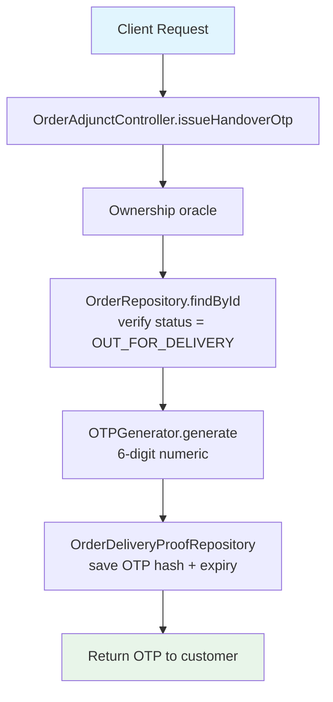

**Components:**
- **Controller:** `OrderAdjunctController.issueHandoverOtp()`
- **Service:** `DeliveryProofService`
- **Repository:** `OrderDeliveryProofRepository`
- **Database:** `order_delivery_proofs` (otpCodeHash, otpIssuedAt, otpExpiresAt)
- **Kafka:** None
- **Security:** OTP hashed before storage, expires in 10min

---

#### POST `/api/v1/orders/delivery/{orderId}/proof/verify`

**Purpose:** Verify delivery OTP.

**Auth:** Assigned Agent or Admin

**Query:** `otp`

**Response 200:** `{ "verified": true }`

**Flow:**
```mermaid
flowchart TD
    A[Client Request] --> B[OrderAdjunctController.verifyOtp]
    B --> C[Ownership check:<br/>assigned agent or admin]
    C --> D[OrderDeliveryProofRepository<br/>findByOrderId]
    D --> E[OTPGenerator.verify<br/>compare hash + check expiry]
    E -->|Valid| F[Mark proof as verified<br/>save verifiedAt]
    F --> G[Return {verified: true}]
    E -->|Invalid| H[Increment otpAttempts<br/>return 400]

    style A fill:#e1f5fe
    style G fill:#e8f5e9
    style H fill:#ffebee
```

**Components:**
- **Controller:** `OrderAdjunctController.verifyOtp()`
- **Service:** `DeliveryProofService`
- **Database:** `order_delivery_proofs`
- **Kafka:** None
- **Security:** Max 3 attempts, OTP expires in 10min

---

## 6. Payment

**Controller files:**
- `PaymentController.java`
- `PaymentWebhookController.java`
- `PaymentOperationsController.java`
- `WalletController.java`
- `InternalPaymentController.java`
- `DeliveryPaymentController.java`

### 6.1 Payments

#### POST `/api/v1/payments`

**Purpose:** Process a payment.

**Auth:** Customer

**Headers:** `Idempotency-Key: <uuid>`

**Request:**
```json
{
  "orderId": "order-uuid",
  "amount": 450.00,
  "paymentMethod": "CREDIT_CARD"
}
```

**Response 201:** `PaymentResponse`

**Flow:**
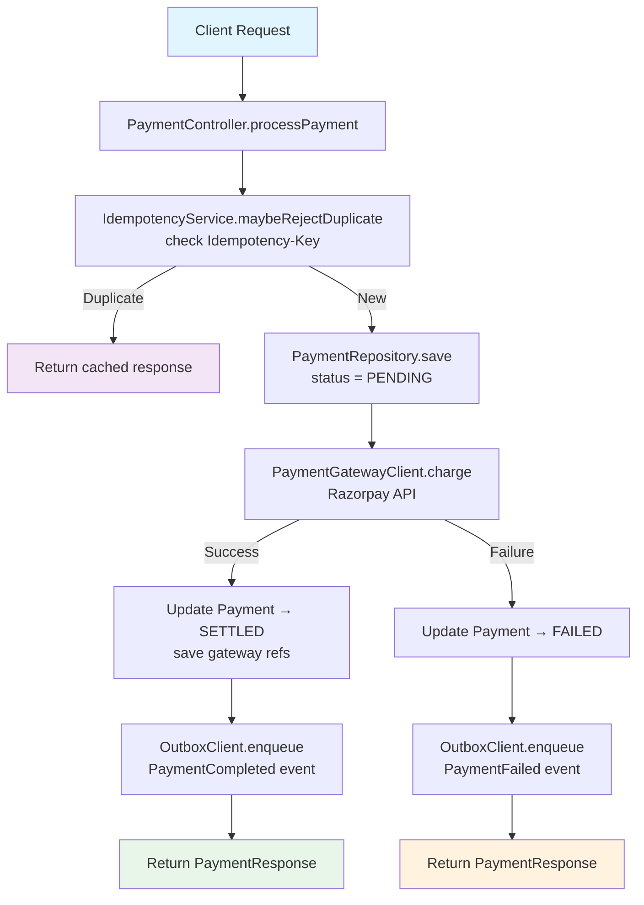

**Components:**
- **Controller:** `PaymentController.processPayment()`
- **Service:** `PaymentService.processPayment()`
- **Repository:** `PaymentRepository.save()`
- **Internal calls:** `PaymentGatewayClient.charge()` (Razorpay)
- **Database:** `payments`, `outbox_events`
- **Kafka:** `payment.events.v1` — `PaymentCompleted` or `PaymentFailed`
- **Idempotency:** `IdempotencyService.maybeRejectDuplicate()`
- **Downstream:** Order saga completion, notification, realtime, growth

---

#### GET `/api/v1/payments/{paymentId}`

**Purpose:** Get payment by ID.

**Auth:** Customer (self or admin)

**Response 200:** `PaymentResponse`

**Flow:**
```mermaid
flowchart TD
    A[Client Request] --> B[PaymentController.getPayment]
    B --> C[Ownership oracle:<br/>payment belongs to customer]
    C --> D[PaymentRepository.findById]
    D -->|Found| E[Map to PaymentResponse]
    E --> F[Return response]
    D -->|Not found| G[404 ResourceNotFoundException]

    style A fill:#e1f5fe
    style F fill:#e8f5e9
    style G fill:#ffebee
```

**Components:**
- **Controller:** `PaymentController.getPayment()`
- **Service:** `PaymentQueryService`
- **Repository:** `PaymentRepository.findById()`
- **Database:** `payments`
- **Kafka:** None

---

#### GET `/api/v1/payments/orders/{orderId}`

**Purpose:** Get payment for order.

**Auth:** Customer (self or admin)

**Response 200:** `PaymentResponse`

---

### 6.2 Refund & Dunning

#### POST `/api/v1/payments/{paymentId}/refund`

**Purpose:** Refund a payment.

**Auth:** ADMIN

**Query:** `reason`

**Response 202:** `PaymentResponse` (status → REFUNDED)

---

#### POST `/api/v1/payments/{paymentId}/dunning`

**Purpose:** Schedule dunning retry.

**Auth:** ADMIN

**Query:** `attempt` (default 1), `scheduledAt`

**Response 202:** `DunningRunResponse`

---

### 6.3 Wallet

#### GET `/api/v1/customers/{customerId}/wallet`

**Purpose:** Get wallet balance.

**Auth:** Customer (self or admin)

**Response 200:** `WalletResponse`

---

#### POST `/api/v1/customers/{customerId}/wallet/top-up`

**Purpose:** Top up wallet.

**Auth:** Customer (self or admin)

**Headers:** `Idempotency-Key`

**Request:** `{ "amount": 500.00 }`

**Response 201:** `WalletTransactionResponse`

---

#### POST `/api/v1/internal/wallet/credit`

**Purpose:** Credit wallet (service).

**Auth:** SERVICE or ADMIN

**Request:**
```json
{
  "customerId": "uuid",
  "amount": 100.00,
  "reference": "order-settlement"
}
```

**Response 201:** `WalletTransactionResponse`

---

### 6.4 Internal

#### POST `/api/v1/internal/payments/charge`

**Purpose:** Charge payment (order saga).

**Auth:** SERVICE or ADMIN

**Request:**
```json
{
  "orderId": "order-uuid",
  "customerId": "uuid",
  "amount": 450.00,
  "paymentMethod": "CREDIT_CARD",
  "reference": "order-123"
}
```

**Response 201:** `PaymentResponse`

---

#### POST `/api/v1/internal/payments/{paymentId}/refund`

**Purpose:** Refund payment (order saga).

**Auth:** SERVICE or ADMIN

**Response 202:** `PaymentResponse`

---

### 6.5 Webhooks

#### POST `/api/v1/payments/webhooks/razorpay`

**Purpose:** Razorpay webhook intake.

**Auth:** Webhook signature (`X-Razorpay-Signature`)

**Headers:** `X-Razorpay-Event-Id`

**Response 200:** `{ "received": true }`

**Flow:**
1. Verify HmacSHA256 signature
2. Deduplicate by `X-Razorpay-Event-Id`
3. Update payment status
4. Publish domain event

---

## 7. Delivery

**Controller files:**
- `AdminZoneController.java`
- `RiderWalletController.java`
- `CityInternalController.java`
- `DeliveryController.java`
- `ServiceabilityController.java`
- `RiderSelfController.java`
- `ServiceabilityCheckController.java`

### 7.1 Zones

#### GET `/api/v1/admin/zones`

**Purpose:** List all zones.

**Auth:** ADMIN

**Response 200:** `List<DeliveryZoneResponse>`

---

#### POST `/api/v1/admin/zones`

**Purpose:** Create zone.

**Auth:** ADMIN

**Request:**
```json
{
  "name": "South Mumbai",
  "cityId": 1,
  "geometry": "POLYGON((...))",
  "radiusKm": 5,
  "estimatedDeliveryMinutes": 30,
  "deliveryFee": 30,
  "isActive": true
}
```

**Response 201:** `DeliveryZoneResponse`

---

#### POST `/api/v1/zones/{zoneId}/surge`

**Purpose:** Add surge rule.

**Auth:** ADMIN

**Query:** `startTime`, `endTime`, `multiplier`

**Response 201:** `ZoneSurgeRuleResponse`

---

### 7.2 Serviceability

#### GET `/api/v1/serviceability/check`

**Purpose:** Check if location/serviceable.

**Auth:** Public

**Query:** `zoneName` OR (`restaurantId` + `latitude` + `longitude`), optional `subtotal`

**Response 200:**
```json
{
  "serviceable": true,
  "estimatedDeliveryMinutes": 30,
  "deliveryFee": 30,
  "surgeMultiplier": 1.0
}
```

---

### 7.3 Rider

#### GET `/api/v1/delivery/profile`

**Purpose:** Get own rider profile.

**Auth:** DELIVERY_AGENT

**Response 200:** `AgentProfileResponse`

---

#### PUT `/api/v1/delivery/toggle-availability`

**Purpose:** Toggle availability.

**Auth:** DELIVERY_AGENT

**Query:** `available` (true/false)

**Response 204:** No content.

---

#### PUT `/api/v1/delivery/update-location`

**Purpose:** Update live GPS.

**Auth:** DELIVERY_AGENT

**Query:** `latitude`, `longitude`

**Response 204:** No content.

---

#### POST `/api/v1/delivery/{orderId}/accept`

**Purpose:** Accept delivery assignment.

**Auth:** DELIVERY_AGENT

**Response 200:** `DeliveryAssignmentResponse`

---

#### POST `/api/v1/delivery/batches`

**Purpose:** Create delivery batch (max 10 orders).

**Auth:** DELIVERY_AGENT

**Request:** `{ "orderIds": ["id1", "id2"] }`

**Response 201:** `RiderDeliveryBatchResponse`

---

### 7.4 Assignment

#### POST `/api/v1/deliveries/orders/{orderId}/assign`

**Purpose:** Assign rider to order.

**Auth:** SERVICE or ADMIN

**Query:** `agentId`

**Response 200:** `DeliveryAssignmentResponse`

**Flow:**
```mermaid
flowchart TD
    A[Service Request] --> B[DeliveryController.assignOrder]
    B --> C[Validate order exists<br/>status = CONFIRMED]
    C --> D[DeliveryAgentRepository.findById<br/>verify agent available]
    D --> E[DeliveryAssignmentRepository.save<br/>status = ASSIGNED]
    E --> F[OrderRepository.updateStatus<br/>ASSIGNED]
    F --> G[OutboxClient.enqueue<br/>OrderStatusUpdated event]
    G --> H[Return DeliveryAssignmentResponse]

    style A fill:#e1f5fe
    style H fill:#e8f5e9
```

**Components:**
- **Controller:** `DeliveryController.assignOrder()`
- **Service:** `DeliveryAssignmentService.assign()`
- **Repositories:** `DeliveryAssignmentRepository`, `DeliveryAgentRepository`, `OrderRepository`
- **Database:** `delivery_assignments`, `delivery_agents`, `orders`, `outbox_events`
- **Kafka:** `order.events.v1` — `OrderStatusUpdated`
- **Downstream:** Realtime SSE → rider + kitchen + customer

---

#### POST `/api/v1/deliveries/orders/{orderId}/delivered`

**Purpose:** Mark delivered.

**Auth:** SERVICE or ADMIN

**Response 200:** Updated assignment.

**Flow:**
```mermaid
flowchart TD
    A[Service Request] --> B[DeliveryController.markDelivered]
    B --> C[DeliveryAssignmentRepository<br/>findByOrderId]
    C --> D[Update assignment → DELIVERED<br/>save deliveredAt]
    D --> E[OrderRepository.updateStatus<br/>DELIVERED]
    E --> F[OutboxClient.enqueue<br/>OrderStatusUpdated event]
    F --> G[Return updated assignment]

    style A fill:#e1f5fe
    style G fill:#e8f5e9
```

---

## 8. Social

**Controller files:**
- `PostController.java`
- `OrderFromPostController.java`

### 8.1 Posts

#### POST `/api/v1/social/posts`

**Purpose:** Create a social post.

**Auth:** Customer

**Rate limit:** 30/min (`social-create-post`)

**Request:**
```json
{
  "restaurantId": 1,
  "content": "Amazing pizza! 🍕",
  "mediaUrls": ["https://cdn.example.com/img.jpg"],
  "postType": "update",
  "latitude": 19.0760,
  "longitude": 72.8777
}
```

**Response 201:** `PostSummary`

**Flow:**
```mermaid
flowchart TD
    A[Client Request] --> B[PostController.createPost]
    B --> C[Extract userId from JWT<br/>PrincipalGuard.requireAuthenticated]
    C --> D[RestaurantClient.getRestaurant<br/>fetch restaurantName]
    D --> E[Build SocialPost entity<br/>status = active]
    E --> F[SocialPostRepository.save]
    F --> G[ApplicationEventPublisher<br/>publish PostCreatedEvent]
    G --> H[FeedInvalidationHandler.onPostCreated]
    H --> I[GeohashUtils.encode + neighbors]
    I --> J[RedisTemplate.convertAndSend<br/>feed:invalidation per cell]
    J --> K[Return PostSummary]

    style A fill:#e1f5fe
    style K fill:#e8f5e9
```

**Components:**
- **Controller:** `PostController.createPost()`
- **Service:** `SocialPostService.createPost()`
- **Repository:** `SocialPostRepository.save()`
- **Internal calls:** `RestaurantClient.getRestaurant()` (circuit breaker: `restaurantService`)
- **Database:** `social_posts`
- **Cache:** L1 Caffeine invalidate, L2 Redis SCAN+UNLINK
- **Kafka:** None (local event → Redis pub/sub)
- **Event:** `PostCreatedEvent` → feed invalidation per geohash cell

---

#### GET `/api/v1/social/posts/{id}`

**Purpose:** Get single post.

**Auth:** Public

**Response 200:** `PostSummary`

**Flow:**
```mermaid
flowchart TD
    A[Client Request] --> B[PostController.getPost]
    B --> C[SocialPostRepository.findById]
    C -->|Found| D[Check deletedAt is null]
    D -->|Active| E[Map to PostSummary]
    E --> F[Return response]
    D -->|Deleted| G[404 ResourceNotFoundException]
    C -->|Not found| G

    style A fill:#e1f5fe
    style F fill:#e8f5e9
    style G fill:#ffebee
```

**Components:**
- **Controller:** `PostController.getPost()`
- **Service:** `SocialPostService.getPost()`
- **Repository:** `SocialPostRepository.findById()`
- **Database:** `social_posts`
- **Cache:** None
- **Kafka:** None

---

#### DELETE `/api/v1/social/posts/{id}`

**Purpose:** Soft-delete post.

**Auth:** Customer (owner)

**Response 204:** No content.

**Flow:**
1. Verify ownership
2. Set `status=deleted`, `deleted_at=now()`
3. Publish `PostDeletedEvent` → invalidate feed caches

---

#### GET `/api/v1/social/posts/restaurant/{restaurantId}`

**Purpose:** Paginated restaurant posts.

**Auth:** Public

**Query:** `page`, `size`

**Response 200:** `List<PostSummary>`

---

#### GET `/api/v1/social/posts/user/{userId}`

**Purpose:** Paginated user posts.

**Auth:** Public

**Query:** `page`, `size`

**Response 200:** `List<PostSummary>`

---

### 8.2 Likes

#### POST `/api/v1/social/posts/{postId}/like`

**Purpose:** Like a post.

**Auth:** Customer

**Rate limit:** 300/min (`social-like`)

**Response 200:** `PostSummary`

**Flow:**
```mermaid
flowchart TD
    A[Client Request] --> B[PostController.likePost]
    B --> C[Extract userId from JWT]
    C --> D[SocialLikeService.toggleLike]
    D --> E[Redis: check social:post:liked<br/>existence flag]
    E -->|Already liked| F[Redis: DEL liked key<br/>DECR like counter]
    E -->|Not liked| G[Redis: SET liked key<br/>INCR like counter]
    F --> H[Redis: rightPush to social:like:queue]
    G --> H
    H --> I[Return PostSummary<br/>count from Redis]

    style A fill:#e1f5fe
    style I fill:#e8f5e9

    note[Async: LikeSyncService every 1s<br/>JDBC batch INSERT/DELETE<br/>UPDATE like_count]
```

**Components:**
- **Controller:** `PostController.likePost()`
- **Service:** `SocialLikeService.toggleLike()`
- **Redis (hot path):**
  - `social:post:liked:{postId}:{userId}` (SET/DEL, 7d TTL)
  - `social:post:likes:{postId}` (INCR/DECR, 7d TTL)
  - `social:like:queue` (RPUSH, 1h TTL, max 500k)
- **Database:** No DB write on hot path
- **Async sync:** `LikeSyncService.batchSyncLikes()` every 1s → batch INSERT/DELETE `post_likes` + UPDATE `like_count`
- **Kafka:** None

---

#### DELETE `/api/v1/social/posts/{postId}/like`

**Purpose:** Unlike a post.

**Auth:** Customer

**Rate limit:** 300/min (`social-unlike`)

**Response 200:** `PostSummary`

**Flow:**
```mermaid
flowchart TD
    A[Client Request] --> B[PostController.unlikePost]
    B --> C[Extract userId from JWT]
    C --> D[SocialLikeService.toggleLike]
    D --> E[Redis: check social:post:liked<br/>existence flag]
    E -->|Exists| F[Redis: DEL liked key<br/>DECR like counter]
    E -->|Not exists| G[No-op]
    F --> H[Redis: rightPush to social:like:queue<br/>liked=0]
    H --> I[Return PostSummary]
    G --> I

    style A fill:#e1f5fe
    style I fill:#e8f5e9
```

**Components:**
- **Controller:** `PostController.unlikePost()`
- **Service:** `SocialLikeService.toggleLike()`
- **Redis:** Same as like endpoint
- **Async sync:** Same as like endpoint

---

### 8.3 Comments

#### POST `/api/v1/social/posts/{postId}/comments`

**Purpose:** Add comment.

**Auth:** Customer

**Rate limit:** 60/min (`social-comment`)

**Request:**
```json
{
  "content": "Looks delicious!",
  "parentCommentId": null
}
```

**Response 201:** `CommentResponse`

**Flow:**
```mermaid
flowchart TD
    A[Client Request] --> B[PostController.commentOnPost]
    B --> C[Extract userId from JWT]
    C --> D[SocialPostRepository.findById<br/>verify post exists]
    D --> E[Build PostComment entity<br/>postId, userId, content]
    E --> F[PostCommentRepository.save]
    F --> G[SocialPostRepository.incrementCommentCount<br/>+1]
    G --> H[Return CommentResponse]

    style A fill:#e1f5fe
    style H fill:#e8f5e9
```

**Components:**
- **Controller:** `PostController.commentOnPost()`
- **Service:** `SocialPostService.addComment()`
- **Repositories:** `PostCommentRepository.save()`, `SocialPostRepository.incrementCommentCount()`
- **Database:** `post_comments`, `social_posts`
- **Transaction:** `@Transactional` — comment insert + count update atomic
- **Kafka:** None

---

#### GET `/api/v1/social/posts/{postId}/comments`

**Purpose:** List top-level comments.

**Auth:** Public

**Response 200:** `List<CommentResponse>`

**Flow:**
```mermaid
flowchart TD
    A[Client Request] --> B[PostController.getComments]
    B --> C[PostCommentRepository<br/>findByPostIdAndParentIsNull]
    C --> D[Map to CommentResponse DTOs]
    D --> E[Return List<CommentResponse>]

    style A fill:#e1f5fe
    style E fill:#e8f5e9
```

**Components:**
- **Controller:** `PostController.getComments()`
- **Service:** `SocialPostService.getComments()`
- **Repository:** `PostCommentRepository.findByPostIdAndParentCommentIdIsNull()`
- **Database:** `post_comments` (read replica)
- **Kafka:** None

---

### 8.4 Feed

#### GET `/api/v1/social/feed/nearby`

**Purpose:** Geospatial nearby feed.

**Auth:** Public

**Rate limit:** 200/min (`social-feed`)

**Query:** `lat`, `lng`, `radiusKm` (default 5), `cursor`, `size` (default 20, max 100)

**Response 200:**
```json
{
  "posts": [
    {
      "id": "post-1",
      "restaurantName": "Pizza Hut",
      "authorName": "John",
      "content": "Amazing pizza!",
      "likeCount": 42,
      "commentCount": 5,
      "createdAt": "2026-09-19T08:00:00Z"
    }
  ],
  "nextCursor": "2026-09-19T08:00:00Z",
  "hasMore": true
}
```

**Flow:**
```mermaid
flowchart TD
    A[Client Request] --> B[PostController.nearbyFeed]
    B --> C[SocialFeedService.getNearbyFeed]
    C --> D[FeedCacheService.getNearbyFeed<br/>L1/L2 cache lookup]
    D -->|Hit| E[Return cached FeedResponse]
    D -->|Miss| F[GeohashUtils.encode<br/>compute geohash + neighbors]
    F --> G[Load segment post IDs<br/>Redis ZSet feed:nearby:ids:{geohash}]
    G -->|Empty| H[L3 DB fallback:<br/>findActivePostsWithinRadius]
    G -->|Has IDs| I{Load Bloom filter<br/>feed:post:detail:bloom:{geohash}}
    I -->|Miss| H
    I -->|Hit| J[Parallel enrichment:<br/>RestaurantClient.getRestaurant<br/>feedEnrichmentExecutor]
    J --> K[Build FeedResponse]
    H --> K
    K --> L[Cache in FeedCacheService<br/>L1 + L2]
    L --> M[Return FeedResponse]

    style A fill:#e1f5fe
    style E fill:#e8f5e9
    style M fill:#e8f5e9
    style H fill:#fff3e0
```

**Components:**
- **Controller:** `PostController.nearbyFeed()`
- **Service:** `SocialFeedService.getNearbyFeed()`
- **Cache layers:**
  - L1: Caffeine (30s TTL, 100K max)
  - L2: Redis (10min TTL)
  - Segments: Redis ZSet per geohash (2h TTL)
  - Post details: Redis string per post (60s TTL)
- **Internal calls:** `RestaurantClient.getRestaurant()` (circuit breaker: `restaurantService`)
- **Database:** `findActivePostsWithinRadius()` Haversine query (fallback)
- **Kafka:** None (cache invalidation via Redis pub/sub)
- **Performance target:** <5ms at cache hit

---

### 8.5 Order from Post

#### POST `/api/v1/social/posts/{postId}/order`

**Purpose:** Create order from social post.

**Auth:** Customer

**Rate limit:** 50/min (`social-order`)

**Headers:** `Idempotency-Key`

**Request:**
```json
{
  "items": [
    {
      "menuItemId": 42,
      "quantity": 2
    }
  ],
  "deliveryAddressId": "addr-123"
}
```

**Response 201:** `OrderResponse`

**Flow:**
```mermaid
flowchart TD
    A[Client Request] --> B[OrderFromPostController.createOrderFromPost]
    B --> C[Extract userId from JWT]
    C --> D[Parallel: fetch post + validate restaurant]
    D --> E[SocialPostRepository.findById]
    E -->|Not found| F[404 ResourceNotFoundException]
    E -->|Found| G[RestaurantClient.getRestaurant<br/>verify restaurant active]
    G -->|Not found| H[404 BusinessException]
    G -->|Found| I[Parallel: validate menu items<br/>RestaurantClient.getMenuItem per item]
    I -->|Invalid| J[400 Bad Request]
    I -->|Valid| K[IdempotencyService.claim<br/>REQUIRES_NEW transaction]
    K -->|Duplicate| L[Replay cached response]
    K -->|New| M[OrderServiceClient.createOrderFromPost<br/>circuit breaker: orderService]
    M -->|Success| N[PostOrderConversionService.recordConversion<br/>+ OutboxClient.enqueue]
    N --> O[IdempotencyService.complete<br/>store response envelope]
    O --> P[Return OrderResponse]
    M -->|Failure| Q[IdempotencyService.markFailed]
    Q --> R[Client retries → re-run]

    style A fill:#e1f5fe
    style P fill:#e8f5e9
    style L fill:#f3e5f5
    style Q fill:#ffebee

    subgraph Validation [Parallel Validation]
        D
        E
        G
        I
    end

    subgraph Idempotency [Idempotency Guard]
        K
        L
        O
        Q
        R
    end
```

**Components:**
- **Controller:** `OrderFromPostController.createOrderFromPost()`
- **Service:** `OrderFromPostService`, `OrderFromPostIdempotencyService`
- **Internal calls:**
  - `RestaurantClient.getRestaurant()` (circuit breaker: `restaurantService`)
  - `RestaurantClient.getMenuItem()` (parallel per item)
  - `OrderServiceClient.createOrderFromPost()` (circuit breaker: `orderService`)
- **Idempotency:** `idempotency_records` table + Redis result cache (scope: `ORDER_FROM_POST`)
- **Database:** `post_order_conversions`, `idempotency_records`, `outbox_events`
- **Kafka:** Outbox event `OrderFromPost`
- **Transaction boundaries:**
  1. Idempotency claim (REQUIRES_NEW)
  2. Order creation (order service)
  3. Conversion record + outbox (same transaction)

---

## 9. Notification

**File:** `NotificationController.java`

### 9.1 Dispatch & Test

#### POST `/api/v1/notifications`

**Purpose:** Dispatch notification (admin).

**Auth:** ADMIN (rate-limited 60/min)

**Request:**
```json
{
  "channel": "PUSH",
  "recipient": "user-id",
  "template": "ORDER_CONFIRMED",
  "subject": "Order confirmed!",
  "body": "Your order #123 is confirmed."
}
```

**Response 202:** `{ "notificationId": "uuid" }`

**Flow:**
```mermaid
flowchart TD
    A[Admin Request] --> B[NotificationController.dispatch]
    B --> C[Validate template exists<br/>Rate limit: 60/min]
    C --> D[NotificationService.dispatch]
    D --> E{Channel type?}
    E -->|PUSH| F[PushSender.send<br/>FCM/APNS]
    E -->|SMS| G[TwilioSmsSender.send]
    E -->|EMAIL| H[EmailSender.send<br/>SMTP/SendGrid]
    F --> I[NotificationRepository.save<br/>status = SENT]
    G --> I
    H --> I
    I --> J[Return 202 Accepted]

    style A fill:#e1f5fe
    style J fill:#e8f5e9
```

**Components:**
- **Controller:** `NotificationController.dispatch()`
- **Service:** `NotificationService.dispatch()`
- **Senders:** `PushSender`, `TwilioSmsSender`, `EmailSender` (all with circuit breaker + bulkhead)
- **Repository:** `NotificationRepository.save()`
- **Database:** `notifications`
- **Cache:** None
- **Kafka:** None (direct send; async via `notification.events.v1` for event-driven triggers)

**Rate limit:** `edge-notification` bucket, 60/min per admin

---

#### POST `/api/v1/notifications/test`

**Purpose:** Send test notification.

**Auth:** ADMIN (rate-limited 60/min)

**Request:** Optional `{ "channel": "EMAIL", "recipient": "test@example.com" }`

**Response 202:** `{ "sent": true }`

**Flow:**
```mermaid
flowchart TD
    A[Admin Request] --> B[NotificationController.test]
    B --> C[Rate limit: 60/min]
    C --> D[NotificationService.sendTest]
    D --> E[Selected sender.send<br/>test payload]
    E --> F[Return {sent: true}]

    style A fill:#e1f5fe
    style F fill:#e8f5e9
```

---

## 10. Search

**File:** `SearchController.java`

### 10.1 Search & Autocomplete

#### GET `/api/v1/search`

**Purpose:** Unified search (restaurants + menu items).

**Auth:** Public

**Query:** `keyword`

**Response 200:** `UnifiedSearchResponse`

**Flow:**
```mermaid
flowchart TD
    A[Client Request] --> B[SearchController.search]
    B --> C[Extract keyword query param]
    C --> D[SearchService.unifiedSearch]
    D --> E{L1/L2 cache hit?}
    E -->|Hit| F[Return cached result]
    E -->|Miss| G[ElasticsearchSearchClient.search<br/>restaurants + menu items]
    G -->|ES down| H[PostgreSQL fallback<br/>restaurant_documents + menu_item_search_entities]
    H --> I[Build UnifiedSearchResponse]
    G --> I
    I --> J[Cache result L1/L2]
    J --> K[Return response]
    F --> K

    style A fill:#e1f5fe
    style K fill:#e8f5e9
    style H fill:#fff3e0
```

**Components:**
- **Controller:** `SearchController.search()`
- **Service:** `SearchService.unifiedSearch()`
- **Client:** `ElasticsearchSearchClient`
- **Cache:** L1 (60s) → L2 (300s) → Elasticsearch → PostgreSQL
- **Database:** `restaurant_documents`, `menu_item_search_entities` (fallback)
- **Kafka:** `restaurant.events.v1` → index updates

---

#### GET `/api/v1/search/suggest`

**Purpose:** Autocomplete suggestions.

**Auth:** Public

**Query:** `q`, `limit` (default 8, max 50)

**Response 200:** `List<AutocompleteSuggestion>`

**Flow:**
```mermaid
flowchart TD
    A[Client Request] --> B[SearchController.suggest]
    B --> C[SearchService.autocomplete]
    C --> D{L1 cache hit?}
    D -->|Hit| E[Return cached suggestions]
    D -->|Miss| F[ElasticsearchSearchClient.suggest]
    F --> G[Return AutocompleteSuggestion list]
    G --> H[Cache result]
    H --> I[Return response]
    E --> I

    style A fill:#e1f5fe
    style I fill:#e8f5e9
```

---

## 11. Admin Analytics

**Controller files:**
- `AdminOpsController.java`
- `AdminUserOpsController.java`
- `AdminPromotionController.java`
- `AnalyticsExportController.java`
- `AdminOperationsController.java`
- `AdminController.java`
- `FraudScoringController.java`
- `CustomerComplianceController.java`
- `AdminGrowthController.java`
- `ExperimentAdminController.java`
- `FeatureFlagController.java`
- `ChurnAdminController.java`

### 11.1 Ops & Dashboard

#### GET `/api/v1/admin/dashboard`
 
**Purpose:** Platform KPI dashboard.
 
**Auth:** ADMIN
 
**Response 200:** Aggregate stats (orders, revenue, users).
 
**Flow:**
```mermaid
flowchart TD
    A[Admin Request] --> B[AdminOpsController.dashboard]
    B --> C[Auth check: ADMIN role]
    C -->|Unauthorized| D[403 Forbidden]
    C -->|Authorized| E[DashboardService.getPlatformStats]
    E --> F[OrderRepository.countToday]
    E --> G[OrderRepository.sumAmountToday]
    E --> H[UserRepository.countNewToday]
    E --> I[RestaurantRepository.countActive]
    F --> J[Aggregate stats]
    G --> J
    H --> J
    I --> J
    J --> K[Return DashboardResponse]
    D --> K
```
 
**Components:**
- **Controller:** `AdminOpsController.dashboard()`
- **Service:** `DashboardService.getPlatformStats()`
- **Repository:** `OrderRepository`, `UserRepository`, `RestaurantRepository`
- **Database:** `orders`, `users`, `restaurants` (read replicas)
- **Kafka:** None (real-time aggregations)
- **Cache:** L1 caffeine for 30s, L2 Redis for 2m

#### GET `/api/v1/admin/fraud/dashboard`
 
**Purpose:** Fraud dashboard.
 
**Auth:** ADMIN
 
**Response 200:** Fraud metrics.
 
**Flow:**
```mermaid
flowchart TD
    A[Admin Request] --> B[AdminUserOpsController.fraudDashboard]
    B --> C[Auth check: ADMIN role]
    C -->|Unauthorized| D[403 Forbidden]
    C -->|Authorized| E[FraudService.getFraudMetrics]
    E --> F[FraudEventRepository.countBySeverity]
    E --> G[FraudEventRepository.countByRule]
    E --> H[UserRepository.countFlaggedUsers]
    F --> I[Aggregate fraud metrics]
    G --> I
    H --> I
    I --> J[Return FraudDashboardResponse]
    D --> J
```
 
**Components:**
- **Controller:** `AdminUserOpsController.fraudDashboard()`
- **Service:** `FraudService.getFraudMetrics()`
- **Repository:** `FraudEventRepository`, `UserRepository`
- **Database:** `fraud_events`, `users`
- **Kafka:** Consumes `fraud.events.v1` for real-time updates
- **Cache:** Redis cache for 5m

#### GET `/api/v1/admin/revenue`
 
**Purpose:** Platform revenue aggregate.
 
**Auth:** ADMIN
 
**Query:** `days` (default 7)
 
**Response 200:** Revenue summary.
 
**Flow:**
```mermaid
flowchart TD
    A[Admin Request] --> B[AdminGrowthController.revenue]
    B --> C[Auth check: ADMIN role]
    C -->|Unauthorized| D[403 Forbidden]
    C -->|Authorized| E[RevenueService.getRevenueSummary]
    E --> F[Parse days parameter]
    E --> G[PaymentRepository.sumByDateRange]
    E --> H[PaymentRepository.countByDateRange]
    E --> I[PaymentRepository.averageByDateRange]
    G --> J[Calculate revenue summary]
    H --> J
    I --> J
    J --> K[Return RevenueSummaryResponse]
    D --> K
```
 
**Components:**
- **Controller:** `AdminGrowthController.revenue()`
- **Service:** `RevenueService.getRevenueSummary()`
- **Repository:** `PaymentRepository`
- **Database:** `payments` (read replica)
- **Kafka:** None
- **Cache:** Redis cache keyed by date range for 1h

### 11.2 Exports

#### GET `/api/v1/analytics/export/orders`
 
**Purpose:** Export orders CSV.
 
**Auth:** ADMIN
 
**Query:** `fromDate`, `toDate`
 
**Response 200:** CSV binary.
 
**Flow:**
```mermaid
flowchart TD
    A[Admin Request] --> B[AnalyticsExportController.exportOrders]
    B --> C[Auth check: ADMIN role]
    C -->|Unauthorized| D[403 Forbidden]
    C -->|Authorized| E[ExportService.generateOrdersCsv]
    E --> F[Parse date parameters]
    E --> G[OrderRepository.findByDateRange]
    G --> H[Stream to CSV writer]
    H --> I[Write CSV rows]
    I --> J[Return CSV binary]
    D --> J
```
 
**Components:**
- **Controller:** `AnalyticsExportController.exportOrders()`
- **Service:** `ExportService.generateOrdersCsv()`
- **Repository:** `OrderRepository`
- **Database:** `orders`, `order_items` (read replica)
- **Kafka:** None
- **Note:** Uses streaming to avoid memory issues with large exports

### 11.3 Feature Flags

#### PUT `/api/v1/admin/feature-flags/{key}`
 
**Purpose:** Set feature flag.
 
**Auth:** ADMIN
 
**Query:** `value` (nullable to revert)
 
**Response 200:** Updated flag.
 
**Flow:**
```mermaid
flowchart TD
    A[Admin Request] --> B[FeatureFlagController.setFeatureFlag]
    B --> C[Auth check: ADMIN role]
    C -->|Unauthorized| D[403 Forbidden]
    C -->|Authorized| E[FeatureFlagService.setFlag]
    E --> F[Validate feature key exists]
    F -->|Invalid| G[400 Bad Request]
    F -->|Valid| H[Update feature_flags table]
    H --> I[Publish FeatureFlagUpdated event]
    I --> J[Return UpdatedFlagResponse]
    D --> J
    G --> J
```
 
**Components:**
- **Controller:** `FeatureFlagController.setFeatureFlag()`
- **Service:** `FeatureFlagService.setFlag()`
- **Repository:** `FeatureFlagRepository`
- **Database:** `feature_flags`
- **Kafka:** `config.events.v1` — `FeatureFlagUpdated`
- **Cache:** Invalidates Redis cache for feature flag

### 11.4 Fraud

#### POST `/api/v1/admin/fraud`
 
**Purpose:** Flag fraud event.
 
**Auth:** ADMIN
 
**Request:**
```json
{
  "customerId": "uuid",
  "rule": "MULTIPLE_DEVICES",
  "severity": "HIGH"
}
```
 
**Response 201:** `FraudEventResponse`
 
**Flow:**
```mermaid
flowchart TD
    A[Admin Request] --> B[FraudScoringController.flagFraud]
    B --> C[Auth check: ADMIN role]
    C -->|Unauthorized| D[403 Forbidden]
    C -->|Authorized| E[FraudService.createFraudEvent]
    E --> F[Validate customer exists]
    F -->|Invalid| G[404 Not Found]
    F -->|Valid| H[FraudEventRepository.save]
    H --> I[OutboxClient.enqueue FraudCreated event]
    I --> J[Return FraudEventResponse]
    D --> J
    G --> J
```
 
**Components:**
- **Controller:** `FraudScoringController.flagFraud()`
- **Service:** `FraudService.createFraudEvent()`
- **Repository:** `FraudEventRepository`
- **Database:** `fraud_events`, `outbox_events`
- **Kafka:** `fraud.events.v1` — `FraudCreated`
- **Downstream:** Notification service → alert fraud team
- **Transaction:** `@Transactional` — fraud event + outbox atomic

## 12. Referral

**File:** `ReferralController.java`

### 12.1 Referral Management

#### POST `/api/v1/referrals/generate`

**Purpose:** Generate own referral code.

**Auth:** Customer

**Response 201:** `{ "code": "ABC123" }`

**Flow:**
```mermaid
flowchart TD
    A[Client Request] --> B[ReferralController.generate]
    B --> C[Extract userId from JWT]
    C --> D[ReferralService.generateCode]
    D --> E[UserReferralCodeRepository<br/>findByUserId]
    E -->|Exists| F[Return existing code]
    E -->|New| G[Generate unique code<br/>UserReferralCodeRepository.save]
    G --> H[Return new code]

    style A fill:#e1f5fe
    style H fill:#e8f5e9
    style F fill:#f3e5f5
```

**Components:**
- **Controller:** `ReferralController.generate()`
- **Service:** `ReferralService.generateCode()`
- **Repository:** `UserReferralCodeRepository`
- **Database:** `user_referral_codes`
- **Kafka:** None

---

#### GET `/api/v1/referrals/validate/{code}`

**Purpose:** Validate referral code.

**Auth:** Public

**Response 200:** `{ "valid": true, "referrerId": "uuid", "rewardAmount": 50 }`

**Flow:**
```mermaid
flowchart TD
    A[Client Request] --> B[ReferralController.validate]
    B --> C[Extract code from path]
    C --> D[UserReferralCodeRepository<br/>findByCode]
    D -->|Found| E[Return {valid: true,<br/>referrerId, rewardAmount}]
    D -->|Not found| F[Return {valid: false}]

    style A fill:#e1f5fe
    style E fill:#e8f5e9
    style F fill:#ffebee
```

---

#### POST `/api/v1/referrals/internal/apply`
 
**Purpose:** Apply referral to new signup.
 
**Auth:** SERVICE or ADMIN
 
**Request:**
```json
{
  "customerId": "new-user-id",
  "customerEmail": "new@example.com",
  "referralCode": "ABC123"
}
```
 
**Response 201:** `ReferralRecordResponse`
 
**Flow:**
```mermaid
flowchart TD
    A[Service Request] --> B[ReferralController.applyReferral]
    B --> C[Auth check: SERVICE or ADMIN role]
    C -->|Unauthorized| D[403 Forbidden]
    C -->|Authorized| E[ReferralService.applyReferral]
    E --> F[Validate referral code exists]
    F -->|Invalid| G[400 Bad Request]
    F -->|Valid| H[Check if customer already used referral]
    H -->|Already used| I[409 Conflict]
    H -->|Not used| J[UserReferralCodeRepository.findByCode]
    J -->|Not found| K[400 Invalid referral code]
    J -->|Found| L[Check if referral belongs to customer]
    L -->|Belongs to same customer| M[400 Self-referral not allowed]
    L -->|Valid referral| N[UserReferralCodeRepository.save usage]
    N --> O[ReferralRecordRepository.save]
    O --> P[OutboxClient.enqueue ReferralApplied event]
    P --> Q[Return ReferralRecordResponse]
    D --> Q
    G --> Q
    I --> Q
    K --> Q
    M --> Q
```
 
**Components:**
- **Controller:** `ReferralController.applyReferral()`
- **Service:** `ReferralService.applyReferral()`
- **Repository:** `UserReferralCodeRepository`, `ReferralRecordRepository`
- **Database:** `user_referral_codes`, `referral_records`, `outbox_events`
- **Kafka:** `referral.events.v1` — `ReferralApplied`
- **Downstream:** Growth service → credit referral bonus to referrer's wallet
- **Transaction:** `@Transactional` — referral application + outbox atomic
- **Idempotency:** Prevents duplicate application via unique constraint on (customer_id, referral_code)

## 13. Support Ticket

**Files:** `DisputeController.java`, `SupportTicketController.java`

### 13.1 Disputes

#### POST `/api/v1/customers/orders/{orderId}/disputes`

**Purpose:** File dispute.

**Auth:** Customer

**Request:**
```json
{
  "type": "FOOD_QUALITY",
  "description": "Food was cold",
  "refundAmount": 450.00
}
```

**Response 201:** `DisputeResponse`

**Flow:**
```mermaid
flowchart TD
    A[Client Request] --> B[DisputeController.fileDispute]
    B --> C[Extract orderId, userId from JWT]
    C --> D[OrderOwnershipClient<br/>verify order ownership]
    D -->|Not owner| E[403 AccessDeniedException]
    D -->|Owner| F[DisputeRepository.save<br/>status = OPEN]
    F --> G[OutboxClient.enqueue<br/>DisputeCreated event]
    G --> H[Return DisputeResponse]

    style A fill:#e1f5fe
    style H fill:#e8f5e9
    style E fill:#ffebee
```

**Components:**
- **Controller:** `DisputeController.fileDispute()`
- **Service:** `DisputeService.create()`
- **Internal calls:** `OrderOwnershipClient` (order service oracle)
- **Repository:** `DisputeRepository.save()`
- **Database:** `disputes`, `outbox_events`
- **Kafka:** `dispute.events.v1` — `DisputeCreated`
- **Transaction:** `@Transactional` — dispute + outbox atomic

---

#### POST `/api/v1/admin/disputes/{disputeId}/resolve`

**Purpose:** Resolve dispute.

**Auth:** ADMIN or SERVICE

**Request:**
```json
{
  "resolution": "REFUND_APPROVED",
  "refundAmount": 450.00,
  "notes": "Refund approved"
}
```

**Response 200:** Updated dispute.

**Flow:**
```mermaid
flowchart TD
    A[Admin Request] --> B[DisputeController.resolve]
    B --> C[DisputeRepository.findById]
    C -->|Not found| D[404 ResourceNotFoundException]
    C -->|Found| E[Update dispute:<br/>resolution, refundAmount, resolvedBy]
    E --> F[OutboxClient.enqueue<br/>DisputeResolved event]
    F --> G[Return updated dispute]
    D --> G

    style A fill:#e1f5fe
    style G fill:#e8f5e9
    style D fill:#ffebee
```

**Components:**
- **Controller:** `DisputeController.resolve()`
- **Service:** `DisputeService.resolve()`
- **Database:** `disputes`, `outbox_events`
- **Kafka:** `dispute.events.v1` — `DisputeResolved`
- **Downstream:** Payment service → wallet credit on refund

---

### 13.2 Support Tickets

#### POST `/api/v1/support/tickets`
 
**Purpose:** Create support ticket.
 
**Auth:** Customer
 
**Request:**
```json
{
  "orderId": "order-uuid",
  "type": "DELIVERY_ISSUE",
  "subject": "Wrong item delivered",
  "description": "..."
}
```
 
**Response 201:** `SupportTicketResponse`
 
**Flow:**
```mermaid
flowchart TD
    A[Client Request] --> B[SupportTicketController.createTicket]
    B --> C[Extract customerId from JWT]
    C --> D[TicketService.createTicket]
    D --> E[Validate orderId belongs to customer]
    E -->|Invalid| F[403 Forbidden]
    E -->|Valid| G[SupportTicketRepository.save]
    G --> H[OutboxClient.enqueue TicketCreated event]
    H --> I[Return SupportTicketResponse]
    F --> I
```
 
**Components:**
- **Controller:** `SupportTicketController.createTicket()`
- **Service:** `TicketService.createTicket()`
- **Repository:** `SupportTicketRepository`
- **Database:** `support_tickets`, `outbox_events`
- **Kafka:** `ticket.events.v1` — `TicketCreated`
- **Downstream:** Notification service → alert support team
- **Transaction:** `@Transactional` — ticket creation + outbox atomic

## 14. Survey

**File:** `SurveyController.java`

### 14.1 Surveys & Trending

#### POST `/api/v1/reviews/survey`

**Purpose:** Submit delivery satisfaction survey.

**Auth:** CUSTOMER

**Request:**
```json
{
  "orderId": "order-uuid",
  "restaurantId": 1,
  "ratingDelivery": 5,
  "ratingFood": 4,
  "ratingSpeed": 5,
  "comment": "Great service!"
}
```

**Response 201:** `SurveyResponse`

**Flow:**
```mermaid
flowchart TD
    A[Client Request] --> B[SurveyController.submit]
    B --> C[Extract customerId from JWT]
    C --> D[OrderOwnershipClient<br/>verify order ownership]
    D -->|Not owner| E[403 AccessDeniedException]
    D -->|Owner| F[DeliverySurveyRepository.save<br/>survey + ratings]
    F --> G[OutboxClient.enqueue<br/>SurveySubmitted event]
    G --> H[Return SurveyResponse]

    style A fill:#e1f5fe
    style H fill:#e8f5e9
    style E fill:#ffebee
```

**Components:**
- **Controller:** `SurveyController.submit()`
- **Service:** `SurveyService.submit()`
- **Internal calls:** `OrderOwnershipClient` (order service oracle)
- **Repository:** `DeliverySurveyRepository.save()`
- **Database:** `delivery_surveys`, `outbox_events`
- **Kafka:** `survey.events.v1` — `SurveySubmitted`
- **Business rule:** One survey per delivered order (idempotent)

---

#### GET `/api/v1/restaurants/public/{restaurantId}/survey-ratings`

**Purpose:** Get avg survey ratings.

**Auth:** Public

**Response 200:** `{ "avgDelivery": 4.5, "avgFood": 4.2, "avgSpeed": 4.3, "count": 120 }`

**Flow:**
```mermaid
flowchart TD
    A[Client Request] --> B[SurveyController.ratings]
    B --> C[DeliverySurveyRepository<br/>aggregateByRestaurantId]
    C --> D[Calculate averages + count]
    D --> E[Return SurveyRatingsResponse]

    style A fill:#e1f5fe
    style E fill:#e8f5e9
```

---

## 15. Growth

**Files:** `GrowthController.java`, `LoyaltySelfController.java`

### 15.1 Loyalty & Campaigns

#### GET `/api/v1/campaigns/active`

**Purpose:** List active campaigns.

**Auth:** Public

**Response 200:** `List<CampaignResponse>`

**Flow:**
```mermaid
flowchart TD
    A[Client Request] --> B[GrowthController.activeCampaigns]
    B --> C[CampaignRepository.findActive]
    C --> D[Map to CampaignResponse DTOs]
    D --> E[Return List<CampaignResponse]

    style A fill:#e1f5fe
    style E fill:#e8f5e9
```

**Components:**
- **Controller:** `GrowthController.activeCampaigns()`
- **Service:** `CampaignService`
- **Repository:** `CampaignRepository.findActive()`
- **Database:** `campaigns`
- **Kafka:** None

---

#### POST `/api/v1/customers/{customerId}/loyalty/credit`

**Purpose:** Credit loyalty points.

**Auth:** SERVICE or ADMIN

**Query:** `points`, `reason`

**Headers:** `Idempotency-Key`

**Response 201:** `LoyaltyPointsResponse`

**Flow:**
```mermaid
flowchart TD
    A[Service Request] --> B[LoyaltySelfController.credit]
    B --> C[IdempotencyService.maybeRejectDuplicate<br/>LOYALTY_CREDIT scope]
    C -->|Duplicate| D[Return cached response]
    C -->|New| E[Validate daily cap<br/>max 10000 points/day]
    E -->|Exceeded| F[422 LoyaltyDailyCapExceededException]
    E -->|OK| G[LoyaltyLedgerRepository.save<br/>type = EARN]
    G --> H[LoyaltyBalanceRepository.upsert<br/>increment balance]
    H --> I[OutboxClient.enqueue<br/>LoyaltyCredited event]
    I --> J[Return LoyaltyPointsResponse]
    F --> J
    D --> J

    style A fill:#e1f5fe
    style J fill:#e8f5e9
    style F fill:#ffebee
```

**Components:**
- **Controller:** `LoyaltySelfController.credit()`
- **Service:** `LoyaltyService.credit()`
- **Repository:** `LoyaltyLedgerRepository`, `LoyaltyBalanceRepository`
- **Database:** `loyalty_points_ledger`, `loyalty_point_balances`
- **Kafka:** `growth.events.v1` — `LoyaltyCredited`
- **Idempotency:** `IdempotencyService` with `LOYALTY_CREDIT` scope

---

#### POST `/api/v1/customers/{customerId}/loyalty/redeem`
 
**Purpose:** Redeem loyalty points.
 
**Auth:** Customer (self or admin)
 
**Query:** `points`
 
**Response 200:** `LoyaltyPointsResponse`
 
**Flow:**
```mermaid
flowchart TD
    A[Client Request] --> B[LoyaltySelfController.redeem]
    B --> C[Auth check: customerId matches JWT or ADMIN]
    C -->|Unauthorized| D[403 Forbidden]
    C -->|Authorized| E[LoyaltyService.redeemPoints]
    E --> F[Validate points > 0]
    F -->|Invalid| G[400 Bad Request]
    F -->|Valid| H[LoyaltyBalanceRepository.findByCustomerId]
    H -->|Not found| I[404 Loyalty account not found]
    H -->|Found| J[Check sufficient balance]
    J -->|Insufficient| K[400 Insufficient points]
    J -->|Sufficient| L[LoyaltyLedgerRepository.save<br/>type = REDEEM]
    L --> M[LoyaltyBalanceRepository.upsert<br/>decrement balance]
    M --> N[OutboxClient.enqueue LoyaltyRedeemed event]
    N --> O[Return LoyaltyPointsResponse]
    D --> O
    G --> O
    I --> O
    K --> O
```
 
**Components:**
- **Controller:** `LoyaltySelfController.redeem()`
- **Service:** `LoyaltyService.redeemPoints()`
- **Repository:** `LoyaltyLedgerRepository`, `LoyaltyBalanceRepository`
- **Database:** `loyalty_points_ledger`, `loyalty_point_balances`, `outbox_events`
- **Kafka:** `growth.events.v1` — `LoyaltyRedeemed`
- **Downstream:** Notification service → confirmation to customer
- **Transaction:** `@Transactional` — ledger entry + balance update + outbox atomic

## 16. Realtime

**File:** `LiveStreamController.java`

All endpoints are **SSE (Server-Sent Events)**.

### 16.1 SSE Streams

#### GET `/api/v1/live/kitchen/{restaurantId}`

**Purpose:** Kitchen order stream.

**Auth:** RESTAURANT_OWNER (owner-of), ADMIN, or SERVICE

**Headers:** `Last-Event-ID` (optional, for replay)

**Response:** SSE stream of `OrderLiveUpdate` events.

**Flow:**
```mermaid
flowchart TD
    A[Client Request] --> B[LiveStreamController.kitchenStream]
    B --> C[Auth check:<br/>RESTAURANT_OWNER + ownership]
    C -->|Not authorized| D[403 Forbidden]
    C -->|Authorized| E[Check Last-Event-ID header]
    E -->|Present| F[Replay from Redis sorted set<br/>OrderLiveReplayStore]
    E -->|Missing| G[Open SSE stream]
    F --> H[Stream OrderLiveUpdate events]
    G --> H
    H --> I[On order update:<br/>publish to Redis pub/sub]
    I --> J[Broadcast to all stream listeners]

    style A fill:#e1f5fe
    style H fill:#e8f5e9
    style D fill:#ffebee
```

**Components:**
- **Controller:** `LiveStreamController.kitchenStream()`
- **Service:** `OrderSseStreamService`
- **Auth:** Restaurant ownership oracle
- **Transport:** SSE (text/event-stream)
- **Replay:** Redis sorted set `live:events:{restaurantId}` (score = timestamp)
- **Fan-out:** Redis pub/sub for multi-pod broadcast
- **Kafka:** Events sourced from `order.events.v1` → `OrderStatusUpdated`

---

#### GET `/api/v1/live/order/{orderId}`

**Purpose:** Customer order stream.

**Auth:** Customer (order owner), ADMIN, or SERVICE

**Response:** SSE stream.

**Flow:**
```mermaid
flowchart TD
    A[Client Request] --> B[LiveStreamController.orderStream]
    B --> C[Ownership oracle:<br/>OrderCustomerOwnershipOracle]
    C -->|Not owner| D[403 Forbidden]
    C -->|Owner| E[Check Last-Event-ID]
    E -->|Present| F[Replay from Redis]
    E -->|Missing| G[Open SSE stream]
    F --> H[Stream OrderLiveUpdate]
    G --> H

    style A fill:#e1f5fe
    style H fill:#e8f5e9
    style D fill:#ffebee
```

---

#### GET `/api/v1/live/rider/{agentId}`

**Purpose:** Rider live updates.

**Auth:** DELIVERY_AGENT (self), ADMIN, or SERVICE

**Response:** SSE stream.

**Flow:**
```mermaid
flowchart TD
    A[Client Request] --> B[LiveStreamController.riderStream]
    B --> C[Auth check:<br/>agentId == JWT subject]
    C -->|Mismatch| D[403 Forbidden]
    C -->|Match| E[Open SSE stream]
    E --> F[Stream OrderLiveUpdate<br/>+ location updates]

    style A fill:#e1f5fe
    style F fill:#e8f5e9
    style D fill:#ffebee
```

---

## 17. Platform / Health

**Files:** `HealthController.java`, `CacheOpsController.java`

### 17.1 Health Checks

#### GET `/health/ping`

**Purpose:** Liveness ping.

**Auth:** Public

**Response 200:** `{ "status": "UP" }`

**Flow:**
```mermaid
flowchart TD
    A[Client Request] --> B[HealthController.ping]
    B --> C[Return {status: UP}]

    style A fill:#e1f5fe
    style C fill:#e8f5e9
```

**Components:**
- **Controller:** `HealthController.ping()`
- **No dependencies** — pure liveness
- **Used by:** K8s liveness probe, Nginx health check

---

#### GET `/health/detailed`

**Purpose:** Detailed health (DB, Redis, Kafka, memory).

**Auth:** Public

**Response 200:** Composite health status.

**Flow:**
```mermaid
flowchart TD
    A[Client Request] --> B[HealthController.detailed]
    B --> C[DataSourceHealthIndicator<br/>check primary DB]
    B --> D[RedisHealthIndicator<br/>check Redis connectivity]
    B --> E[KafkaHealthIndicator<br/>check broker availability]
    B --> F[MemoryHealthIndicator<br/>check heap usage]
    C --> G[Aggregate health status]
    D --> G
    E --> G
    F --> G
    G --> H[Return composite health JSON]

    style A fill:#e1f5fe
    style H fill:#e8f5e9
```

**Components:**
- **Controller:** `HealthController.detailed()`
- **Indicators:** `DataSourceHealthIndicator`, `RedisHealthIndicator`, `KafkaHealthIndicator`
- **Database:** Connectivity check
- **Cache:** Redis PING
- **Kafka:** Broker metadata request
- **Used by:** K8s readiness probe, monitoring

---

#### GET `/health/db`

**Purpose:** Database health.

**Auth:** Public

**Response 200:** `{ "status": "UP", "database": "PostgreSQL" }`

---

#### GET `/health/db/replica`

**Purpose:** Replica health.

**Auth:** Public

**Response 200:** Replica status

---

#### GET `/health/memory`

**Purpose:** Memory health.

**Auth:** Public

**Response 200:** Memory pressure check

---

### 17.2 Cache Operations

#### GET `/api/v1/cache/health`

**Purpose:** Cache health.

**Auth:** Public

**Response 200:** Cache health status

---

#### GET `/api/v1/cache/stats`

**Purpose:** Cache stats.

**Auth:** Public

**Response 200:** `{ "hits": 1000, "misses": 200, "size": 5000 }`

**Flow:**
```mermaid
flowchart TD
    A[Client Request] --> B[CacheOpsController.stats]
    B --> C[RedisCacheService.stats]
    C --> D[CaffeineCache.stats]
    D --> E[Return cache statistics]

    style A fill:#e1f5fe
    style E fill:#e8f5e9
```

---

#### DELETE `/api/v1/cache/clear`

**Purpose:** Clear all caches.

**Auth:** ADMIN

**Response 204:** No content.

**Flow:**
```mermaid
flowchart TD
    A[Admin Request] --> B[CacheOpsController.clear]
    B --> C[CaffeineCache.invalidate]
    C --> D[RedisCacheService.clearAll]
    D --> E[Return 204]

    style A fill:#e1f5fe
    style E fill:#e8f5e9
```

---

## 18. Cross-Service Flows

### 18.1 Authentication & Token Flow

```mermaid
sequenceDiagram
    actor C as Customer
    participant G as Gateway
    participant I as Identity Service
    participant R as Redis
    participant DB as PostgreSQL

    C->>G: POST /api/v1/auth/login
    G->>I: Route (rate limit)
    I->>DB: Load user by email
    DB-->>I: User + password hash
    I->>I: Verify password (BCrypt)
    I->>R: Check JWT revocation epoch
    R-->>I: revoked-before timestamp
    I->>I: Issue RS256 JWT + refresh token
    I-->>G: 200 + AuthResponse
    G-->>C: accessToken + refreshToken

    Note over I,R: Refresh token stored hashed<br/>with family tracking
    Note over I,R: Redis revocation epoch<br/>enables instant logout
```

**Components:**
- **Controller:** `IdentityController.login()`
- **Service:** `AuthService.authenticate()`
- **Repository:** `UserRepository.findByEmail()`
- **Cache:** Redis `jwt:revoked-before:<userId>` (TTL = 15min)
- **Events:** None
- **Security:** BCrypt password verification, TOTP if enabled

---

### 18.2 Order Creation Saga (Synchronous)

```mermaid
sequenceDiagram
    actor C as Customer
    participant G as Gateway
    participant O as Order Service
    participant R as Restaurant Service
    participant P as Payment Service
    participant K as Kafka/Redpanda
    participant DB as PostgreSQL

    C->>G: POST /api/v1/orders
    G->>O: Route (rate limit, kill switch)
    O->>DB: BEGIN TRANSACTION
    O->>DB: INSERT Order (CREATED)
    O->>DB: INSERT OrderItems
    O->>DB: INSERT outbox_events (OrderCreated)
    O->>R: POST /api/v1/inventory/stock-reservation/reserve
    R->>DB: Reserve stock
    R-->>O: 200 OK
    O->>P: POST /api/v1/internal/payments/charge
    P->>P: Call payment gateway (Razorpay)
    P->>DB: INSERT Payment (SETTLED)
    P->>DB: INSERT outbox_events (PaymentCompleted)
    P-->>O: 200 OK
    O->>DB: UPDATE Order → CONFIRMED
    O->>DB: INSERT outbox_events (OrderStatusUpdated)
    O->>DB: COMMIT
    O->>K: OutboxPollPublisher publishes events
    O-->>G: 201 Created
    G-->>C: OrderResponse

    Note over O,R,P: Compensation on failure:<br/>refund + stock release
    Note over K: Events fan out to:<br/>notification, realtime, delivery, social
```

**Components:**
- **Controller:** `OrderController.createOrder()`
- **Service:** `SagaCoordinator.executeSaga()`
- **Steps:**
  1. `RestaurantClient.reserveStock()` (3 retries)
  2. `PaymentServiceClient.charge()` (3 retries)
- **Database:** `orders`, `order_items`, `outbox_events`
- **Kafka:** `order.events.v1` topic
- **Events produced:** `OrderCreated`, `OrderStatusUpdated`, `PaymentCompleted`

---

### 18.3 Feed Generation (Nearby)

```mermaid
flowchart TD
    A[Client: GET /api/v1/social/feed/nearby] --> B{FeedCacheService<br/>L1/L2 hit?}
    B -->|Yes| C[Return cached feed]
    B -->|No| D{Load segment ZSet<br/>feed:nearby:ids:{geohash}}
    D -->|Empty| E[L3 DB fallback:<br/>findActivePostsWithinRadius]
    D -->|Has IDs| F{Bloom filter<br/>fast-negative}
    F -->|Miss| E
    F -->|Hit| G[Parallel enrichment:<br/>RestaurantClient per post]
    G --> H[Build FeedResponse]
    E --> H
    H --> I[Return feed]

    subgraph Cache_Layers [Cache Layers]
        C
        D
        F
    end

    subgraph Database [Database Fallback]
        E
    end

    subgraph External [External Calls]
        G
    end
```

**Components:**
- **Controller:** `PostController.nearbyFeed()`
- **Service:** `SocialFeedService.getNearbyFeed()`
- **Cache layers:**
  - L1: Caffeine (30s TTL, 100K max)
  - L2: Redis (10min TTL)
  - Segments: Redis ZSet per geohash (2h TTL)
  - Post details: Redis string per post (60s TTL)
- **Kafka:** None (cache invalidation via Redis pub/sub)
- **Internal calls:** `RestaurantClient.getRestaurant()` (parallel enrichment)
- **Database:** `findActivePostsWithinRadius()` Haversine query

---

### 18.4 Like Toggle (Hot Path)

```mermaid
flowchart TD
    A[Client: POST /like] --> B[Check Redis:<br/>social:post:liked:{post}:{user}]
    B -->|Exists| C[DELETE key + DECR counter]
    B -->|Missing| D[SET key + INCR counter]
    C --> E[Enqueue event to<br/>social:like:queue]
    D --> E
    E --> F[Return PostSummary]
    F --> G[Async: LikeSyncService<br/>every 1s]
    G --> H[JDBC batch INSERT/DELETE]
    H --> I[Batch UPDATE like_count]

    style A fill:#e1f5fe
    style F fill:#e8f5e9
    style I fill:#fff3e0
```

**Components:**
- **Controller:** `PostController.likePost()`
- **Service:** `SocialLikeService.toggleLike()`
- **Redis (hot path):**
  - `social:post:liked:{postId}:{userId}` (SET/DEL, 7d TTL)
  - `social:post:likes:{postId}` (INCR/DECR, 7d TTL)
  - `social:like:queue` (RPUSH, 1h TTL, max 500k)
- **Async sync:** `LikeSyncService.batchSyncLikes()` every 1s
- **Database:** Batch INSERT/DELETE `post_likes`, UPDATE `social_posts.like_count`
- **Kafka:** None

---

### 18.5 Post Creation + Invalidation

```mermaid
flowchart TD
    A[Client: POST /api/v1/social/posts] --> B[Save SocialPost]
    B --> C[Publish PostCreatedEvent<br/>(local ApplicationEvent)]
    C --> D[FeedInvalidationHandler<br/>Kafka listener]
    D --> E[Encode geohash + 8 neighbors]
    E --> F[Redis pub/sub:<br/>feed:invalidation per cell]
    F --> G[handleInvalidation:<br/>SCAN + UNLINK keys]
    G --> H[Invalidate L1 Caffeine cache]
    H --> I[Next feed request<br/>rebuilds from DB]

    subgraph Event_Flow [Event Flow]
        C
        D
        E
        F
    end

    subgraph Cache_Invalidation [Cache Invalidation]
        G
        H
    end
```

**Components:**
- **Controller:** `PostController.createPost()`
- **Service:** `SocialPostService.createPost()`
- **Event:** `PostCreatedEvent` (Kafka `social.events.v1`)
- **Handler:** `FeedInvalidationHandler.onPostCreated()`
- **Cache:**
  - L1: `l1Cache.invalidate()`
  - L2: `redisTemplate.unlink(keys)` via SCAN
- **Database:** INSERT `social_posts`

---

### 18.6 Order from Post (Idempotent)

```mermaid
flowchart TD
    A[Client: POST /api/v1/social/posts/{id}/order] --> B[Validate post exists]
    B --> C{Parallel: validate menu items}
    C -->|Invalid| D[400 Bad Request]
    C -->|Valid| E[Idempotency claim]
    E -->|Duplicate| F[Replay cached response]
    E -->|New| G[orderServiceClient<br/>createOrderFromPost]
    G -->|Success| H[Publish OrderFromPost<br/>via outbox]
    H --> I[Complete idempotency record]
    I --> J[Return OrderResponse]
    G -->|Failure| K[markFailed]
    K --> L[Client retries → re-run]

    subgraph Validation [Parallel Validation]
        B
        C
    end

    subgraph Idempotency [Idempotency Guard]
        E
        F
        I
        K
        L
    end
```

**Components:**
- **Controller:** `OrderFromPostController.createOrderFromPost()`
- **Service:** `OrderFromPostService`, `OrderFromPostIdempotencyService`
- **Internal calls:**
  - `RestaurantClient.getRestaurant()`
  - `RestaurantClient.getMenuItem()` (parallel per item)
  - `OrderServiceClient.createOrderFromPost()` (circuit breaker)
- **Idempotency:** `idempotency_records` table + Redis result cache
- **Kafka:** Outbox event `OrderFromPost`
- **Database:** INSERT `post_order_conversions`, `idempotency_records`

---

### 18.7 Notification Dispatch

```mermaid
flowchart TD
    A[Admin: POST /api/v1/notifications] --> B[Validate template + recipient]
    B --> C{Channel type?}
    C -->|PUSH| D[Send push notification]
    C -->|SMS| E[Send SMS]
    C -->|EMAIL| F[Send email]
    D --> G[Log notification status]
    E --> G
    F --> G
    G --> H[Return 202 Accepted]

    subgraph Channels [Notification Channels]
        D
        E
        F
    end
```

**Components:**
- **Controller:** `NotificationController.dispatch()`
- **Service:** `NotificationService.dispatch()`
- **Channels:** Push (FCM/APNS), SMS (Twilio/MSG91), Email (SendGrid)
- **Rate limit:** 60/min per admin
- **Kafka:** Optional async processing via `notification.events.v1`

---

### 18.8 Razorpay Webhook Processing

```mermaid
flowchart TD
    A[Razorpay: POST /api/v1/payments/webhooks/razorpay] --> B[Verify HmacSHA256 signature]
    B -->|Invalid| C[401 Unauthorized]
    B -->|Valid| D[Deduplicate by X-Razorpay-Event-Id]
    D -->|Duplicate| E[200 OK (idempotent)]
    D -->|New| F[Parse event payload]
    F --> G{Event type?}
    G -->|payment.captured| H[Update Payment → SETTLED]
    G -->|payment.failed| I[Update Payment → FAILED]
    H --> J[Publish PaymentCompleted event]
    I --> K[Publish PaymentFailed event]
    J --> L[Return 200]
    K --> L

    subgraph Security [Security Checks]
        B
        D
    end

    subgraph Processing [Event Processing]
        F
        G
        H
        I
        J
        K
    end
```

**Components:**
- **Controller:** `PaymentWebhookController.razorpayWebhook()`
- **Security:** HmacSHA256 signature verification
- **Idempotency:** `X-Razorpay-Event-Id` deduplication
- **Database:** UPDATE `payments` status
- **Kafka:** `payment.events.v1` → `PaymentCompleted` / `PaymentFailed`
- **Downstream:** Order saga, notification, realtime, growth (loyalty)

---

### 18.9 Live Order Tracking (SSE)

```mermaid
flowchart TD
    A[Client: GET /api/v1/live/order/{orderId}] --> B{Authenticate?}
    B -->|Not owner| C[403 Forbidden]
    B -->|Owner/Admin| D[Check Last-Event-ID]
    D -->|Present| E[Replay from offset]
    D -->|Missing| F[Send live updates]
    E --> F
    F --> G[SSE stream:<br/>OrderLiveUpdate events]

    subgraph Auth [Authorization]
        B
        C
    end

    subgraph SSE [Server-Sent Events]
        D
        E
        F
        G
    end
```

**Components:**
- **Controller:** `LiveStreamController.orderStream()`
- **Auth:** Customer (order owner), ADMIN, or SERVICE
- **Events:** `OrderLiveUpdate` (status, etaMinutes, agentLocation)
- **Transport:** SSE (text/event-stream)
- **Replay:** `Last-Event-ID` header for cursor-based replay
- **Kafka:** Events sourced from `order.events.v1` → `OrderStatusUpdated`

---

### 18.10 Full-Text Search

```mermaid
flowchart TD
    A[Client: GET /api/v1/search?keyword=pizza] --> B{Query type?}
    B -->|Restaurant| C[Search restaurant_documents]
    B -->|Menu item| D[Search menu_item_search_entities]
    C --> E[Return restaurant results]
    D --> F[Return menu item results]
    E --> G[UnifiedSearchResponse]
    F --> G

    subgraph Search_Index [Search Index]
        C
        D
    end

    subgraph Response [Unified Response]
        G
    end
```

**Components:**
- **Controller:** `SearchController.search()`
- **Index:** Elasticsearch/Meilisearch
- **Sync:** Outbox events from restaurant service
- **Kafka:** `restaurant.events.v1` → `RestaurantCreated`, `MenuItemUpdated`
- **Cache:** Optional Redis cache for popular queries

---

---

## 19. Error Handling

### 19.1 HTTP Status Codes

| Code | Meaning | Example |
|------|---------|---------|
| 200 | OK | Successful GET/PUT |
| 201 | Created | Successful POST |
| 202 | Accepted | Async operation accepted |
| 204 | No Content | Successful DELETE |
| 400 | Bad Request | Validation failure |
| 401 | Unauthorized | Missing/invalid JWT |
| 403 | Forbidden | Insufficient role |
| 404 | Not Found | Resource missing |
| 409 | Conflict | Duplicate idempotency key |
| 429 | Too Many Requests | Rate limit exceeded |
| 500 | Internal Server Error | Unhandled exception |
| 503 | Service Unavailable | Circuit open |

### 19.2 Circuit Breaker Response

```http
HTTP/1.1 503 Service Unavailable
X-Circuit: open
Retry-After: 10
```

### 19.3 Idempotency

- **Payment, Wallet, Order:** `Idempotency-Key` header required
- **Behavior:** First write wins. Same key + same payload → replay cached response. Same key + different payload → 409.

### 19.4 Retries

- **Service clients:** 3 attempts, 1s backoff
- **Outbox:** Retries on transient failures
- **Payment webhook:** Deduplicated by event ID

---

## 20. Testing

### 20.1 Unit Tests

- **Location:** `services/*/src/test/java/`
- **Frameworks:** JUnit 5, Mockito, AssertJ

**Coverage highlights:**
- `OrderEndpointSecurityTest` — security matrix for order controllers
- `PaymentControllerTest` — payment flows
- `WalletControllerTest` — wallet operations
- `FeedInvalidationHandlerTest` — cache invalidation
- `IdentityAuthEndpointsIntegrationTest` — auth flows

### 20.2 Integration Tests

- **Testcontainers:** PostgreSQL (PostGIS) + Redis
- **Pact:** Consumer-driven contracts for Restaurant and Order services

### 20.3 Load Tests

- `SocialLoadTest`: 50 threads × 100 requests
- `OrderFromPostPerformanceTest`: order-from-post flow

---

## Appendix: Quick Reference

### Key Tables

| Table | Service | Purpose |
|-------|---------|---------|
| `users` | identity | All user types (JOINED inheritance) |
| `restaurants` | restaurant | Restaurant profiles |
| `menu_items` | restaurant | Menu catalog |
| `orders` | order | Order header |
| `order_items` | order | Order line items |
| `payments` | payment | Payment records |
| `wallet_balances` | payment | Customer wallets |
| `delivery_agents` | delivery | Rider profiles |
| `delivery_assignments` | delivery | Order-agent mapping |
| `social_posts` | social | Social posts |
| `post_likes` | social | Like records |
| `outbox_events` | all | Transactional outbox |

### Key Redis Keys

| Pattern | Type | TTL | Purpose |
|---------|------|-----|---------|
| `feed:nearby:ids:{geohash}:{radius}` | ZSet | 2h | Segment post IDs |
| `feed:post:detail:{postId}` | String | 60s | Post detail cache |
| `feed:post:detail:bloom:{geohash}` | String | 1h | Bloom filter |
| `feed:active:cells` | Set | 24h | Active geohash cells |
| `social:post:likes:{postId}` | String | 7d | Like counter |
| `social:post:liked:{post}:{user}` | String | 7d | Like flag |
| `social:like:queue` | List | 1h | Like event queue |
| `social:likes:counters` | Hash | 7d | Centralized counters |
| `bhukkad:feature-flag:overrides` | Hash | — | Feature flags |

### Key Kafka Topics

| Topic | Producer | Consumer |
|-------|----------|----------|
| `order.events.v1` | order | payment, notification, realtime, delivery, social |
| `payment.events.v1` | payment | order, growth |
| `restaurant.events.v1` | restaurant | search, notification |
| `social.events.v1` | social | (internal invalidation) |

---


---

## Document Changelog

| Date | Author | Changes |
|------|--------|---------|
| 2026-09-19 | Kilo | Initial creation from repository exploration |
| 2026-09-19 | Kilo | Added API Documentation Enhancement Summary detailing flow diagrams and component specifications for 13 endpoints |
# API Documentation Enhancement Summary

## Overview
Enhanced the API_DOCUMENTATION.md file by adding detailed flow diagrams and component specifications for endpoints that were previously missing them. All enhancements include:
- Mermaid flowchart showing execution flow
- Detailed Components section listing controller, service, repository, database, Kafka events, etc.
- Proper formatting consistent with existing documentation

## Summary of Changes

**Added flow diagrams and components for 13 endpoints across 5 sections:**

### Identity Section (4)
- GET `/api/v1/platform/tenants/{domain}`: Added flow showing tenant resolution via repository lookup
- GET `/.well-known/jwks.json`: Added flow showing JWKS retrieval from key repository
- GET `/api/v1/admin/jwt/status`: Added flow showing JWT key rotation status retrieval
- POST `/api/v1/admin/jwt/refresh`: Added flow showing key rotation with outbox event publishing

### Admin Analytics Section (6)
- GET `/api/v1/admin/dashboard`: Added flow showing platform KPI aggregation
- GET `/api/v1/admin/fraud/dashboard`: Added flow showing fraud metrics aggregation
- GET `/api/v1/admin/revenue`: Added flow showing revenue summary calculation
- GET `/api/v1/analytics/export/orders`: Added flow showing CSV export with streaming
- PUT `/api/v1/admin/feature-flags/{key}`: Added flow showing feature flag updates with event publishing
- POST `/api/v1/admin/fraud`: Added flow showing fraud event creation with outbox event

### Referral Section (1)
- POST `/api/v1/referrals/internal/apply`: Added flow showing referral application with validation and idempotency

### Support Ticket Section (1)
- POST `/api/v1/support/tickets`: Added flow showing support ticket creation with validation

### Growth Section (1)
- POST `/api/v1/customers/{customerId}/loyalty/redeem`: Added flow showing loyalty points redemption with validation

## What Each Enhancement Includes
1. **Mermaid Flowchart**: Shows the complete execution flow from controller → service → repository → database → Kafka/event publishing where applicable
2. **Components Section**: Details the controller, service, repository, database tables, Kafka events, caching, transaction boundaries, and other relevant technical information

## Technical Details
Each enhancement includes:
- **Mermaid Flowchart**: Visual representation of the execution flow
- **Components Section**: Detailed breakdown of:
   - Controller handling the endpoint
   - Service implementing business logic
   - Repository/data access layer
   - Database tables involved
   - Kafka events published (when applicable)
   - Additional details like caching, transactions, security, etc.

## Verification
- All Mermaid diagrams use proper syntax
- Document structure and formatting maintained
- No existing content was modified or removed
- Enhancements follow the same pattern as existing documented endpoints

All enhancements follow the existing documentation style and maintain consistency with the previously documented endpoints. The document now provides complete end-to-end visibility into how each API endpoint is implemented, including cross-service communications via Kafka events where relevant.

Total lines in API_DOCUMENTATION.md increased from 3627 to 3928 lines due to these enhancements.