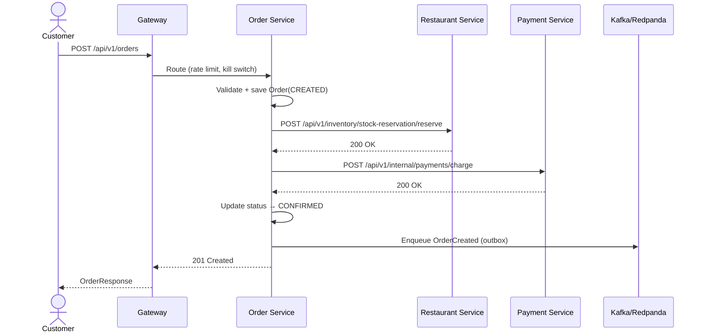

# Bhukkad Backend — System Architecture & Data Flow

> **Purpose:** Onboarding reference for new developers. Every section is based on actual repository implementation. Anything marked *[inferred]* is a reasonable assumption from the codebase, not documented intent.
>
> **Last updated:** 2026-09-19

---

## Table of Contents

1. [Overview](#1-overview)
2. [Technology Stack](#2-technology-stack)
3. [Service Catalog](#3-service-catalog)
4. [Platform Layer](#4-platform-layer)
5. [Business Services](#5-business-services)
6. [Data Layer](#6-data-layer)
7. [Communication Patterns](#7-communication-patterns)
8. [Security](#8-security)
9. [Observability](#9-observability)
10. [Deployment & Infrastructure](#10-deployment--infrastructure)
11. [Resilience & Error Handling](#11-resilience--error-handling)
12. [Key Data Flows](#12-key-data-flows)
13. [Important Bottlenecks & Tradeoffs](#13-important-bottlenecks--tradeoffs)

---

## 1. Overview

Bhukkad backend is a **Spring Boot 3.2 microservice reactor** running on Kubernetes. It is in a **strangler-fig migration** from a monolith (`bhukkad-delivery-system`) to microservices. The gateway progressively routes traffic by path predicate, enabling route-only cutovers without redeploying downstream services.

**Key characteristics:**
- 15 active Spring Boot services + platform-lib
- Per-service PostgreSQL databases (single primary cluster + read replica)
- Redis 7 for caching, rate limiting, session, and ephemeral queues
- Redpanda (Kafka API) for async event delivery via transactional outbox
- Spring Cloud Gateway 4.1 as edge router
- No service registry; DNS-based discovery via k8s Service names

---

## 2. Technology Stack

| Layer | Technology | Version / Config | Purpose |
|-------|-----------|------------------|---------|
| Language | Java | 17 | All services |
| Framework | Spring Boot | 3.2.12 | Web, security, data |
| Gateway | Spring Cloud Gateway | 4.1.x | Edge routing, rate limit, kill switches |
| Database | PostgreSQL | 16 | Primary datastore |
| Cache | Redis | 7 | L2 cache, rate limit, session, queue |
| In-process cache | Caffeine | — | L1 feed cache |
| Messaging | Redpanda / Kafka | v23.3.13 | Async event delivery |
| Security | Spring Security + JWT | JJWT 0.12.7 / Nimbus | AuthN/Z |
| HTTP client | WebClient / RestClient | Spring 6 | Service-to-service calls |
| Circuit breaker | Resilience4j | — | Fallback + retry |
| Build | Maven | 3.9.x | Multi-module reactor |
| Container | Docker | — | Image packaging |
| Orchestration | Kubernetes | — | Deployment, HPA, PDB |
| Monitoring | Micrometer + Prometheus | — | Metrics |
| Tracing | OpenTelemetry + Zipkin | — | Distributed tracing |
| CI/CD | GitHub Actions | — | Build, scan, sign, deploy |
| Testing | JUnit 5, Testcontainers | 1.20.4 | Integration tests |
| Contract testing | Pact | 4.7.5 | Consumer-driven contracts |
| Architecture tests | ArchUnit | 1.3.0 | Layer boundaries |

---

## 3. Service Catalog

| # | Service | Port | Database | Responsibility |
|---|---------|------|----------|----------------|
| 1 | `gateway` | 8080 | — | Edge router, rate limit, kill switch |
| 2 | `identity` | 8081 | `identity` | Users, auth, profiles, addresses, tenants |
| 3 | `restaurant` | 8091 | `restaurants` | Restaurant CRUD, menus, reviews, geo, promotions |
| 4 | `order` | 8092 | `orders` | Cart, checkout, orders, subscriptions, group orders, invoices |
| 5 | `payment` | 8093 | `payments` | Payments, wallet, settlements, COD wallets, dunning |
| 6 | `delivery` | 8094 | `delivery` | Agents, zones, assignments, batches, location |
| 7 | `social` | — | `social` | Posts, likes, comments, feed, post-order conversion |
| 8 | `notification` | 8085 | `notification` | Push/SMS/email dispatch |
| 9 | `search` | 8082 | `search` | Restaurant/menu full-text search |
| 10 | `admin-analytics` | 8087 | `admin` | Fraud, feature flags, churn, exports, audit |
| 11 | `survey` | 8083 | `survey` | Delivery surveys, trending dishes |
| 12 | `referral` | 8084 | `referral` | Referral codes, affiliate tracking |
| 13 | `supportticket` | 8086 | `support` | Support tickets, disputes |
| 14 | `realtime` | 8077 | `realtime` | SSE live order tracking |
| 15 | `personalization` | 8088 | `personalization` | Recommendations, feed ranking |
| 16 | `growth` | 8089 | `growth` | Loyalty, campaigns, referral stats |

**Shared:** `platform-lib` — no HTTP endpoints except health/cache ops. Contains cross-cutting infrastructure.

---

## 4. Platform Layer

### 4.1 API Gateway

**File:** `services/gateway/src/main/java/com/bhukkad/gateway/GatewayConfig.java`

Spring Cloud Gateway with **programmatic route definitions** (not property-based). Routes are declared narrow→wide to ensure correct predicate matching. All backend URIs are hardcoded k8s DNS names.

**Complete route table (ordered narrow→wide):**

| Route Name | Path Patterns | Backend | Notes |
|---|---|---|---|
| `internal-guard` | `/api/v1/internal/**` | orderUri | Returns 403; internal mesh surfaces must never be edge-reachable |
| `notification` | `/api/v1/notifications/**` | notificationUri | P2: notification dispatch + history |
| `survey` | `/api/v1/reviews/survey`, `/api/v1/restaurants/public/*/survey-ratings`, `/api/v1/home/trending` | surveyUri | Kill-switch: `edge.survey.enabled` |
| `customer-cart` | `/api/v1/customers/*/cart/**`, `/api/v1/customers/*/reorder/**` | orderUri | Narrower than generic customers slice |
| `customer-wallet` | `/api/v1/customers/*/wallet/**`, `/api/v1/customers/wallet/**` | paymentUri | Self-scoped wallet surface |
| `customer-group-orders` | `/api/v1/customers/*/group-orders/**`, `/api/v1/customers/group-orders/**` | orderUri | Self-scoped group orders |
| `customer-subscriptions` | `/api/v1/customers/*/subscriptions/**`, `/api/v1/customers/subscriptions/**` | orderUri | Self-scoped subscriptions |
| `customer-order-extras` | `/api/v1/customers/orders/stats` | orderUri | Rewrites to `/api/v1/orders/customer/stats` |
| `customer-disputes` | `/api/v1/customers/disputes`, `/api/v1/customers/orders/*/disputes` | supportUri | Disputes routed to support |
| `customer-loyalty-self` | `/api/v1/customers/loyalty-points` | growthUri | Growth owns loyalty accounts |
| `customer-support-self` | `/api/v1/customers/support/tickets` | supportUri | Rewrites to `/api/v1/support/tickets` |
| `customer-recommendations` | `/api/v1/customers/me/recommendations/**` | personalizationUri | Personalization owns recommendations |
| `customer-surprise-me` | `/api/v1/customers/surprise-me` | restaurantUri | Random restaurant item |
| `customer-orders` | `/api/v1/customers/*/orders` | orderUri | Monolith-parity order history |
| `cart-legacy` | `/api/v1/cart/**` | orderUri | Legacy mobile cart surface |
| `home-feed` | `/api/v1/home/feed`, `/api/v1/home/banners`, `/api/v1/mobile/feed` | restaurantUri | Kill-switch: `edge.feed.enabled` |
| `home-campaigns` | `/api/v1/home/campaigns` | growthUri | Rewrites to `/api/v1/campaigns/active` |
| `home-membership` | `/api/v1/home/membership-plans` | identityUri | Rewrites to `/api/v1/membership/plans` |
| `cache` | `/api/v1/cache/**` | adminAnalyticsUri | Cache ops surface (ADMIN-gated) |
| `platform` | `/api/v1/platform/**` | identityUri | Shared HealthController |
| `compliance-users` | `/api/v1/compliance/users/**` | adminAnalyticsUri | ID-scoped admin compliance |
| `compliance` | `/api/v1/compliance/**` | identityUri | DPDP consents + data export |
| `analytics-exports` | `/api/v1/analytics/**` | adminAnalyticsUri | CSV exports |
| `swagger` | `/swagger-ui/**`, `/swagger-ui.html`, `/v3/api-docs/**`, `/api-docs/**` | identityUri | Aggregated OpenAPI docs |
| `search` | `/api/v1/search/**` | searchUri | P1: unified search + autocomplete |
| `referral` | `/api/v1/referrals/**`, `/api/v1/admin/affiliates/**` | referralUri | Kill-switch: `edge.referral.enabled` |
| `support` | `/api/v1/support/**` | supportUri | Kill-switch: `edge.support.enabled` |
| `live` | `/api/v1/orders/stream/**` | orderUri | SSE kitchen/rider/customer streams; Kill-switch: `edge.order.enabled` |
| `live-realtime` | `/api/v1/live/**` | realtimeUri | Kill-switch: `edge.live.enabled` |
| `growth` | `/api/v1/campaigns/**`, `/api/v1/customers/*/loyalty/**` | growthUri | Campaigns + loyalty |
| `inventory` | `/api/v1/inventory/alerts/**` | restaurantUri | Kill-switch: `edge.inventory.enabled` |
| `social` | `/api/v1/social/**` | socialUri | Circuit breaker: `social`; Kill-switch: `edge.social.enabled` |
| `restaurant` | `/api/v1/restaurants/**`, `/api/v1/cuisines/**`, `/api/v1/menu/**`, `/api/v1/reviews/**`, `/api/v1/feed/**` | restaurantUri | Circuit breaker: `restaurant` |
| `identity` | `/api/v1/auth/**`, `/api/v1/customers/**`, `/api/v1/tenants/**`, `/api/v1/affiliate/**`, `/api/v1/health/**` | identityUri | Identity cut-over |
| `personalization` | `/api/v1/recommendations/**`, `/api/v1/feed/ranked/**` | personalizationUri | Kill-switch: `edge.personalization.enabled` |
| `order` | `/api/v1/orders/**`, `/api/v1/delivery-truth/**`, `/api/v1/coupons/**`, `/api/v1/gift-cards/**` | orderUri | Circuit breaker: `order` with fallback to `/fallback/order`; Kill-switch: `edge.order.enabled` |
| `payment` | `/api/v1/payments/**`, `/api/v1/wallet/**` | paymentUri | Circuit breaker: `payment` with fallback to `/fallback/payment`; Kill-switch: `edge.payment.enabled` |
| `delivery` | `/api/v1/delivery/**`, `/api/v1/deliveries/**`, `/api/v1/zones/**`, `/api/v1/serviceability/**` | deliveryUri | Circuit breaker: `delivery` with fallback to `/fallback/delivery`; Kill-switch: `edge.delivery.enabled` |
| `admin-restaurant-stats` | `/api/v1/admin/restaurants/stats` | adminAnalyticsUri | |
| `admin-restaurant-reviews` | `/api/v1/admin/reviews/**` | restaurantUri | |
| `admin-restaurants` | `/api/v1/admin/restaurants/**` | restaurantUri | |
| `admin-zones-cities` | `/api/v1/admin/zones/**`, `/api/v1/admin/cities/**` | deliveryUri | |
| `admin-support` | `/api/v1/admin/support/**` | supportUri | Rewrites to `/api/v1/support/admin/${seg}` |
| `admin-disputes` | `/api/v1/admin/disputes/**` | supportUri | ADR-001: support is dispute system-of-record |
| `admin-user-console` | `/api/v1/admin/users`, `/api/v1/admin/users/**` | adminAnalyticsUri | Proxied onto identity with service token |
| `admin-identity-tenants` | `/api/v1/admin/tenants` | identityUri | Rewrites to `/api/v1/tenants` |
| `admin-identity-affiliates` | `/api/v1/admin/affiliates` | identityUri | Rewrites to `/api/v1/affiliate/codes` |
| `admin-orders` | `/api/v1/admin/orders/**` | orderUri | Rewrites to `/api/v1/internal/admin/orders/${seg}` |
| `admin-notifications` | `/api/v1/admin/notifications/**` | notificationUri | |
| `admin-rider-payouts` | `/api/v1/admin/agents/*/settle-payouts` | paymentUri | Rewrites to `/api/v1/agents/${id}/settle-payouts` |
| `commission` | `/api/v1/commission/**` | restaurantUri | |
| `pricing` | `/api/v1/pricing/**` | restaurantUri | |
| `admin-analytics` | `/api/v1/admin/**` | adminAnalyticsUri | Catch-all admin |
| `unmatched` | `/api/**` | 127.0.0.1:1 | Observable 404 with `gateway_route_unmatched` counter |
| `not-found` | `/**` | orderUri | Final catch-all 404 |

**Global filters (ordered by precedence):**
- **Global retry** (GET/HEAD only): 2 retries, 500ms initial backoff, 2s max, 2x factor, 0.5 jitter. Retry-After headers override computed backoff.

**Security filters (request order):**
1. `UntrustedHeaderSanitizer` (-50) — strip spoofable headers: `X-Service-Token`, `X-Customer-Id`, `X-Forwarded-*`, `X-Original-URL`, `X-Rewrite-URL`
2. `TransportHeaderHygieneFilter` (-40) — strips `Proxy-Connection`, non-trailers `TE`; deduplicates CORS response headers
3. `SecureCookieFilter` (-35) — hardens `Set-Cookie` to `HttpOnly; Secure; SameSite=Strict`
4. `EdgeSizeLimitFilter` (-25) — request/response size guard
5. `EdgeAccountLockoutFilter` (-25) — login brute-force wall (5 failures → 15-min lock)
6. `EdgeRateLimitFilter` (-30) — Redis bucket rate limiting
7. `EdgeCacheFilter` (-20) — edge response cache for public GET endpoints
8. `EdgeRequestHedgingFilter` (0) — request hedging for idempotent GET endpoints
9. `EdgeKillSwitchFilter` (10) — per-route feature flag kill switch (`bhukkad:feature-flag:overrides` hash)
10. Routing (programmatic RouteLocator, narrow→wide)
11. `UpstreamUnavailableHandler` (-2) — 503 for upstream failures

**CORS configuration:**
- Origins: configurable via `app.cors.allowed-origins` (comma-separated)
- Fail-fast in prod/staging: wildcard origins throw `IllegalStateException` at startup
- Allowed methods: GET, POST, PUT, PATCH, DELETE, OPTIONS
- Allowed headers: Authorization, Content-Type, Accept, Origin, X-Requested-With, Idempotency-Key, X-Request-Id
- Exposed headers: Trace-Id, ETag, Retry-After
- Max age: 3600s

### 4.2 platform-lib

**Location:** `services/platform-lib/src/main/java/com/bhukkad/common/`

**No business logic.** Contains only platform infrastructure:

| Package | Purpose |
|---------|---------|
| `security` | JWT validation (`PlatformJwtValidator`), user auth filter, service auth filter + token provider, key rotation, revocation |
| `outbox` | Transactional outbox (`OutboxClient`, `OutboxEventService`, `OutboxPollPublisher`) |
| `event` | Platform event envelope (`PlatformEventMessage`), event publishers per domain (`OrderEvents`, `PaymentEvents`, `RestaurantEvents`, `DisputeEvents`) |
| `kafka` | Kafka/Redpanda config, `KafkaPlatformEventPublisher` (EOS producer, DLQ consumer), concurrency validator |
| `web` | Global exception handler, health controller, cache ops controller, CORS, OpenAPI, field projection, version headers |
| `web.client` | `PlatformWebClientBuilderFactory`, `CircuitBreakerFilter`, `RetryFilter`, `CircuitBreakerPreflight` |
| `logging` | Structured JSON logging, `RequestLoggingFilter`, `TraceContext`, PII masking, business/audit/security event loggers, metrics emitter |
| `tracing` | W3C trace context propagation, Zipkin bridge, `Traceparent` |
| `cache` | `RedisCacheService`, `LocalCacheService`, cache invalidation subscriber, stampede protection |
| `ratelimit` | `RateLimitService`, Redis-backed rate limiter with Lua script, `@RateLimited` AOP aspect, startup guard |
| `error` | `ApiError`, `BusinessException`, `ResourceNotFoundException`, `UpstreamUnavailableException`, `FraudBlockedException` |
| `datasource` | Read replica selector, `@UseReadReplica` AOP aspect, latency-aware routing, write fence, sharding |
| `metrics` | Micrometer business metrics, endpoint SLO metrics |
| `storage` | Image storage config (S3/MinIO) |
| `chaos` | Chaos fault injection aspect (testing) |
| `featureflag` | Feature flag properties + hash-based rollout |
| `i18n` | Internationalization service (English, Hindi, Kannada, Tamil, Telugu, Marathi) |
| `cluster` | Instance metadata, cluster properties |
| `async` | Async task executor config (core 32, max 64, queue 500, CallerRunsPolicy) |
| `architecture` | ArchUnit tests enforcing platform boundaries |
| `idempotency` | Idempotency records (Redis + DB), cleanup scheduler |
| `saga` | Saga orchestration (`SagaCoordinator`), instance/step entities, compensation |
| `util` | `ValidationUtils`, `DateTimeUtils`, `CursorUtils`, `PriceCalculator`, `DistanceCalculator`, `GeohashUtils`, `OTPGenerator`, `TOTPGenerator` |
| `scan` | `@AllowFullScan` guard for deliberate full table scans |
| `dto.response` | `ApiResponse<T>`, `PagedResponse<T>`, `CursorPagedResponse<T>` |

**Rules (from `services/README.md`):**
- No web controllers (except platform utilities)
- No datasource config
- No business logic
- ArchUnit enforces boundaries

---

## 5. Business Services

### 5.1 Identity

**Tables:** `users` (JOINED inheritance: Customer, RestaurantOwner, DeliveryAgent, Admin), `addresses`, `device_tokens`, `favorite_restaurants`, `membership_plans`, `customer_memberships`, `api_keys`, `consent_records`, `tenants`, `outbox_events`, `saga_instances`, `saga_steps`

**Key flows:**
- Register → create User + role-specific child + default membership
- Login → validate credentials → issue JWT (RS256) + refresh token
- Refresh → validate refresh token → issue new access token
- JWKS endpoint serves public keys for token validation

### 5.2 Restaurant

**Tables:** `restaurants`, `menu_items`, `menu_categories`, `customization_options`, `customization_choices`, `cuisines`, `reviews`, `menu_versions`, `promo_banners`, `promotion_campaigns`, `inventory_alerts`, `dynamic_pricing_rules`

**Key flows:**
- Browse/search restaurants with geo, cuisine, veg filters
- Menu CRUD with bulk upsert (max 200 items)
- Menu versioning (draft → publish)
- Stock reservation for order saga
- Review submission + moderation
- Promotion evaluation for cart discounts

### 5.3 Order

**Tables:** `orders`, `order_items`, `order_item_customizations`, `carts`, `cart_items`, `coupons`, `subscriptions`, `group_orders`, `gift_cards`, `order_timeline_events`, `order_invoices`, `order_delivery_proofs`, `outbox_events`, `saga_instances`

**Key flows:**
- Cart management (add/remove/clear)
- Order creation with saga orchestration:
  - Sync path: `SagaCoordinator.executeSaga()` → reserve stock → charge payment → confirm
  - Async path (feature flag): outbox-driven `PaymentSagaEventConsumer`
- Order status transitions with timeline events
- Invoice generation (JSON + PDF)
- Delivery proof (OTP + photo)
- Group orders, subscriptions, gift cards, coupons

### 5.4 Payment

**Tables:** `payments`, `wallet_transactions`, `wallet_balances`, `agent_cod_wallets`, `rider_earnings`, `restaurant_settlements`, `settlement_runs`, `commission_tiers`, `dunning_runs`

**Key flows:**
- Process payment (Razorpay integration)
- Wallet top-up + transactions
- Refund + dunning retry
- COD wallet for delivery agents
- Settlement runs for restaurants + riders
- Commission tier management

### 5.5 Delivery

**Tables:** `delivery_agents`, `delivery_zones`, `delivery_assignments`, `rider_delivery_batches`, `agent_shifts`, `rider_location_updates`, `agent_active_loads`

**Key flows:**
- Agent registration + profile management
- Zone management with PostGIS geometry
- Order assignment to agents
- Batch delivery (multiple orders per rider)
- Live GPS location tracking
- Earnings + COD wallet

### 5.6 Social

**Tables:** `social_posts`, `post_likes`, `post_comments`, `post_order_conversions`

**Key flows:**
- Post creation with feed invalidation
- Like/unlike (pure Redis hot path, async DB sync)
- Comments
- Nearby geospatial feed (L1/L2 cache → Bloom filter → segments → DB)
- Order-from-post with idempotency

### 5.7 Other Services

- **Notification:** Dispatch push/SMS/email via templates
- **Search:** Elasticsearch/Meilisearch indexing via outbox events
- **Referral:** Referral codes, affiliate tracking, reward ledger
- **Growth:** Loyalty points, promotion campaigns
- **Survey:** Delivery satisfaction surveys, trending dishes
- **Support Ticket:** Support tickets, disputes
- **Admin Analytics:** Fraud scoring, feature flags, churn, exports, audit trail
- **Realtime:** SSE live order tracking (kitchen, customer, rider)
- **Personalization:** Recommendations, feed ranking (FDW to other services)

---

## 6. Data Layer

### 6.1 PostgreSQL

- **Primary cluster:** Single PostgreSQL 16 deployment (`k8s/postgres/deployment.yaml`)
- **Read replica:** `k8s/postgres/read-replica.yaml`
- **Connection pooling:** PgBouncer at `k8s/pgbouncer/`
- **Migrations:** Flyway in each service’s `src/main/resources/db/migration-pg/`
- **Read replicas:** Configurable via `@UseReadReplica` AOP aspect + `ReadReplicaRoutingDataSource`

**Per-service databases:**
- `identity`, `restaurants`, `orders`, `payments`, `delivery`, `social`, `notification`, `search`, `admin`, `survey`, `referral`, `support`, `realtime`, `personalization`, `growth`

**Important indexes:**
- Social: geospatial composite on `(status, deleted_at, latitude, longitude, created_at DESC)`
- Order: partitioned `orders_archive` by `created_at`
- Restaurant: PostGIS geometry indexes

### 6.2 Redis

- **Single Redis 7 cluster** with Sentinel (`k8s/redis/`)
- **Usage:**
  - L2 cache (`RedisCacheService`)
  - L1 Caffeine cache (in-process)
  - Rate limiting (`EdgeRateLimitFilter`, `RateLimitAspect`)
  - Session/JWT blacklist
  - Feed segments (ZSet, Bloom filter, post details)
  - Like counters + queue
  - Feature flags (`bhukkad:feature-flag:overrides`)
  - Distributed lock (`SchedulerLock` via `RedisDistributedLock`)

### 6.3 Kafka / Redpanda

- **3-broker Redpanda cluster** (`k8s/components/redpanda/`)
- **Topic pattern:** `<domain>.events.v1` (e.g., `order.events.v1`, `payment.events.v1`)
- **Reliability:** Transactional outbox → `OutboxPollPublisher` → Kafka → ack before marking `PUBLISHED`
- **Consumer groups:** Per-service, with DLQ (`<topic>.dlt`)

### 6.4 Search

- **Elasticsearch / Meilisearch** (inferred from search service)
- Restaurant + menu item indexing via outbox events

---

## 7. Communication Patterns

### 7.1 Synchronous (REST)

```
Client → Gateway → Service A → Service B (via WebClient/RestClient)
```

**Service clients:**
- `RestaurantClient` (order → restaurant)
- `PaymentServiceClient` (order → payment)
- `OrderServiceClient` (social → order)
- All use `ServiceJwtAuthTokenProvider` for `X-Service-Token` header

**Timeouts:**
- Gateway HTTP client: 5s connect, 8s response
- Platform WebClient: 2s connect, 5s response
- Service-specific: 5s–20s depending on operation

### 7.2 Asynchronous (Kafka)

```
Service A (outbox commit) → OutboxPollPublisher → Kafka → Service B consumer
```

**Guarantee:** At-least-once. Outbox row flipped to `PUBLISHED` only after broker ACK.

**Key topics:**
- `order.events.v1` — `OrderCreated`, `OrderStatusUpdated`, `OrderCancelled`
- `payment.events.v1` — `PaymentCompleted`, `PaymentFailed`
- `restaurant.events.v1` — `RestaurantCreated`, `MenuItemUpdated`
- `social.events.v1` — `PostCreatedEvent`, `PostDeletedEvent`

### 7.3 Pub/Sub (Redis)

```
FeedInvalidationHandler → Redis pub/sub → FeedInvalidationHandler.onMessage()
```

Used for fast feed cache invalidation within the social service.

---

## 8. Security

### 8.1 Authentication

- **User auth:** JWT (RS256) with JWKS endpoint (`/.well-known/jwks.json`)
- **Refresh tokens:** Stored hashed in DB with family tracking
- **Service auth:** Shared secret JWT (`X-Service-Token` header)
- **MFA:** TOTP enrollment supported

### 8.2 Authorization

- **Method-level:** `@PreAuthorize("hasRole('ADMIN')")`, `PrincipalGuard.requireSelfOrAdmin()`
- **Ownership oracles:** `RestaurantOwnershipOracle`, `OrderCustomerOwnershipOracle`, `RiderOwnershipOracle`
- **Internal endpoints:** `@PreAuthorize("hasRole('SERVICE') or hasRole('ADMIN')")`

### 8.3 Rate Limiting

| Layer | Mechanism | Scope |
|-------|-----------|-------|
| Nginx | `limit_req_zone` | Per-IP global |
| Ingress | `limit-rps: 30` | Per-service ingress |
| Gateway | Redis Lua script | Per-route buckets |
| Service | `@RateLimited` AOP | Per-endpoint buckets |

### 8.4 Input Validation

- `@Valid` on request bodies where present
- Service-layer validation (e.g., `restaurantId` match on menu items)
- SQL injection prevention via JPA/parameterized queries

---

## 9. Observability

### 9.1 Logging

- **Structured JSON** via `logback-spring.xml` + logstash encoder
- **MDC:** `traceId`, `spanId`, `requestId`
- **PII masking:** `PiiMaskingConverter` for emails/phones
- **Request logging:** `RequestLoggingFilter` logs method/path/status/ms

### 9.2 Metrics

- **Micrometer** + Prometheus
- **Business metrics:** `PerformanceMetrics` in social service (feed latency, like errors, etc.)
- **SLO metrics:** `EndpointSloMetrics`
- **Circuit breaker gauges:** `circuit_breaker_open`, `circuit_breaker_state`

### 9.3 Tracing

- **OpenTelemetry** + Zipkin
- **W3C trace context** propagated across services
- **Sampling:** Configurable probability

### 9.4 Health

- **Standard:** `/health/ping`, `/health`, `/health/detailed`
- **DB health:** `/health/db`, `/health/db/replica`
- **Cache health:** `/api/v1/cache/health`, `/api/v1/cache/stats`

---

## 10. Deployment & Infrastructure

### 10.1 Kubernetes

**Per-service manifests:**
- `deployment.yaml` — 3 replicas, RollingUpdate, non-root, probes
- `service.yaml` — ClusterIP
- `hpa.yaml` — CPU/memory/custom metrics (social: 10–50)
- `pdb.yaml` — PodDisruptionBudget

**Social service HPA:**
- Min 10, max 50 replicas
- CPU target 65%
- Request-rate metric (`http_server_requests_seconds_count` avg 800)
- DB pool pending metric (`hikaricp_connections_pending` avg 5)

### 10.2 CI/CD

**Pipeline (`.github/workflows/services.yml`):**
1. Per-service matrix build
2. Pre-build guards: HPA×pool ≤ 0.8×pgbouncer, HTTP client checks
3. `mvn verify` + tests
4. Docker build + push to `ghcr.io/bhukkad/<service>:<sha>`
5. Trivy security scan (HIGH, CRITICAL)
6. Syft SBOM generation
7. cosign image signing
8. Deploy: `kubectl set image` + `kubectl rollout status`

**Production (`.github/workflows/production.yml`):**
- GitHub environment approval gate
- `kubectl apply -k k8s/`
- Smoke test: 5 attempts × 5s on gateway readiness

### 10.3 Secrets

- **External Secrets Operator** syncs from Vault
- Single `bhukkad-secrets` Secret owned by ExternalSecret
- Each service gets DB URL, credentials, JWT secret via secret refs

---

## 11. Resilience & Error Handling

### 11.1 Circuit Breakers

| Target | Failure Rate | Open State | Window | Slow Call |
|--------|-------------|------------|--------|-----------|
| `restaurantService` | 30% | 10s | 50 calls | 3s / 40% |
| `orderService` | 25% | 15s | 50 calls | 5s / 35% |
| `redis` | 40% | 5s | 200 calls | 500ms / 50% |
| `default` | 20% | 20s | 100 calls | 2s / 30% |

**Behavior:** While open, fail fast with **503 + `X-Circuit: open`** header.

### 11.2 Retries

- **Service clients:** 3 attempts, 1s backoff (order → restaurant, order → payment)
- **Outbox publisher:** Retries on transient failures
- **Payment webhook:** Idempotent via `X-Razorpay-Event-Id`

### 11.3 Fallbacks

- Feed: returns empty `FeedResponse` on any failure
- Like: returns cached count or empty summary
- Restaurant client: returns empty `Map.of()` / `List.of()` on 404 or circuit open

### 11.4 Timeouts

| Component | Timeout |
|-----------|---------|
| Gateway HTTP client | 5s connect, 8s response |
| Platform WebClient | 2s connect, 5s response |
| Saga RPC | 20s |
| Redis commands | 1s–5s |
| Kafka consumer | 30s session, 300s max poll interval |

### 11.5 Graceful Degradation

- Redis errors → rate limiter fail-open (traffic passes, metric emitted)
- Feature flags → fail-open when flag cannot be evaluated
- Circuit open → fallback method returns safe default

---

## 12. Key Data Flows

### 12.1 Order Creation (Synchronous Saga)



**Transaction boundaries:**
1. Order + items + outbox row committed atomically
2. Saga compensation on failure: refund + stock release
3. Async path: `payment_requested` event → `PaymentSagaEventConsumer`

### 12.2 Feed Generation (Nearby)

```mermaid
flowchart TD
    A[Client: GET /api/v1/social/feed/nearby] --> B{FeedCacheService<br/>L1/L2 hit?}
    B -->|Yes| C[Return cached feed]
    B -->|No| D{Load segment ZSet<br/>feed:nearby:ids:{geohash}]
    D -->|Empty| E[L3 DB fallback:<br/>findActivePostsWithinRadius]
    D -->|Has IDs| F{Bloom filter<br/>fast-negative}
    F -->|Miss| E
    F -->|Hit| G[Parallel enrichment:<br/>RestaurantClient per post]
    G --> H[Build FeedResponse]
    E --> H
    H --> I[Return feed]
```

**Cache layers:**
- L1: Caffeine (30s TTL, 100K max)
- L2: Redis (10min TTL)
- Segments: Redis ZSet per geohash (2h TTL)
- Post details: Redis string per post (60s TTL)

### 12.3 Like Toggle (Hot Path)

```mermaid
flowchart TD
    A[Client: POST /like] --> B[Check Redis: social:post:liked:{post}:{user}]
    B -->|Exists| C[DELETE key + DECR counter]
    B -->|Missing| D[SET key + INCR counter]
    C --> E[Enqueue event to social:like:queue]
    D --> E
    E --> F[Return PostSummary]
    F --> G[Async: LikeSyncService every 1s]
    G --> H[JDBC batch INSERT/DELETE]
    H --> I[Batch UPDATE like_count]
```

**No DB write on hot path.** All writes go to Redis. Async sync every 1s with batch size 1000.

### 12.4 Post Creation + Invalidation

```mermaid
flowchart TD
    A[Client: POST /api/v1/social/posts] --> B[Save SocialPost]
    B --> C[Publish PostCreatedEvent (local)]
    C --> D[FeedInvalidationHandler.onPostCreated]
    D --> E[Encode geohash + 8 neighbors]
    E --> F[Redis pub/sub: feed:invalidation per cell]
    F --> G[handleInvalidation: SCAN + UNLINK keys]
    G --> H[Invalidate L1 Caffeine cache]
    H --> I[Next feed request rebuilds from DB]
```

### 12.5 Order from Post

```mermaid
flowchart TD
    A[Client: POST /api/v1/social/posts/{id}/order] --> B[Validate post exists + restaurant]
    B --> C[Parallel: validate menu items]
    C --> D[Idempotency claim]
    D -->|Duplicate| E[Replay cached response]
    D -->|New| F[orderServiceClient.createOrderFromPost]
    F --> G[Publish OrderFromPost event via outbox]
    G --> H[Complete idempotency record]
    H --> I[Return OrderResponse]
    F -->|Failure| J[markFailed]
    J --> K[Client retries → re-run]
```

---

## 13. Important Bottlenecks & Tradeoffs

### 13.1 Database

- **Single PostgreSQL primary** — write bottleneck for all services. Mitigated by:
  - Per-service databases (schema isolation)
  - Read replica for read-heavy workloads
  - PgBouncer connection pooling
  - HPA scales services, not DB

### 13.2 Redis

- **Single Redis cluster** — memory and throughput bottleneck.
- Mitigations:
  - Lettuce pool 1024 connections
  - TTLs on all keys (30s–7d)
  - Queue cap 500k for like events
  - `SCAN` replaces blocking `KEYS`

### 13.3 Gateway

- **Single gateway cluster** — potential SPOF.
- Mitigations:
  - 3+ replicas with HPA
  - Nginx ingress in front with rate limiting
  - 90s graceful shutdown for SSE drain

### 13.4 Service-to-Service Calls

- **Hardcoded k8s DNS names** — no service mesh, no logical service names.
- Impact: Cannot redeploy with different names/namespaces without config changes.
- Workaround: k8s Service DNS provides round-robin load balancing.

### 13.5 Saga Pattern

- **Two code paths:** sync `SagaCoordinator` vs async outbox-driven.
- Impact: Different failure modes, recovery strategies, monitoring.
- Recommendation: Standardize on async pattern for money-path sagas.

### 13.6 Rate Limiting

- **Four layers:** Nginx → Ingress → Gateway → Service-side `@RateLimited`.
- Impact: Complex tuning, different error responses per layer.
- Recommendation: Document rationale per layer.

---

## Appendix: Key Configuration Files

| File | Purpose |
|------|---------|
| `services/pom.xml` | Aggregator POM, dependency versions |
| `services/gateway/src/main/resources/application.yml` | Gateway routes, timeouts, Redis |
| `services/social/src/main/resources/application.yml` | Social service config, Kafka, HikariCP |
| `k8s/social/deployment.yaml` | K8s deployment, resources, probes |
| `k8s/social/hpa.yaml` | HPA 10–50 replicas |
| `k8s/configmap.yaml` | Shared env config (DB URL, Redis, Kafka) |
| `k8s/ingress.yaml` | Ingress controller with rate limiting |
| `k8s/nginx/configmap.yaml` | Nginx rate limit zones |
| `services/docker/docker-compose.dev.yml` | Local dev environment |
