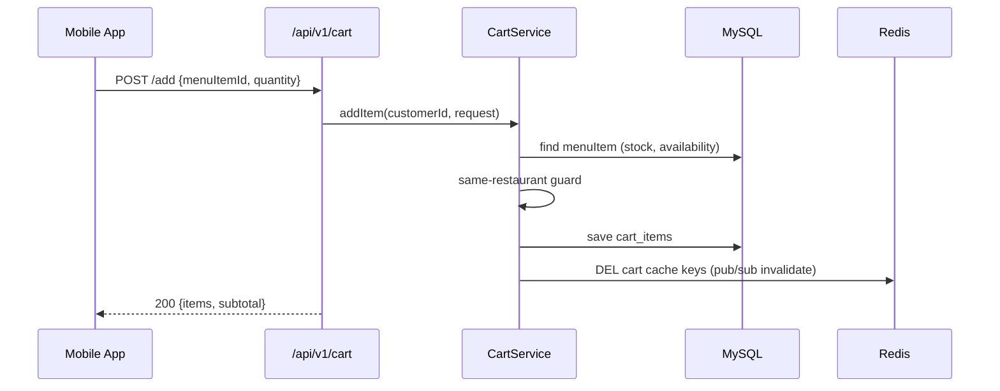
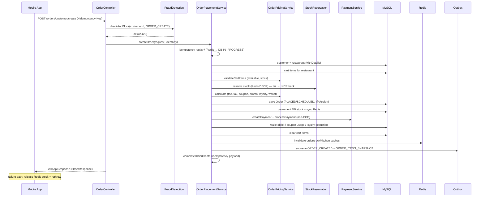
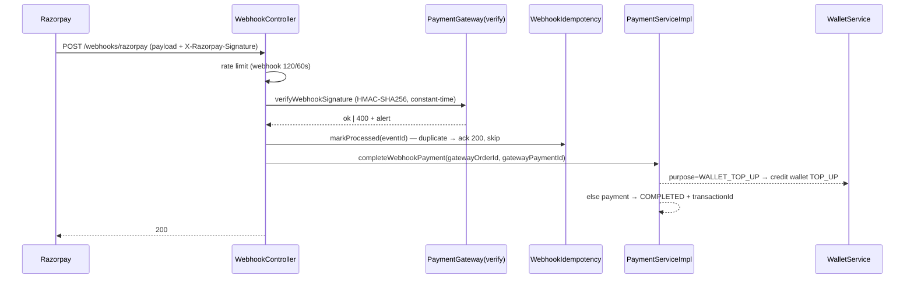
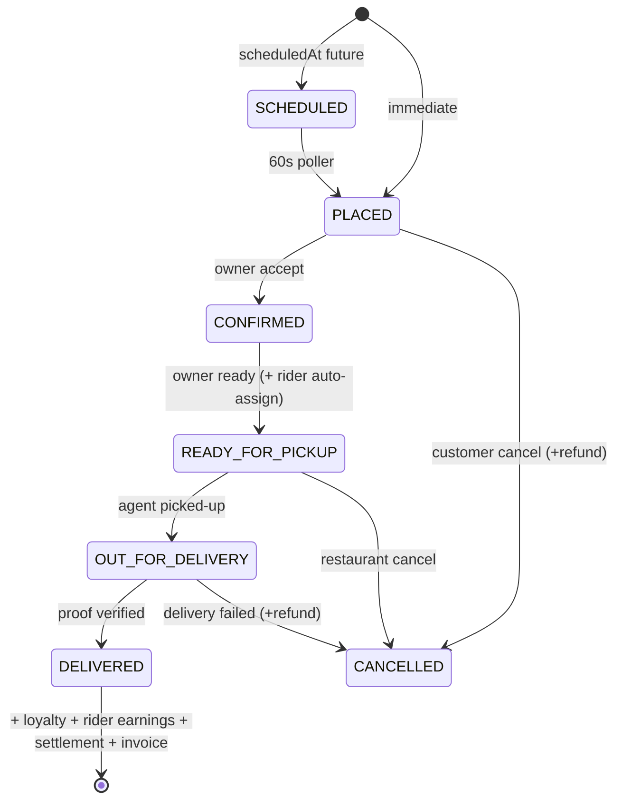
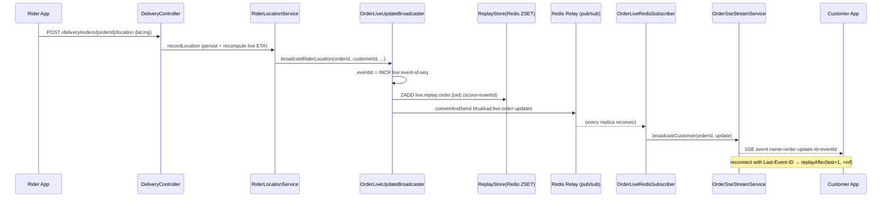
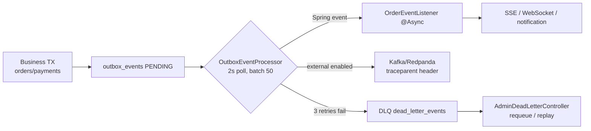

# Bhukkad API Workflow — Detailed Reference

Base URL: `http://localhost:8080/api/v1` (prod: `https://<host>/api/v1`)

This document traces every public workflow end-to-end: the exact HTTP
requests, the response envelopes, the service steps, and the Redis/DB/Kafka
touchpoints. Flow diagrams use Mermaid (renders on GitHub).

---


11. [API Contract Lifecycle Management](#11-api-contract-lifecycle-management)

## Table of contents

1. [Conventions & request lifecycle](#1-conventions--request-lifecycle)
2. [Authentication](#2-authentication)
3. [Discovery: home feed, search, restaurants, menu](#3-discovery)
4. [Cart](#4-cart)
5. [Order creation](#5-order-creation)
6. [Payment](#6-payment)
7. [Order lifecycle & live tracking](#7-order-lifecycle--live-tracking)
8. [Post-order: reviews, loyalty, referrals, wallet](#8-post-order)
9. [Admin & analytics](#9-admin--analytics)
10. [Cross-cutting infrastructure](#10-cross-cutting-infrastructure)

---

## 1. Conventions & request lifecycle

### 1.1 Envelope

Every success is wrapped in `ApiResponse<T>`; every error goes through
`GlobalExceptionHandler` into the same shape with `success=false`.

**Success (200):**

```json
{
  "success": true,
  "message": "Order placed successfully",
  "data": { "...": "payload" },
  "timestamp": "2026-08-24T21:00:00",
  "traceId": "8060e534c23630e6a1393f746a07029d",
  "spanId": "09c46cd3bd00279e",
  "requestId": "862681db"
}
```

**Error (e.g. 401/404/429):**

```json
{
  "success": false,
  "message": "Order not found",
  "data": null,
  "timestamp": "2026-08-24T21:00:01",
  "traceId": "8060e534c23630e6a1393f746a07029d",
  "spanId": "09c46cd3bd00279e",
  "requestId": "862681db"
}
```

### 1.2 Status codes

| Code | Meaning |
|---|---|
| 200 | OK (most reads/writes) |
| 201 | Created |
| 202 | Accepted (async job, e.g. `?async=true` order create) |
| 400 | Validation / WAF block / unsupported API version |
| 401 | Invalid/missing/revoked credentials |
| 403 | Role not permitted |
| 404 | Not found |
| 409 | Conflict (e.g. duplicate order in-flight) |
| 429 | Rate limited / fraud-blocked (with `Retry-After`) |
| 500 | Server error |

### 1.3 Versioning & headers

| Header | Direction | Purpose |
|---|---|---|
| `Accept-Version` (or `X-API-Version`) | Request | API version; `0` → 400; deprecated → `Warning: 299` header |
| `X-API-Version` | Response | Always set to current version (`1`) |
| `Authorization: Bearer <JWT>` | Request | Access token (24 h) |
| `Idempotency-Key` | Request | Dedup key for order create / payment |
| `X-API-Key: bhk_...` | Request | Partner/internal service key (SHA-256 hashed) |
| `X-Device-Fingerprint` | Request | Fraud velocity fingerprint |
| `Last-Event-ID` | Request (SSE) | Resume missed live events |
| `Deprecation`, `Sunset`, `Link` | Response | Legacy `/api/**` paths |

### 1.4 Request pipeline (every request)

```mermaid
flowchart LR
    C[Client] --> L1[LegacyApiPathRewrite<br/>/api/** → /api/v1/**]
    L1 --> L2[VersionHeaderFilter<br/>Accept-Version check]
    L2 --> L3[SecurityHeaders<br/>CSP HSTS X-Frame]
    L3 --> L4[WafFilter<br/>SQLi/XSS scan]
    L4 --> L5[RequestLogging<br/>traceId + SLO metrics]
    L5 --> L6[PrometheusAuth<br/>/actuator/prometheus only]
    L6 --> L7{API key?}
    L7 -- yes --> A1[ApiKeyFilter<br/>SHA-256 lookup<br/>ROLE_PARTNER]
    L7 -- no --> J1[JwtAuthenticationFilter<br/>validate + DB roles]
    A1 --> R[SecurityConfig rules<br/>+ @PreAuthorize]
    J1 --> R
    R --> S[Controller → Service]
    S --> RB{@RateLimited?}
    RB -- yes --> RL[Redis Lua INCR counter<br/>→ 429 + Retry-After]
    RB -- no --> F[FraudDetection?]
    F -- yes --> FD[fraud_events velocity<br/>→ 429 + Retry-After: 300]
    F -- no --> D[Business logic → DB / Redis / Kafka]
```

---

## 2. Authentication

### 2.1 Register — `POST /auth/register`

**Request:**

```json
{
  "fullName": "Aarav Sharma",
  "email": "aarav@example.com",
  "password": "Test@123456",
  "phoneNumber": "9876543210",
  "role": "CUSTOMER",
  "referralCode": "ARAV50"
}
```

| Field | Rule |
|---|---|
| `fullName` | required |
| `email` | required, valid email |
| `password` | min 6 chars |
| `phoneNumber` | `^[0-9]{10}$` |
| `role` | `CUSTOMER` \| `RESTAURANT_OWNER` \| `DELIVERY_AGENT` (no ADMIN) |
| `referralCode` / `affiliateCode` | optional |

**Flow:**

```
RateLimit(auth-register) → Fraud.checkAndBlock → uniqueness (email/phone)
→ BCrypt hash → create Customer|Owner|Agent (+ referral/affiliate hooks)
→ issueTokenPair → Redis SET auth:refresh:{uid}:{token} + SADD index
```

**Response 200:**

```json
{
  "success": true,
  "message": "Registration successful",
  "data": {
    "token": "eyJhbGciOiJIUzI1NiIs...",
    "refreshToken": "eyJhbGciOiJIUzI1NiIs...",
    "tokenType": "Bearer",
    "userId": 101,
    "email": "aarav@example.com",
    "fullName": "Aarav Sharma",
    "role": "CUSTOMER",
    "mfaRequired": false,
    "mfaToken": null
  }
}
```

### 2.2 Login — `POST /auth/login`

**Request:**

```json
{ "email": "aarav@example.com", "password": "Test@123456" }
```

**Flow:**

```
RateLimit(auth-login, key=email) → Fraud.checkAndBlock(AUTH_LOGIN)
→ DaoAuthenticationProvider → CustomUserDetailsService → BCrypt compare
→ MFA gate? (TOTP + ADMIN|OWNER) → {mfaRequired:true, mfaToken}
→ else issueTokenPair
```

**Response 200 (no MFA):** as above. **MFA-gated:**

```json
{
  "success": true,
  "data": {
    "token": null,
    "refreshToken": null,
    "mfaRequired": true,
    "mfaToken": "eyJhbGciOiJIUzI1NiIsInR5cGUiOiJtZmEi...",
    "userId": 101,
    "email": "owner@example.com",
    "fullName": "Owner",
    "role": "RESTAURANT_OWNER"
  }
}
```

### 2.3 MFA verify — `POST /auth/mfa/verify?mfaToken=...&code=123456`

```
RateLimit(auth-login, login:unknown) → validate mfa JWT (type=mfa, 5min)
→ TOTPGenerator.verify(secret, code, ±1 window)
→ issueTokenPair → full AuthResponse
```

### 2.4 Refresh (rotation) — `POST /auth/refresh-token`

`Authorization: Bearer <refreshToken>` → validate + Redis check →
revoke old (`DEL auth:refresh:{uid}:{token}`, `SREM` index) → **new pair**.

### 2.5 Logout — `POST /auth/logout`

Refresh token → revoked from Redis. Access token → **blacklisted**
`SET auth:blacklist:{token}` TTL = remaining validity; the filter now treats
it as unauthenticated.

### 2.6 Passwords

| Endpoint | Flow |
|---|---|
| `POST /auth/forgot-password?email=` | UUID token → Redis `auth:reset:{uuid}` (30 min) → email |
| `POST /auth/reset-password?token=&newPassword=` | consume token, BCrypt, revoke all refresh tokens |
| `POST /auth/change-password` (Bearer) | old password match → save → revoke refresh |
| `POST /auth/verify-email` (Bearer + `email`) | JWT-based verification |

---

## 3. Discovery

### 3.1 Home feed — `GET /home/feed` (public, cached)

```
Request:  GET /api/v1/home/feed
Flow:     HomeFeedCacheService (in-process 60s + Redis, @UseReadReplica)
          → banners + campaigns + membership plans + TrendingDishService
          → trending_dishes table (event-fed, Phase 2)
Response: data: {
            banners: [ {id, imageUrl, targetUrl, active} ],
            campaigns: [ {id, title, discountType, discountValue} ],
            membershipPlans: [ {id, name, price, perks} ],
            trendingDishes: [ {id, name, orderItemCount} ]
          }
```

Mobile BFF: `GET /mobile/feed` — same aggregates, shaped for the app.

### 3.2 Search — `GET /search?q=pizza&page=0&size=10` (rate-limited `search`)

```
Flow: UnifiedSearchService → repository match (name/cuisine/menuItem)
      → suggestion cache Redis `bhukkad:search:suggestions:*` (@UseReadReplica)
Response: data: { results: [ {restaurantId, name, cuisine, rating, menuItemMatches} ] }
```

### 3.3 Restaurants & menu (public)

| Endpoint | Notes |
|---|---|
| `GET /restaurants/public` | paginated list, cached, read replica |
| `GET /restaurants/public/{id}` | detail + `@UseReadReplica` |
| `GET /restaurants/public/nearby?lat=&lng=&radius=` | geo filtering |
| `GET /restaurants/public/search?q=` | text search |
| `GET /restaurants/public/filter?...` | cuisine/rating/veg filters |
| `GET /menu/items/restaurant/{restaurantId}` | menu for a restaurant |
| `GET /menu/items/category/{categoryId}` | by category |
| `GET /menu/items/{id}` | item detail (+ customizations) |
| `GET /menu/items/restaurant/{restaurantId}/bestsellers` | cached ranking |
| `GET /menu/items/search?q=` | item search |

Menu **writes** (owner): `POST /menu/items`, `PUT /menu/items/{id}`,
`PUT /menu/items/{id}/toggle-availability`, `POST /menu/categories`,
image upload-url — each invalidates the Redis menu cache via
`DistributedCacheInvalidator` pub/sub.

---

## 4. Cart

Base `/cart` (CUSTOMER, rate-limited `cart-mutation`).

| Endpoint | Behavior |
|---|---|
| `GET /cart` | items grouped by restaurant; `@UseReadReplica` |
| `POST /cart/add` | body `{restaurantId, menuItemId, quantity, customizations[]}` → validate availability/stock → upsert `cart_items` |
| `PUT /cart/items/{cartItemId}` | update quantity/customizations |
| `DELETE /cart/items/{cartItemId}` | remove line |
| `DELETE /cart/restaurant/{restaurantId}` | clear one restaurant's lines |
| `DELETE /cart/clear` | clear cart |
| `POST /cart/apply-coupon` | body `{code, restaurantId}` → validate against subtotal |



---

## 5. Order creation

### 5.1 Endpoints

| Endpoint | Role | Notes |
|---|---|---|
| `POST /orders/customer/create` | CUSTOMER | sync or `?async=true` |
| `GET /orders/customer/create/jobs/{jobId}` | CUSTOMER | poll async job |
| `GET /orders/customer/my-orders` (+ `/cursor`) | CUSTOMER | cursor pagination |
| `GET /orders/customer/{orderId}` | CUSTOMER | detail |
| `GET /orders/customer/track/{orderId}` | CUSTOMER | live snapshot |
| `POST /orders/customer/{orderId}/reorder` | CUSTOMER | repeat last order |
| `PUT /orders/customer/{orderId}/cancel` | CUSTOMER | + refund if paid |
| `GET /orders/restaurant/{restaurantId}` (+ `/cursor`, `/pending`, `/kitchen-queue`) | OWNER | order list / KDS |
| `PUT /orders/restaurant/{orderId}/accept` | OWNER | PLACED → CONFIRMED |
| `PUT /orders/restaurant/{orderId}/ready` | OWNER | READY_FOR_PICKUP + auto-assign rider |
| `PUT /orders/restaurant/{orderId}/assign-delivery?agentId=` | OWNER | manual assign |
| `PUT /orders/delivery/{orderId}/picked-up` | AGENT | OUT_FOR_DELIVERY |
| `PUT /orders/delivery/{orderId}/delivered` | AGENT | proof gate → DELIVERED |
| `POST /orders/delivery/{orderId}/proof/{otp,verify,photo-url}` | AGENT | delivery proof |
| `GET /orders/number/{orderNumber}` | auth | lookup by number |

### 5.2 Create order — `POST /orders/customer/create`

**Request:**

```json
{
  "restaurantId": 12,
  "deliveryAddressId": 5,
  "specialInstructions": "No onions please",
  "contactlessDelivery": true,
  "couponCode": "WELCOME50",
  "paymentMethod": "UPI",
  "loyaltyPointsToRedeem": 20,
  "useWallet": true,
  "tipAmount": 15.0,
  "scheduledAt": null
}
```
Headers: `Authorization: Bearer <access>` · `Idempotency-Key: ord-abc-123`

**Full sequence:**



**Response 200:**

```json
{
  "success": true,
  "message": "Order placed successfully",
  "data": {
    "id": 4242,
    "orderNumber": "ORD-3f8a21c4",
    "customerId": 101,
    "customerName": "Aarav Sharma",
    "restaurantId": 12,
    "restaurantName": "Spice Route",
    "items": [
      { "id": 1, "menuItemName": "Butter Chicken", "quantity": 2,
        "price": 320.0, "customizations": [], "specialInstructions": null }
    ],
    "deliveryAddress": { "id": 5, "street": "12 MG Road", "city": "Bengaluru" },
    "status": "PLACED",
    "subtotal": 640.0,
    "deliveryFee": 35.0,
    "taxAmount": 108.8,
    "discountAmount": 50.0,
    "totalAmount": 733.8,
    "tipAmount": 15.0,
    "paymentMethod": "UPI",
    "paymentStatus": "COMPLETED",
    "specialInstructions": "No onions please",
    "contactlessDelivery": true,
    "estimatedDeliveryTime": 40,
    "estimatedDeliveryAt": "2026-08-24T21:40:00",
    "scheduledAt": null,
    "liveEtaMinutes": 40,
    "liveEtaAt": "2026-08-24T21:40:00",
    "deliveredAt": null,
    "createdAt": "2026-08-24T21:00:00",
    "deliveryAgent": null
  }
}
```

### 5.3 Async path (`?async=true`)

```
→ 202 {"success":true,"data":{"jobId":"ord-abc-123"}}
Poll: GET /orders/customer/create/jobs/{jobId}
→ {"status":"PROCESSING"} | {"status":"COMPLETED","order":{...}} | {"status":"FAILED","error":"..."}
Job state lives in Redis order-create-job:{jobId} (TTL 24h); processing runs on orderTaskExecutor.
```

### 5.4 Idempotency

- Same `Idempotency-Key` replayed after success → the **stored `OrderResponse` is returned** (Redis `idempotency:order:{key}`, fallback DB).
- Concurrent duplicate while in-flight → `409 "Duplicate order request is already being processed"` (DB unique `(scope, idempotencyKey)` + `IN_PROGRESS` row).

### 5.5 Scheduled & group orders

- **Scheduled:** created `SCHEDULED` with future `scheduledAt`; a 60s poller promotes `SCHEDULED → PLACED` (two overlapping schedulers exist today). Cancel via `PUT /orders/customer/scheduled-orders/{orderId}/cancel`.
- **Group orders** (`/customers/group-orders`): create → invite by phone → join → split payment (per-member contributions) → host places the order through the standard pipeline → `placeGroupOrder` freezes the group.

---

## 6. Payment

### 6.1 Methods & strategies

| Method | Strategy | Result |
|---|---|---|
| `CASH_ON_DELIVERY` | `CODPaymentStrategy` | stays `PENDING`, money at door |
| `WALLET` | `WalletPaymentStrategy` | `COMPLETED`, tx `WALLET-<orderNumber>` |
| `CREDIT_CARD` / `DEBIT_CARD` / `UPI` / `NET_BANKING` | `GatewayPaymentStrategy` → Razorpay | `COMPLETED` / `FAILED` |

### 6.2 Payment lifecycle (synchronous with order create)

```
createPayment: PENDING row {amount, walletAmount, gatewayAmount, idempotencyKey}
              + Razorpay createOrder (if gateway method & enabled)
processPayment: idempotency (Redis lock + DB IN_PROGRESS) → doProcessPayment
              → capturePayment (GET /v1/orders/{id}/payments → "captured")
              → COMPLETED | FAILED (FAILED → BusinessException + dunning retry)
```

Resilience: `@Retry("paymentGateway")` 3× exp backoff + jitter;
`@CircuitBreaker` 10-window / 50% threshold / 30s open → fallback throws
`"Payment gateway is temporarily unavailable"`.

### 6.3 Webhook — `POST /payments/webhooks/razorpay` (public)



**Webhook sample (simplified):**

```json
{
  "event": "payment.captured",
  "payload": { "payment": { "entity": { "id": "pay_Lxyz", "order_id": "order_Oxyz", "status": "captured" } } }
}
```

### 6.4 Refunds

| Trigger | Path |
|---|---|
| Admin | `POST /admin/payments/refund/{orderId}` → `AutoRefundService` (policy → Redis SETNX double-refund guard → wallet credit or gateway refund) |
| Customer cancel | `PUT /orders/customer/{orderId}/cancel` → `refundPayment` if COMPLETED |
| Dunning | `DunningService` retries PENDING/FAILED 3× (ShedLock, 5-min scan, 1h backoff) then alerts |

Refund splits: `walletAmount` → wallet credit; `gatewayAmount` → Razorpay
`POST /v1/payments/{id}/refund`; payment → `REFUNDED` + `ORDER_REFUNDED`
timeline + refund notification.

### 6.5 Wallet

| Endpoint | Flow |
|---|---|
| `GET /customers/wallet/balance` | balance + history (cursor) |
| `POST /customers/wallet/top-up?amount=500` | Razorpay order (purpose `WALLET_TOP_UP`) → **completed via webhook** → credit `TOP_UP` |
| `POST /customers/wallet/add-money` | dev/admin direct credit (gated `app.wallet.allow-direct-top-up`) |
| (checkout) | `walletService.debit(ORDER_DEBIT)` for split pay / full wallet |

---

## 7. Order lifecycle & live tracking

### 7.1 Status machine



Every transition → timeline event → outbox `ORDER_STATUS_CHANGED` →
SSE/WebSocket + notification.

### 7.2 SSE live tracking (cross-replica)



**OrderLiveUpdate payload (RIDER_LOCATION):**

```json
{
  "eventType": "RIDER_LOCATION",
  "eventId": 88231,
  "orderId": 4242,
  "orderNumber": "ORD-3f8a21c4",
  "customerId": 101,
  "restaurantId": 12,
  "deliveryAgentId": 77,
  "previousStatus": null,
  "status": null,
  "changedAt": "2026-08-24T21:31:00",
  "liveEtaMinutes": 12,
  "liveEtaAt": "2026-08-24T21:43:00",
  "latitude": 12.9716,
  "longitude": 77.5946
}
```

**SSE wire format:**

```
event: connected
id: 0
data: {"channel":"order:4242","id":0}

event: order-update
id: 88231
data: {"eventType":"STATUS_CHANGED","status":"OUT_FOR_DELIVERY",...}

:heartbeat
```

**Subscribe endpoints:**

| Endpoint | Auth | Notes |
|---|---|---|
| `GET /orders/stream/kitchen/{restaurantId}` | OWNER | kitchen queue |
| `GET /orders/stream/rider` | AGENT | agent's deliveries |
| `GET /orders/stream/customer/{orderId}` | CUSTOMER | snapshot + replay from `Last-Event-ID` |
| `POST /orders/stream/customer/{orderId}/tracking-token` | CUSTOMER | guest token |
| `GET /orders/stream/customer-token/{orderId}?token=` | public | guest tracking |

Replay keys: `live:replay:kitchen:{rid}`, `live:replay:order:{oid}`,
`live:replay:rider:{aid}` (ZSET, score=eventId, trim 200, TTL 1h).
Heartbeat every 25s; SseEmitter timeout 60s.

---

## 8. Post-order

### 8.1 Reviews

| Endpoint | Body / Notes |
|---|---|
| `POST /reviews` | `{orderId, restaurantId, rating(1-5), comment}` — order-gated |
| `POST /reviews/menu-items` | `{menuItemId, rating, comment}` |
| `GET /reviews/restaurant/{restaurantId}` | public list (read replica) |
| `GET /reviews/my-reviews` | customer's reviews |
| `GET /reviews/order/{orderId}` | reviews for an order |
| `DELETE /reviews/{reviewId}` | owner of the review |
| `PUT /restaurants/owner/reviews/{reviewId}/response` | owner reply |

Rating aggregates feed `restaurant_ratings_summary` (materialized, 5-min refresh).

### 8.2 Referrals, loyalty, membership

| Endpoint | Flow |
|---|---|
| `POST /referrals/generate` | creates a unique referral code |
| `POST /referrals/validate` | `{code}` → linked to caller |
| `GET /referrals/rewards` | earned rewards (wallet/loyalty credits) |
| `GET /customers/loyalty-points` | balance + history |
| (checkout) | redeem points → discount |
| (delivered) | earn points (on delivery) |

### 8.3 Customer profile & addresses

`GET/PUT /customers/profile` · `POST /customers/addresses` ·
`GET /customers/addresses` · `PUT/DELETE /customers/addresses/{id}` ·
`PUT /customers/addresses/{id}/set-default` · `POST/DELETE /customers/device-tokens` ·
`GET/PUT /customers/notification-preferences` · `GET /customers/data-export` ·
`DELETE /customers/account` · favorites CRUD · `GET /customers/orders/stats`.

### 8.4 Delivery agent

`GET /delivery/earnings/summary` (+ `/earnings` cursor) ·
`GET/PUT /delivery/profile` · `PUT /delivery/toggle-availability` ·
`PUT /delivery/update-location` · `GET /delivery/available-orders` ·
`POST /delivery/{orderId}/accept` / `reject` · `GET /delivery/active-deliveries` ·
`GET /delivery/delivery-history` · `POST /delivery/batches` ·
`GET /delivery/batches/active` · `PUT /delivery/batches/{batchId}/complete`.

---

## 9. Admin & analytics

All `/admin/**` require `ROLE_ADMIN`; dashboards are `@UseReadReplica`.

| Endpoint group | Purpose |
|---|---|
| `GET /admin/dashboard/*` | platform stats, order/restaurant/user metrics, SLO |
| `POST /admin/payments/refund/{orderId}` | manual refund |
| `GET/DELETE /admin/dead-letters` | outbox DLQ inspect/requeue |
| `GET /admin/feature-flags` · `PUT /admin/feature-flags/{key}` | kill-switch (Redis + pub/sub) |
| `/admin/api-keys` | partner key management (SHA-256 hashed) |
| `/admin/fraud/*` | fraud events, review queue, blocks |
| `/admin/churn/*` | churn scores |
| `/admin/experiments/*` | A/B exposures |
| `/admin/coupons` | coupon CRUD (owner can create) |
| `GET /analytics/export/*` | CSV/JSON exports (async jobs) |
| `/compliance/*` | consent, data-export approval, retention |
| `GET /admin/scale` | capacity/queue metrics |

**Feature-flag flow:**

```
PUT /admin/feature-flags/checkout.new {value:false}
→ Redis HSET bhukkad:feature-flag:overrides checkout.new "false"
→ convertAndSend bhukkad:feature-flag:changed
→ every replica evicts its local cache → next isEnabled() hits Redis
```

---

## 10. Cross-cutting infrastructure

### 10.1 Outbox → events (eventual consistency)



Event types: `ORDER_CREATED`, `ORDER_STATUS_CHANGED`, `ORDER_AGENT_ASSIGNED`,
`ORDER_ITEMS_SNAPSHOT` (routable). Known gap: `PAYMENT_WEBHOOK_RECEIVED` is
enqueued but not routed by the processor (dead-letters; money path already
applied).

### 10.2 Saga (Phase 3 scaffolding)

`saga_instances` / `saga_steps` + `SagaCoordinator`: forward steps with
per-step compensation in reverse order; terminal-state replay is a no-op;
guards against a second in-flight saga with the same id.

### 10.3 Read/write routing

```mermaid
flowchart LR
    T[@Transactional / @UseReadReplica]
    T -->|readOnly or REPLICA context| RR[ReadReplicaRoutingDataSource]
    RR -->|round-robin| R1[Replica 0]
    RR -->|round-robin| R2[Replica 1 ...N]
    T -->|read-write| P[Primary]
```

### 10.4 Cache (stampede-safe)

Cache-aside + TTL jitter ±10% + probabilistic early-expiry; Redis `SETNX`
single-flight lock across replicas; pub/sub invalidation
(`bhukkad:cache:invalidation`) per replica; per-domain keyspaces
(`bhukkad:orders:*`, `bhukkad:restaurant:*`, `bhukkad:search:*`).

### 10.5 Monitoring

`EndpointSloMetrics` writes `bhukkad.http.requests` (timer) +
`bhukkad.http.errors` (counter) → `SloMonitorService` (per-replica p95 +
error-budget burn rate, Redis-deduped alerts) → Prometheus `/actuator/prometheus`
+ Grafana dashboards.

---

*Generated from the live codebase. Endpoint paths, payloads and Redis keys are
verified against `src/main/java/com/bhukkad/controller/*`, `dto/*`, service
and infrastructure classes. Known divergences from the "ideal" architecture are
noted inline (unwired BNPL, unroutable webhook outbox event, overlapping
scheduled-order pollers).*

---

## 11. API Contract Lifecycle Management

This section describes the process for defining, reviewing, delivering, and maintaining API contracts in the Bhukkad system.

### 11.1 Contract Definition

API contracts are defined as Spring MVC REST controllers with the following characteristics:
- Located in `src/main/java/com/bhukkad/controller/`
- Use `@RestController` and `@RequestMapping(ApiPaths.V1_PREFIX)` annotations
- Define endpoints with appropriate HTTP methods (`@GetMapping`, `@PostMapping`, etc.)
- Utilize request/response DTOs from `src/main/java/com/bhukkad/dto/request/` and `src/main/java/com/bhukkad/dto/response/`
- Include validation via Jakarta Validation annotations (`@NotNull`, `@Size`, etc.)
- Implement security via `@PreAuthorize` annotations
- Apply rate limiting where appropriate with custom `@RateLimited` annotation
- Include idempotency keys for state-changing operations
- Documented with Spring/OpenAPI annotations (`@Operation`, `@Tag`) for auto-generated documentation

### 11.2 Review Process

All API contracts undergo a rigorous review process:
1. **Self-Review**: Developer checks against checklist covering REST principles, validation, security, idempotency, error handling, and documentation
2. **Peer Review**: Backend team lead or senior engineer verifies implementation quality, consistency, and adherence to guidelines
3. **Cross-Team Review**: Frontend team reviews for consumability and alignment with UI requirements
4. **API Contract Review Board**: Monthly review for significant changes or those with broad impact

Approval requires:
- All review checklists satisfied
- Unit test coverage ≥80% for new code
- Backward compatibility (or explicit migration plan)
- Complete and accurate documentation
- No security vulnerabilities
- Acceptable performance impact
- Frontend team confirmation of contract consumability

### 11.3 Delivery Procedure

API contracts are delivered through a controlled process:
1. **Development**: Feature branch from `main` with naming `feature/api-{resource}-{description}`
2. **Local Development**: Implementation and unit testing, manual verification via curl/Postman
3. **CI Pipeline**: Automated validation including build, unit tests, contract validation (OpenAPI schema), security scanning, and integration tests
4. **Merge Requirements**: All CI checks pass, minimum 2 backend approvals (1 tech lead/architect), frontend approval for user-impacting changes
5. **Deployment**: 
   - Staging: Auto-deploy on merge to `main`, smoke tests, contract verification
   - Production: GitHub Actions workflow with blue/green deployment, traffic shifting, health checks
6. **Publication**: OpenAPI spec at `/v3/api-docs`, Swagger UI at `/swagger-ui.html`, version headers, deprecation notices when applicable

### 11.4 Lifecycle Management

Contract evolution follows strict compatibility guidelines:
- **Backward Compatible** (same version): Adding endpoints, optional fields, response fields, HTTP methods, enum values
- **Breaking Changes** (require version bump): Removing endpoints/fields, changing data types/methods/auth, making optional fields required, changing success status codes
- **Deprecation**: 6-month minimum support period, `Deprecation` header with sunset date, 410 Gone after sunset
- **Versioning**: Path-based (`/api/v1/{resource}`), future versions use `/api/v2/{resource}`

The contract lifecycle is monitored via:
- Changelog in `docs/api/changelog.md`
- Usage metrics via Prometheus
- Consumer-driven contract testing for critical APIs
- Regular review of low-usage endpoints for potential deprecation
