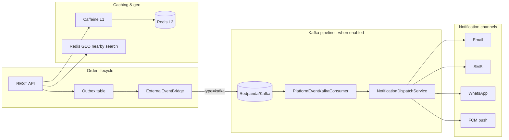

# Platform Feature Guide

Consolidated reference for versioned platform features (V10–V17).

---

# Advanced Platform Features

This guide covers V9/V10 capabilities beyond the core order flow: referrals, favorites, batch checkout, scheduled orders, live ETA, settlements, unified search, and external event hooks.

## Unified search

Single endpoint combining restaurant and menu item full-text search (MySQL FULLTEXT):

```http
GET /api/v1/search?keyword=Paneer
```

Public — no auth required. Response includes `restaurants`, `menuItems`, and counts.

## Scheduled orders

Customers can schedule delivery at least **30 minutes** ahead (configurable), up to **7 days**:

```http
POST /api/v1/orders/customer/create
Content-Type: application/json

{
  "restaurantId": 1,
  "deliveryAddressId": 1,
  "paymentMethod": "CASH_ON_DELIVERY",
  "scheduledAt": "2026-08-15T14:30:00"
}
```

- Order status is **`SCHEDULED`** until the dispatch job moves it to **`PLACED`**.
- Background processor runs every 60s (`app.scheduled-orders.dispatch-interval-ms`).
- Kitchen queues exclude `SCHEDULED` orders until dispatched.

## Live ETA

Orders expose dynamic ETA fields on responses and SSE updates:

| Field | Description |
|-------|-------------|
| `liveEtaMinutes` | Estimated minutes until delivery |
| `liveEtaAt` | ISO timestamp of estimated arrival |

ETA is recalculated by order status and rider GPS when available. Track endpoint:

```http
GET /api/v1/orders/customer/track/{orderId}
```

SSE `OrderLiveUpdate` events also include `liveEtaMinutes` and `liveEtaAt`.

## Restaurant settlements

When an order is marked **delivered**, a settlement row is created:

- `orderAmount` — restaurant subtotal
- `commissionAmount` — platform commission (default 15%)
- `netAmount` — amount owed to restaurant
- `status` — `PENDING` or `SETTLED`

### Owner: view ledger

```http
GET /api/v1/restaurants/owner/{restaurantId}/settlements?page=0&size=20
Authorization: Bearer <owner-token>
```

### Admin: mark settled

```http
PUT /api/v1/admin/restaurants/{restaurantId}/settle-payouts
Authorization: Bearer <admin-token>
```

## Referrals, favorites, tips, batch checkout

| Feature | Endpoint |
|---------|----------|
| Referral code & stats | `GET /api/v1/customers/referral` |
| Add/remove favorite | `POST/DELETE /api/v1/customers/favorites/{restaurantId}` |
| List favorites | `GET /api/v1/customers/favorites` |
| Rider tip on order | `tipAmount` in `POST /orders/customer/create` |
| Multi-restaurant checkout | `POST /api/v1/orders/customer/create-batch` |
| Menu item ratings | `POST /api/v1/reviews/menu-items` |

## External events (outbox bridge)

When `app.events.external.enabled=true`, outbox events are forwarded to `ExternalEventBridge` (default: structured log sink; extend for Kafka/Rabbit).

```yaml
app:
  events:
    external:
      enabled: true
      type: log   # plug in kafka/rabbitmq publisher
```

## Staging profile

Use `SPRING_PROFILES_ACTIVE=staging` for production-like settings:

- Read replica enabled by default (`DB_REPLICA_ENABLED=true`)
- Hibernate SQL logging at WARN
- Prometheus scrape requires auth
- File logging to `logs/bhukkad-staging.log`

See [configuration.md](./configuration.md) for all properties.

## Testing

```bash
# Full bash integration suite (Docker stack)
bash docker/scripts/test-all-apis.sh

# Python catalog runner
python3 scripts/test-all-apis.py
```

Both suites cover unified search, scheduled orders, live ETA, and restaurant settlements.

## V11 platform enhancements

### Coupon per-user limits

`perUserLimit` on coupons is now enforced via `coupon_usages` tracking. Validation checks how many times the current customer has used a code.

```http
GET /api/v1/coupons/validate?code=SAVE10&orderAmount=500&restaurantId=1
Authorization: Bearer <customer-token>
```

### Low-stock alerts (owner)

```http
GET /api/v1/menu/items/restaurant/{restaurantId}/low-stock?threshold=10
Authorization: Bearer <owner-token>
```

Returns items with `stockQuantity` at or below the threshold (default from `app.inventory.low-stock-threshold`).

### Per-restaurant commission

Admins can override the global settlement commission per restaurant:

```http
PUT /api/v1/admin/restaurants/{restaurantId}/commission?percent=12.5
```

Settlement ledger uses restaurant override when set, otherwise `app.settlement.commission-percent`.

### Notification preferences

Customers control channels for order updates:

```http
GET  /api/v1/customers/notification-preferences
PUT  /api/v1/customers/notification-preferences
```

### Customer order stats

```http
GET /api/v1/customers/orders/stats
```

Returns `totalOrders`, `deliveredOrders`, `cancelledOrders`, `totalSpent`, and `loyaltyPoints`.


---

# Growth & Operations Features (V13)

V13 adds delivery zones, home feed, membership, support tickets, order timeline, GST invoices, rider live map, restaurant busy mode, and wallet history.

## Delivery zones & serviceability

Zone-aware delivery fees use haversine distance from restaurant to delivery address. Seeded zone: **Bangalore Central** (15 km radius).

| Method | Path | Auth | Description |
|--------|------|------|-------------|
| GET | `/api/v1/serviceability/check` | Public | Check if restaurant delivers to lat/lng |

Query params: `restaurantId`, `latitude`, `longitude`, `subtotal` (optional).

```bash
curl "http://localhost:8080/api/v1/serviceability/check?restaurantId=1&latitude=12.9716&longitude=77.5946&subtotal=500"
```

Order pricing automatically uses the delivery address coordinates when placing an order.

## Home feed

| Method | Path | Auth | Description |
|--------|------|------|-------------|
| GET | `/api/v1/home/banners` | Public | Active promo banners |
| GET | `/api/v1/home/campaigns` | Public | Active promotion campaigns |
| GET | `/api/v1/home/membership-plans` | Public | Available membership plans |
| GET | `/api/v1/home/feed` | Public | Combined feed (banners + campaigns + plans) |

## Membership (Bhukkad One)

| Method | Path | Auth | Description |
|--------|------|------|-------------|
| GET | `/api/v1/customers/membership/plans` | Customer | List plans |
| GET | `/api/v1/customers/membership/status` | Customer | Active membership |
| POST | `/api/v1/customers/membership/subscribe` | Customer | Subscribe to a plan |

Membership benefits (free delivery, % discount) are applied automatically during order pricing.

## Support tickets

| Method | Path | Auth | Description |
|--------|------|------|-------------|
| POST | `/api/v1/customers/support/tickets` | Customer | Create ticket |
| GET | `/api/v1/customers/support/tickets` | Customer | List own tickets |
| GET | `/api/v1/admin/support/tickets` | Admin | List all tickets |
| PUT | `/api/v1/admin/support/tickets/{id}/status` | Admin | Update status |

## Order timeline & invoice

| Method | Path | Auth | Description |
|--------|------|------|-------------|
| GET | `/api/v1/orders/{orderId}/timeline` | Customer/Owner/Agent/Admin | Status history |
| GET | `/api/v1/orders/{orderId}/invoice` | Customer/Owner/Admin | GST invoice (after delivery) |

Timeline events are recorded on order placement, status changes, and delivery. Invoices are generated automatically when an order is marked delivered.

## Rider live map

| Method | Path | Auth | Description |
|--------|------|------|-------------|
| POST | `/api/v1/delivery/orders/{orderId}/location` | Delivery agent | Record GPS |
| GET | `/api/v1/orders/{orderId}/rider-location` | Customer/Owner/Admin | Latest GPS |

## Restaurant busy mode

| Method | Path | Auth | Description |
|--------|------|------|-------------|
| PUT | `/api/v1/restaurants/owner/{id}/busy-mode` | Owner | Enable busy mode |
| DELETE | `/api/v1/restaurants/owner/{id}/busy-mode` | Owner | Disable busy mode |

When busy mode is active, new orders are rejected until `busyUntil` expires or busy mode is cleared.

## Wallet history

| Method | Path | Auth | Description |
|--------|------|------|-------------|
| GET | `/api/v1/customers/wallet/transactions` | Customer | Paginated wallet ledger |

## Database migration

Schema for these features is consolidated in `src/main/resources/db/migration/V1__baseline_schema.sql` (zones, tickets, invoices, banners, membership, timeline, rider locations, campaigns, fraud events, busy mode, cancellation metadata). New changes go in the next version file — see db/migration/README.md.

## Related docs

- [API Usage](./api-usage.md) — curl examples and auth
- [Advanced Features](./advanced-features.md) — V9–V12 platform features
- [Optimizations](./optimizations.md) — Kafka, cache, GEO index

---

# V14: Delivery Truth

Smarter ETA, zone surge rules, and live rider map enhancements.

## Smarter ETA (V14)

ETA now factors in:

| Factor | Effect |
|--------|--------|
| Order status | Per-stage time estimates |
| Restaurant busy mode | Adds `extraPrepMinutes` |
| Traffic heuristic | Lunch (+15%), dinner (+25%), morning (+10%) |
| Zone surge | Peak-hour surge rules per zone |
| Rider GPS | Haversine distance at ~36 km/h when out for delivery |

Each ETA includes a **confidence band** (default ±5 minutes) and is persisted as a snapshot for accuracy tracking.

| Method | Path | Auth | Description |
|--------|------|------|-------------|
| GET | `/api/v1/delivery-truth/orders/{orderId}/eta` | Customer/Owner/Agent/Admin | ETA detail + history |

Rider location updates (`POST /delivery/orders/{id}/location`) now sync agent coordinates and refresh live ETA automatically.

## Dynamic zones & surge (V14)

Zone fees use:

- Base fee + per-km distance × **effective surge** (max of zone base surge and time-of-day rules)
- `freeDeliveryAbove` subtotal threshold per zone
- Peak-hour rules in `zone_surge_rules` (seeded: lunch 12–14, dinner 19–22 for Bangalore)

| Method | Path | Auth | Description |
|--------|------|------|-------------|
| GET | `/api/v1/serviceability/check` | Public | Serviceability + fee estimate |
| GET | `/api/v1/admin/zones` | Admin | List zones |
| POST | `/api/v1/admin/zones` | Admin | Create zone |
| PUT | `/api/v1/admin/zones/{id}` | Admin | Update zone |
| DELETE | `/api/v1/admin/zones/{id}` | Admin | Delete zone |

## Configuration

```yaml
app:
  delivery-truth:
    avg-speed-km-per-min: 0.6
    pickup-buffer-minutes: 8
    confidence-band-minutes: 5
    record-snapshots: true
```

## Database

`V14__delivery_truth.sql` — `order_eta_snapshots`, `zone_surge_rules`, `delivery_zones.free_delivery_above`

## Related

- Growth Features (V13) — zones, membership, support
- [Scale Operations](./scale-operations.md) — V16 settlement & batching

---

# Promotions Engine (V15)

Full promotions engine with campaign rules, usage limits, admin CRUD, and checkout integration.

## Campaign types

| Type | Field | Behavior |
|------|-------|----------|
| `PERCENT_OFF` | `discountPercent` | % off subtotal, capped by `maxDiscountAmount` |
| `FLAT_OFF` | `flatDiscountAmount` | Fixed ₹ discount |
| `FREE_DELIVERY` | `freeDelivery: true` | Waives delivery fee |

## Engine rules

The `PromotionEngineService` evaluates all active campaigns and selects the **best** discount (highest ₹ value):

- **Eligibility**: min order amount, restaurant scope, global usage limit, per-user limit
- **Stacking**: Best campaign + membership discount + coupon (coupon applied separately)
- **Usage tracking**: `campaign_usages` table records redemptions

## Public / customer APIs

| Method | Path | Description |
|--------|------|-------------|
| GET | `/api/v1/home/campaigns` | Active campaigns for home feed |
| GET | `/api/v1/home/feed` | Banners + campaigns + membership plans |

Campaign discounts are applied automatically at checkout via `OrderPricingServiceImpl`.

## Admin APIs

| Method | Path | Description |
|--------|------|-------------|
| GET | `/api/v1/admin/promotions/campaigns` | List all campaigns |
| POST | `/api/v1/admin/promotions/campaigns` | Create campaign |
| PUT | `/api/v1/admin/promotions/campaigns/{id}` | Update campaign |
| DELETE | `/api/v1/admin/promotions/campaigns/{id}` | Deactivate campaign |
| GET | `/api/v1/admin/promotions/banners` | List banners |
| POST | `/api/v1/admin/promotions/banners` | Create banner |
| PUT | `/api/v1/admin/promotions/banners/{id}` | Update banner |

### Create campaign example

```json
POST /api/v1/admin/promotions/campaigns
{
  "name": "Weekend Feast",
  "campaignType": "PERCENT_OFF",
  "description": "15% off orders above ₹300",
  "discountPercent": 15.0,
  "minOrderAmount": 300.0,
  "maxDiscountAmount": 100.0,
  "priority": 20,
  "usageLimit": 1000,
  "perUserLimit": 3,
  "isActive": true
}
```

## Database

`V15__promotions_engine.sql` — extends `promotion_campaigns`, adds `campaign_usages`

## Related

- Growth Features (V13) — membership & home feed
- [API Usage](./api-usage.md) — checkout flow

---

# Scale Operations (V16)

Settlement automation, rider delivery batching, and dashboard 2.0 for admin and restaurant owners.

## Settlement automation

Automated daily settlement runs settle pending restaurant payouts and rider earnings when pending amount exceeds the configured minimum.

| Setting | Default | Description |
|---------|---------|-------------|
| `app.settlement.auto-settle-enabled` | `true` | Enable cron job |
| `app.settlement.min-pending-amount` | `100.0` | Min ₹ before auto-settle |
| `app.settlement.auto-settle-cron` | `0 0 2 * * *` | Daily at 2 AM |

Each run is recorded in `settlement_runs` with restaurants/agents settled and total amount.

| Method | Path | Auth | Description |
|--------|------|------|-------------|
| POST | `/api/v1/admin/settlements/run` | Admin | Trigger manual settlement run |
| GET | `/api/v1/admin/operations-dashboard` | Admin | Ops dashboard 2.0 |

## Rider delivery batching

Groups up to 3 nearby active orders into a multi-stop batch for efficient delivery.

| Method | Path | Auth | Description |
|--------|------|------|-------------|
| POST | `/api/v1/delivery/batches` | Agent | Create batch from active orders |
| GET | `/api/v1/delivery/batches/active` | Agent | Get current active batch |
| PUT | `/api/v1/delivery/batches/{id}/complete` | Agent | Mark batch complete |

Batching selects orders within 2 km of the anchor restaurant, max 3 stops.

## Admin operations dashboard 2.0

`GET /api/v1/admin/operations-dashboard` returns:

- Pending restaurant settlements (total ₹ + count)
- Pending rider payouts (total ₹ + count)
- Active delivery batches
- Orders by status
- Recent settlement runs
- ETA accuracy (snapshots last 24h, avg ETA minutes; V17 added measured/on-time counts, on-time rate, and avg late minutes — see [trust-and-compliance.md](./trust-and-compliance.md))

## Restaurant dashboard 2.0

`GET /api/v1/restaurants/owner/{id}/dashboard?days=30` combines:

- Revenue, orders, AOV (from analytics)
- Pending settlement amount
- Busy mode status + extra prep minutes
- Top menu items and daily revenue

## Database

`V16__scale_operations.sql` — `settlement_runs`, `rider_delivery_batches`, `rider_delivery_batch_orders`

## Related

- [Advanced Features](./advanced-features.md) — manual settlements (V10)
- [Delivery Truth](./delivery-truth.md) — V14 ETA & zones
- [Operations](./operations.md) — monitoring & alerting

---

# Trust & Compliance (V17)

GST invoice PDFs, fraud enforcement, review moderation, and delivery proof of handover — the four subsystems a customer, a tax auditor, or a dispute agent needs before this platform can run in India.

All of V17 ships behind configuration, and two of the four features are deliberately **not** enforcing by default. Read [Rollout order](#rollout-order) before enabling anything in production.

## GST invoice PDF

An invoice row is created the first time an order reaches `DELIVERED`. It is a tax document, so it is treated as immutable once issued: `OrderInvoiceService` writes the tax figures once and afterwards only updates the PDF object key. Marking delivery twice returns the existing invoice rather than issuing a second one — `order_invoices.order_id` carries a unique constraint, so a duplicate would fail at the database anyway.

| Method | Path | Auth | Description |
|--------|------|------|-------------|
| GET | `/api/v1/orders/{orderId}/invoice` | Customer/Owner/Admin | Invoice as JSON |
| GET | `/api/v1/orders/{orderId}/invoice/pdf` | Customer/Owner/Admin | Rendered PDF (`application/pdf`) |

The PDF is rendered with OpenPDF, stored under `order_invoices.pdf_storage_key`, and emailed to the customer as an attachment. The recipient address is snapshotted into `order_invoices.email_recipient` at send time, because the customer may change their email later and the audit trail must show where the document actually went.

There is no delete endpoint. Cancelling an issued invoice is a credit note, not a row removal — that is deliberate and remains backlog.

## Fraud enforcement

`fraud_events` is an append-only evidence trail. `FraudDetectionService` writes a row **before** the guarded operation proceeds, so rejected attempts are recorded too. A block is a velocity decision: count the rows matching this `event_type` plus one actor identifier (IP or device fingerprint) inside the sliding window, and if the count reaches the threshold, raise `FraudBlockedException`.

Guarded operations: **register**, **login**, **order create**.

Counting is scoped per event type, so heavy login traffic can never trip the registration threshold.

| Setting | Default | Description |
|---------|---------|-------------|
| `app.fraud.enabled` | `true` | Master switch; when off, no rows are written and no checks run |
| `app.fraud.blocking-enabled` | `true` | When off, rows are still written but nothing is rejected — use this to pick thresholds from real data |
| `app.fraud.window-minutes` | `60` | Sliding window applied to every threshold |
| `app.fraud.retry-after-seconds` | `300` | Value sent in the `Retry-After` header |
| `app.fraud.default-threshold` | `20` | Applied to any event type with no explicit entry |

Per-type defaults (a `0` disables that dimension for that type):

| Event type | Per IP | Per device |
|------------|--------|------------|
| `AUTH_REGISTER` | 10 | 5 |
| `AUTH_LOGIN` | 40 | 25 | 
| `ORDER_CREATE` | 25 | 15 |

Registration is tight because a genuine user registers once; login is loose because a whole apartment block or office can share one NAT'd IP. `FraudProperties.thresholdFor(...)` falls back to the built-in default and then to `default-threshold`, so adding a new event type can never NPE.

### Response contract

A blocked request returns **HTTP 429** with a `Retry-After` header. Clients must treat 429 as "back off and retry later", not as a validation error. Note that `RateLimitExceededException` also maps to 429 — the two are distinguished by the response body, not the status.

Only `event_type` and `created_at` are guaranteed non-null on a fraud row. There is no customer before authentication, and either network identifier may be missing; a check skips an absent identifier rather than matching on `null`. The device fingerprint is spoofable by design — it is a correlation hint, never an authentication factor.

## Review moderation

`reviews.moderation_status` is `PENDING`, `APPROVED`, or `REJECTED`. Both `PENDING` and `REJECTED` are hidden from public reads **and** excluded from aggregate restaurant ratings, so a review cannot move the star average before a human has seen it.

| Method | Path | Auth | Description |
|--------|------|------|-------------|
| GET | `/api/v1/admin/reviews/moderation` | Admin | Moderation queue; optional `?status=` filter |
| PUT | `/api/v1/admin/reviews/{reviewId}/moderate?status=` | Admin | Approve or reject (`status` required) |
| POST | `/api/v1/restaurants/owner/reviews/{reviewId}/response` | Owner | Public reply, body `{"response":"..."}` |
| GET | `/api/v1/reviews/restaurant/{restaurantId}` | Public | Approved reviews only |

An owner replying to a review that belongs to a different restaurant gets a **400**, not a 403 — the check is a business rule inside the service, not a security matcher.

## Delivery proof of handover

Before an order is marked `DELIVERED`, the rider captures evidence: a 6-digit OTP the customer reads out, optionally plus a photo. This backs the "my order never arrived" dispute flow.

| Method | Path | Auth | Description |
|--------|------|------|-------------|
| POST | `/api/v1/orders/delivery/{orderId}/proof/otp` | Agent | Issue/resend OTP (sent to customer by SMS) |
| POST | `/api/v1/orders/delivery/{orderId}/proof/verify` | Agent | Verify OTP, optionally attach photo/recipient/GPS |
| POST | `/api/v1/orders/delivery/{orderId}/proof/photo-url` | Agent | Presigned upload URL for the handover photo |
| GET | `/api/v1/orders/delivery/{orderId}/proof` | Agent | Current proof state |

**The OTP plaintext is never returned by any endpoint.** Only a BCrypt hash is persisted in `order_delivery_proofs.otp_code_hash`; the plaintext leaves the system only over SMS. `DeliveryProofResponse` has no OTP field. This is why `docker/scripts/test-all-apis.sh` asserts a **400** on `proof/verify` — a script has no way to learn a valid code, and that is the point.

| Setting | Default | Description |
|---------|---------|-------------|
| `app.delivery.proof.enabled` | `true` | Master switch; when off the proof endpoints reject and no rows are written |
| `app.delivery.proof.enforced` | **`false`** | When on, a verified proof becomes mandatory for the `DELIVERED` transition |
| `app.delivery.proof.otp-expiry-minutes` | `10` | Long enough to survive a lift with no signal |
| `app.delivery.proof.max-otp-attempts` | `5` | Exhausting attempts marks the proof `FAILED`; only a fresh code restores the allowance |
| `app.delivery.proof.otp-resend-cooldown-seconds` | `60` | Stops a resend tap from billing us for an SMS burst |

Verification fails **closed** — but only when `enforced` is on. With the shipped default, `assertProofSatisfied` returns early and delivery is never blocked. Enforcement is off at ship time because turning it on would strand every order already out for delivery with a rider on an older build.

Proof lives in its own table rather than on `orders` so the hot orders row stays narrow and the OTP hash can be dropped independently for data retention.

## ETA accuracy metric

`GET /api/v1/admin/operations-dashboard` (Admin) gained an `etaAccuracy` block. Snapshot volume and average quoted ETA come from `order_eta_snapshots`; accuracy is derived from `orders.estimated_delivery_at` versus `orders.delivered_at`, because snapshots hold no actual delivery timestamp.

| Field | Meaning |
|-------|---------|
| `snapshotsLast24h` | Promises made in the window |
| `avgEtaMinutes` | Average quoted ETA across those snapshots |
| `measuredDeliveriesLast24h` | Deliveries with both a promised and an actual timestamp |
| `onTimeDeliveriesLast24h` | Subset that met or beat the promise |
| `onTimeRatePercent` | 0–100, two decimals; `0` when nothing was measurable |
| `avgLateMinutes` | Average overshoot across late deliveries **only** |

`avgLateMinutes` excludes on-time deliveries on purpose: it answers "when we miss, by how much?" rather than diluting the number with early arrivals. All fields report `0` rather than `null` for an empty window.

## Read-path caching

Two read-heavy public endpoints are now cached with short TTLs.

| Endpoint | Cache | TTL |
|----------|-------|-----|
| `GET /api/v1/home/feed` | `home-feed` | `cache.ttl.home-feed`, 60s |
| `GET /api/v1/serviceability/check` | `serviceability` | `cache.ttl.serviceability`, 60s |

`/home/feed` composes three independently cached sections (`banners`, `campaigns`, `membershipPlans`), so a miss on one does not recompute the others. Sixty seconds is chosen so a promo or zone edit becomes visible within a minute without a manual eviction.

## Track-order fix

`GET /api/v1/orders/customer/{orderId}/track` now works alongside the pre-existing `/customer/track/{orderId}` form; both map to the same handler. The 403 that previously masked this was a servlet ERROR-dispatch artifact — an unmapped path forwards to `/error`, which Spring Security re-authorized with an empty context. `/error` is now `permitAll`, so the real status surfaces.

Separately, `trackOrder` gained an ownership check, closing an IDOR where any authenticated customer could track any order. A non-owner now gets **401** (`UnauthorizedException`), not 403.

## Rollout order

1. Deploy with the shipped defaults. Fraud rows accumulate, invoices and PDFs are issued, proof is captured but not required.
2. Watch `fraud_events` for a few days and tune `app.fraud.thresholds` against real traffic before trusting the defaults.
3. Confirm riders are on a build that captures proof, then flip `app.delivery.proof.enforced` to `true` in a low-traffic window.
4. Staff the moderation queue before it becomes the reason reviews stop appearing.

## Database

`V17__trust_and_compliance.sql`:

| Section | Change |
|---------|--------|
| 1 | `order_invoices` PDF + email audit columns, `idx_invoice_email_pending` |
| 2 | New table `order_delivery_proofs` (unique on `order_id`) |
| 3 | `orders` index `idx_order_eta_accuracy` |
| 4 | `reviews` indexes `idx_review_restaurant_moderation`, `idx_review_moderation_queue` |
| 5 | `fraud_events` composite indexes `idx_fraud_ip_type_created`, `idx_fraud_fingerprint_type_created` |

Section 5 matters more than it looks: V13 indexed only `customer_id` and `event_type`, so every enforcement check on the register/login/order path was a full table scan. The new indexes put both equality predicates first and `created_at` last, making the sliding window an index range scan. Their names are referenced from the `FraudEventRepository` Javadoc — keep them in sync.

`order_invoices`, `reviews.moderation_status`, `reviews.owner_response`, `orders.estimated_delivery_at`, and `orders.delivered_at` all pre-date V17; no invoice or review data is rewritten by this migration.

## Related

- Growth Features (V13) — invoices, review columns
- [Delivery Truth](./delivery-truth.md) — V14 ETA snapshots this metric reads
- [Scale Operations](./scale-operations.md) — V16 operations dashboard this metric extends
- [Configuration](./configuration.md) — full environment variable reference
- [API Usage](./api-usage.md) — auth flow and curl examples

---

# Platform Optimizations

Bhukkad V12 adds performance optimizations and async multi-channel notifications.

## Architecture overview



## Kafka async notifications

When `app.events.external.enabled=true` and `app.events.external.type=kafka`:

1. Order events are written to the **outbox** (existing pattern).
2. `OutboxEventProcessor` publishes to Kafka via `KafkaPlatformEventPublisher`.
3. `PlatformEventKafkaConsumer` consumes `ORDER_CREATED`, `ORDER_STATUS_CHANGED`, and `ORDER_AGENT_ASSIGNED`.
4. `NotificationDispatchService` routes to email, SMS, WhatsApp, and push based on customer preferences.

`OrderEventListener` skips direct notification calls when Kafka is enabled to avoid duplicates.

### Docker dev setup

`docker-compose.dev.yml` includes **Redpanda** and enables Kafka for the app:

| Variable | Value |
|----------|-------|
| `KAFKA_BOOTSTRAP_SERVERS` | `redpanda:9092` |
| `APP_EVENTS_EXTERNAL_ENABLED` | `true` |
| `APP_EVENTS_EXTERNAL_TYPE` | `kafka` |

### Configuration

```yaml
app:
  events:
    external:
      enabled: true
      type: kafka
      kafka:
        bootstrap-servers: localhost:9092
        platform-topic: bhukkad.platform.events
        consumer-group: bhukkad-platform-consumer
```

## Notification channels

| Channel | Property | Provider |
|---------|----------|----------|
| Email | `app.notification.email.enabled` | Spring Mail + Resilience4j |
| SMS | `app.notification.sms.enabled` | `log` or `twilio` |
| WhatsApp | `app.notification.whatsapp.enabled` | `log` or `twilio` |
| Push | `app.notification.push.enabled` | `log` or `fcm` |

Customers control channels via `GET/PUT /api/v1/customers/notification-preferences` (includes `whatsappEnabled`).

Admins can send test messages: `POST /api/v1/admin/notifications/test`

```json
{
  "channel": "email",
  "recipient": "user@example.com",
  "message": "Test message"
}
```

## Tiered caching (Caffeine + Redis)

- **L1**: In-process Caffeine cache (`app.cache.local.*`)
- **L2**: Redis (`RedisCacheService`)

`GET /api/v1/cache/stats` includes `localCache` hit/miss stats.

## Redis GEO nearby restaurants

Restaurants are indexed on create/update. `findNearbyRestaurants` uses Redis GEO first, with MySQL haversine fallback.

```yaml
app:
  geo:
    redis-geo-enabled: true
    restaurants-geo-key: restaurants:geo
```

## Atomic stock reservation

Redis-backed stock decrement prevents overselling under concurrent orders:

```yaml
app:
  inventory:
    stock-reservation:
      enabled: true
      reservation-ttl-seconds: 900
```

Flow: validate cart → `reserveStock` (Redis) → create order → `decrementStock` (DB) → `syncStock`.

## Platform status API

`GET /api/v1/platform/status` (public) returns enabled features:

- External events / Kafka
- Local cache stats
- Redis GEO
- Stock reservation
- Notification channels

## Database migration

The `whatsapp_enabled` column on `customer_notification_preferences` lives in the consolidated `V1__baseline_schema.sql` baseline.

