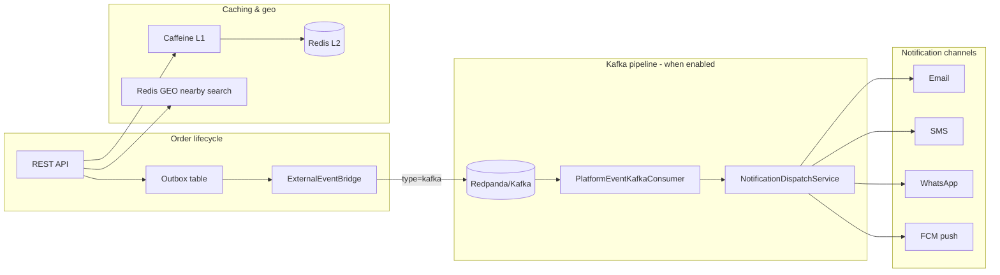

# Platform Optimizations

Bhukkad V12 adds performance optimizations and async multi-channel notifications.

## Architecture overview



## Kafka async notifications

When `app.events.external.enabled=true` and `app.events.external.type=kafka`:

1. Order events are written to the **outbox** (existing pattern).
2. `OutboxEventProcessor` publishes to Kafka via `KafkaPlatformEventPublisher`.
3. `PlatformEventKafkaConsumer` consumes `ORDER_CREATED`, `ORDER_STATUS_CHANGED`, and `ORDER_AGENT_ASSIGNED`.
4. `NotificationDispatchService` routes to email, SMS, WhatsApp, and push based on customer preferences.

`OrderEventListener` skips direct notification calls when Kafka is enabled to avoid duplicates.

### Docker dev setup

`docker-compose.dev.yml` includes **Redpanda** and enables Kafka for the app:

| Variable | Value |
|----------|-------|
| `KAFKA_BOOTSTRAP_SERVERS` | `redpanda:9092` |
| `APP_EVENTS_EXTERNAL_ENABLED` | `true` |
| `APP_EVENTS_EXTERNAL_TYPE` | `kafka` |

### Configuration

```yaml
app:
  events:
    external:
      enabled: true
      type: kafka
      kafka:
        bootstrap-servers: localhost:9092
        platform-topic: bhukkad.platform.events
        consumer-group: bhukkad-platform-consumer
```

## Notification channels

| Channel | Property | Provider |
|---------|----------|----------|
| Email | `app.notification.email.enabled` | Spring Mail + Resilience4j |
| SMS | `app.notification.sms.enabled` | `log` or `twilio` |
| WhatsApp | `app.notification.whatsapp.enabled` | `log` or `twilio` |
| Push | `app.notification.push.enabled` | `log` or `fcm` |

Customers control channels via `GET/PUT /api/v1/customers/notification-preferences` (includes `whatsappEnabled`).

Admins can send test messages: `POST /api/v1/admin/notifications/test`

```json
{
  "channel": "email",
  "recipient": "user@example.com",
  "message": "Test message"
}
```

## Tiered caching (Caffeine + Redis)

- **L1**: In-process Caffeine cache (`app.cache.local.*`)
- **L2**: Redis (`RedisCacheService`)

`GET /api/v1/cache/stats` includes `localCache` hit/miss stats.

## Redis GEO nearby restaurants

Restaurants are indexed on create/update. `findNearbyRestaurants` uses Redis GEO first, with MySQL haversine fallback.

```yaml
app:
  geo:
    redis-geo-enabled: true
    restaurants-geo-key: restaurants:geo
```

## Atomic stock reservation

Redis-backed stock decrement prevents overselling under concurrent orders:

```yaml
app:
  inventory:
    stock-reservation:
      enabled: true
      reservation-ttl-seconds: 900
```

Flow: validate cart → `reserveStock` (Redis) → create order → `decrementStock` (DB) → `syncStock`.

## Platform status API

`GET /api/v1/platform/status` (public) returns enabled features:

- External events / Kafka
- Local cache stats
- Redis GEO
- Stock reservation
- Notification channels

## Database migration

`V12__notification_whatsapp.sql` adds `whatsapp_enabled` to `customer_notification_preferences`.
